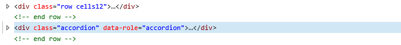

# Belscript tips, tricks and geavanceerde functies

Met het autoscript kan een belscript in enkele minuten worden
klaargemaakt. Toch zijn er situaties waar de eenvoud van het autoscript
net niet voldoende is en je als scriptbouwer de weergave of validatie
van velden meer wilt controleren. Hiervoor kan de HTML weergave worden
gebruikt.

Het autoscript maakt standaard regels kolommen aan. Hierdoor worden ook
de custom velden altijd weergegeven binnen een opmaakt voor 1 regel
zoals:

Hierbij staat de html opmaak binnen de binnenste div. Door de optie
“Genereer geen regel opmaak (html) om de velden” aan te vinken
genereert het autoscript geen regels en kolommen maar moet alle opmaak,
compatible met de tabel opmaak van de MetroUI stijl zelf worden
geplaatst in het HTML blok.

Het is goed te weten dat bij verkeerd gebruik van de html opmaak de
weergave in de war kan raken. Zorg altijd dat de weergave goed
gecontroleerd wordt bij het maken van het script tenzij wordt gewerkt
met maatwerk code die niet zichtbaar is zoals \<script\> blokken.

## Extra guides voor geavanceerde functies in het belscripts

* [Plaats velden binnen een tabcontrol](./autoscript-plaats-velden-in-een-tabcontrol.md)
* [Maatwerk opmaak voor invoervelden](autoscript-maatwerk-veldopmaak.md)
* [Belhistorie resultaten aanpassen met CSS opmaak](autoscript-belhistorie-opmaak-aanpassen.md)
* [Afcoderingen verbergen in de statuslijst met CSS opmaak](autoscript-statussen-verbergen.md)
* [Custom validatie tijdens afcoderen](autoscript-custom-validation.md)
* [Stel een callback rooster in op een belopdracht](./autoscript-set-callback-schedule-for-entry.md)
