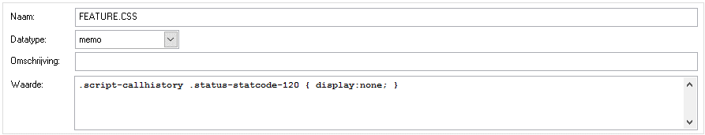
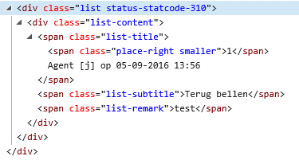

# Belhistorie resultaten aanpassen met CSS opmaak

Als de belhistorie wordt afgebeeld komen alle eerdere belpogingen in de
lijst. Soms wil je bepaalde belresultaten niet weergeven, of juist
markeren in de belhistorie. Dit is mogelijk door gebruik te maken van de
variabele FEATURE.CSS en hier enkele CSS opmaak regels op te nemen.

Door de volgende stijl regel op te nemen kan een belpoging die is
afgecodeert met een belopdrachtstatus worden onzichtbaar gemaakt. In dit
voorbeeld wordt de “Geen gehoor” (120) belopdrachtstatus onzichtbaar
gemaakt.

Door meerdere van deze regels op te nemen met telkens de statuscode (120
in het voorbeeld) kunnen meer belpogingen onzichtbaar worden gemaakt. De
opbouw van elke belpoging is als volgt.

Met deze informatie kunnen ook individuele onderdelen worden aangepast
via CSS opmaak. Bekijk de structuur van de autoscript html pagina eens
vanuit de browser en gebruik de “Inspect element” of “View source”
optie. Via CSS zijn diverse andere onderdelen ook cosmetisch aan te
passen.
