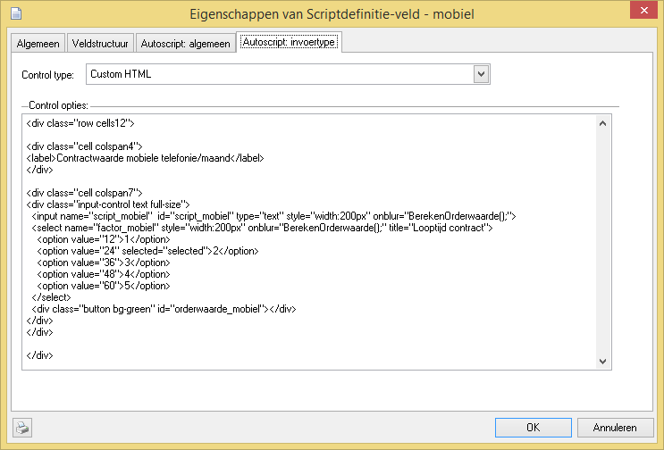

# Maatwerk opmaak voor invoervelden

Via de control weergave Html kan de gehele opmaak van het veld, of een
samenstel van meerdere velden worden gemaakt. Om deze regel te maken is
de onderstaande html nodig.

Kijk voor inspiratie en mogelijkheden van de MetroUI stijl op onze github
<https://github.com/calway/Metro-UI-CSS-3> waar de versie 3 stijl die het autoscript gebruikt is geplaatst. Controleer wel altijd de juiste werking
binnen CallPro omdat sommige controls via jQuery worden gemaakt en
hierdoor het in de opmaakcode gedefinieerde input veld niet wordt
gebruikt voor de opslag van de veldwaarde. CallPro kijkt altijd alleen
naar de originele input tag met de naam script_\<veldnaam\> Als jQuery
onder water in het DOM model nieuwe velden aanmaakt zijn deze niet
gekoppeld tenzij ze ook de script_\<veldnaam\> naam krijgen.
