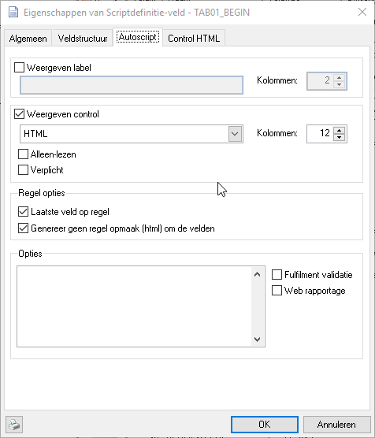
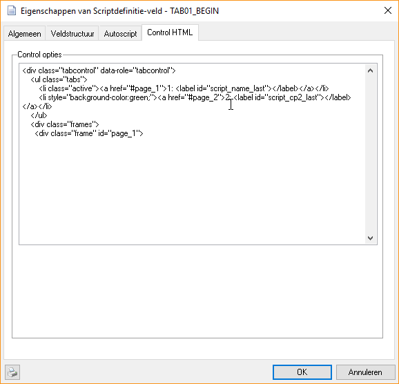
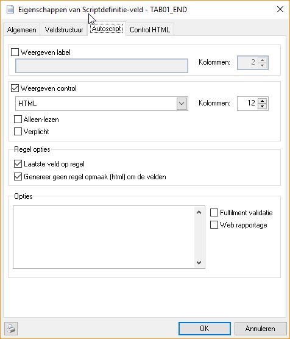
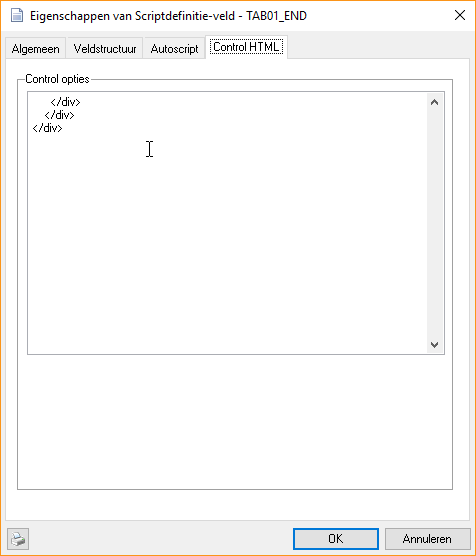
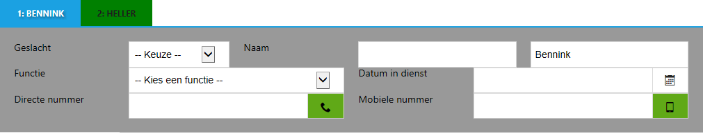
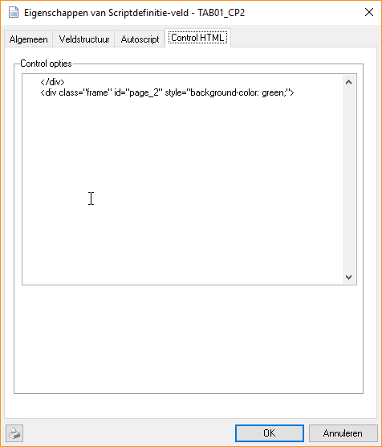

# Plaats velden binnen een tabcontrol

Om velden in het autoscript in een tabcontrol te plaatsen zijn 2 extra
scriptvelden nodig. De velden worden verder niet gebruikt dus het beste
kan het veldtype op karakter(1) worden gezet. De TAB01_BEGIN wordt
boven het eerste veld geplaatst dat in de tabcontrol moet komen en
TAB01_END wordt na het laatste veld geplaatst. Bij beide velden wordt
de optie “Genereer geen regel opmaak (html) om de velden” aangegeven en
ook “Laatste veld op regel”. Het voorgaande veld moet ook de optie
“Laatste veld op regel” aan hebben staan zodat de tabcontrol op een
nieuw regel begint.

 

 

In het autoscript ziet die er als volgt uit.

Om extra tabs te maken kan deze opmaak ook weer in een extra veld worden
geplaatst.

 