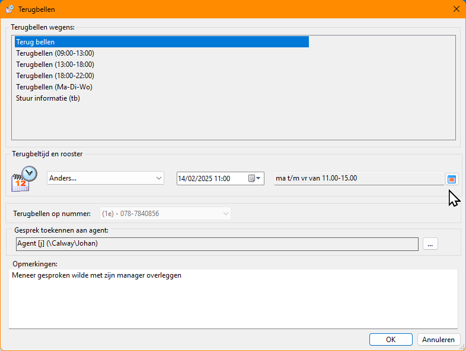

# Stel een callback rooster in op een belopdracht

> Dit is een feature die alleen beschikbaar is vanaf CallPro v5.1.0

Met deze guide kan de agent in het belscript zelf een restrictie instellen op de dagen van de week en de tijden op de dag dat een belopdracht zal worden aangeboden. Deze optie is bedoeld om te voorkomen dat bedrijven die bijvoorbeeld altijd op maandagochtend dicht zijn worden gebeld op maandagochtend. Of bedrijven of contactpersonen die altijd op Vrijdag vrij zijn te bellen op Vrijdag.

Dit terugbel rooster kan worden ingesteld in het Terugbellen venster van CallPro.

Maar deze informatie is ook nuttig tijdens het gesprek.

## Zichtbaar maken van een ingesteld terugbel rooster
Om het ingestelde terugbel rooster van de belopdracht zichtbaar te maken in het belscript is een nieuw systeem veld `script_sys_oentry_callbackscheduledescr` toegevoegd. Door dit veld als label of readonly tekstveld in het script te plaatsen wordt het ingestelde rooster weer gegeven. 
```html
<label name="script_sys_oentry_callbackscheduledescr">hier komt het terugbel rooster</label>
```

## Wijzigen van een ingesteld terugbel rooster
Het is ook mogelijk om het "Rooster voor terugbellen" scherm direct op te roepen vanuit het belscript zodat de agent kan zien welke tijden zijn ingesteld, of deze nav. feedback van de klant kan aanpassen/bijstellen. Dit kan ook in het afcodeerscherm.

Om in het belscript een button te maken die dit scherm opent is de volgende code nodig:
```javascript
<a href="javascript:SetCallbackSchedule()">Bewerken Rooster voor terugbellen</a>
<script>
function SetCallbackSchedule() 
{
    // Get references to CallPro objects
	var goCallPro = window.external;
	var loScript = goCallPro.GetScript();
	var entry = loScript.GetEntry();
    
    // Call the edit form
	if (entry.EditCallbackSchedule())
	{
        // If closed with OK, update the schedule in the script
		var browser = goCallPro.GetBrowser();
		browser.SetDocumentField("SYS_OENTRY_CALLBACKSCHEDULEDESCR"); 
	}
}
</script>
```