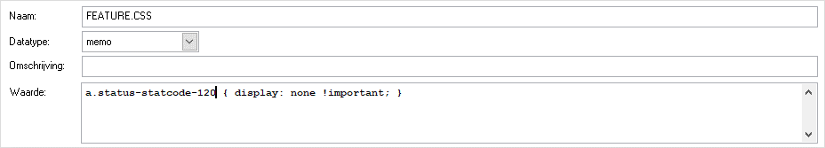

# Afcoderingen verbergen in de statuslijst met CSS opmaak

Ook de afcoderingen in de linkerbalk kunnen worden weggehaald met CSS
opmaak. Hoewel er bij de status vanaf v4.30 kan worden opgegeven of deze
in het belscript zichtbaar moet zijn, is die instelling voor alle
belscripts (globaal over CallPro). Om een bepaalde (systeem) status weg
te laten uit 1 belscript, of zelfs voor 1 situatie kan de volgende CSS
opmaak worden gebruikt.

Met bovenstaande CSS opmaak wordt de Geen gehoor systeemstatus
onzichtbaar gemaakt in het autoscript.