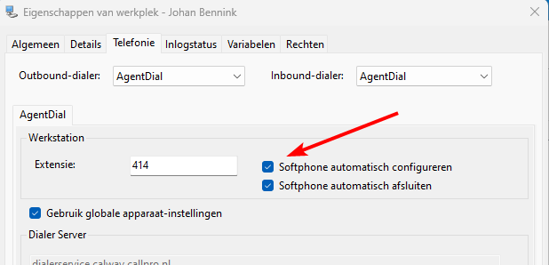
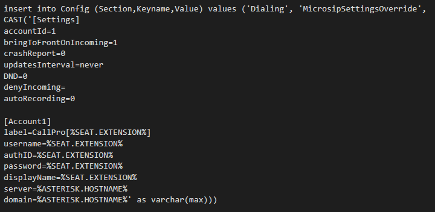
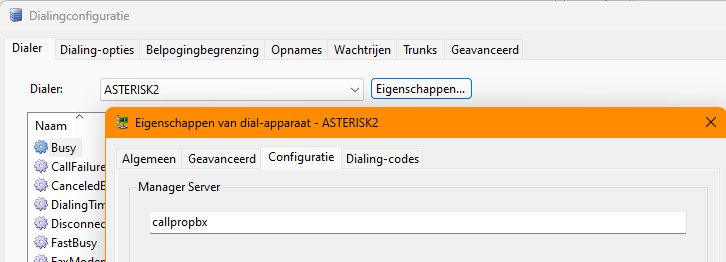
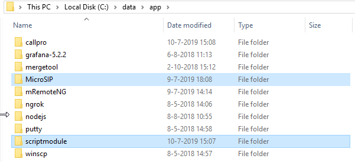
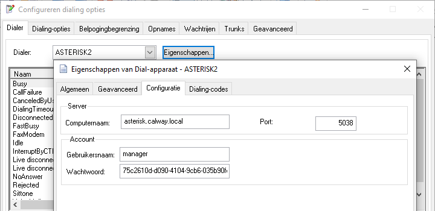

# Microsip instellingen synchronisatie

## Scriptmodule vanaf v5.0.10
Dit werkt alleen als een recente versie van de scriptmodule en Resource Explorer beschikbaar zijn, en als de database versie minimaal 5.0.0 heeft.

1. Installeer de Scriptmodule via [installer.callpro.nl](https://installer.callpro.nl)
1. Ga in de Resource Explorer naar de Seat, en dan het tabblad Telefonie. De instelling is beschikbaar voor de AgentDial dialer. Zorg dat het vinkje bij `Softphone automatisch configureren` aan staat.

    
Alternatief kan dit ook in de Scriptmodule in het `Extra` menu `Dialing Configuratie` en dan de button `Configureren...` worden gedaan.

1. Controleer vervolgens ook dat in het `Control panel` bij `Dialing Configuratie` op het tabblad `Geavanceerd` de Microsip instellingen template is gevuld. Pas deze template alleen aan als je weet wat je doet. De standaard template is:

    ```
    [Settings]
    accountId=1
    bringToFrontOnIncoming=1
    crashReport=0
    enableLog=0
    updatesInterval=never
    DND=0
    denyIncoming=
    autoRecording=0
    localDTMF=0

    [Account1]
    label=CallPro[%SEAT.EXTENSION%]
    username=%SEAT.EXTENSION%
    authID=%SEAT.EXTENSION%
    password=%SEAT.EXTENSION%
    displayName=%SEAT.EXTENSION%
    server=%ASTERISK.HOSTNAME \SW"","%DIALING.ASTERISKIP%"%
    domain=%ASTERISK.HOSTNAME \SW"","%DIALING.ASTERISKIP%"%
    ```


## Scriptmodule vanaf v5.0.0

1. Installeer de Scriptmodule via [installer.callpro.nl](https://installer.callpro.nl)
1. In de Config database van CallPro moet een key aanwezig zijn.
 
1. Controleer dat in de Dialing configuratie bij Dialer eigenschappen
    voor de “ASTERISK2” dialer de hostname of IP van de asterisk correct
    staat ingesteld.  
    


## Scriptmodule vanaf v4.3.2.65

Met de nieuwe script.net module (vanaf v4.3.2.65) wordt het beheer van
de microsip instellingen synchronisatie vereenvoudigd. De instellingen
van microsip worden overgenomen uit de Seat instellingen, en de Asterisk
instelling wordt van het dial apparaat gehaald. Hiervoor dient de
best-practise installatie richtlijn te worden gevolgd.

1.  Zorg ervoor dat de scriptmodule in een sub-folder staat waar ook de portable versie van microsip is geïnstalleerd.  
    

2.  In de Config database van CallPro moet een key aanwezig zijn.
    
    1.  De settings override template (mergetool syntax) “Dialing,
        “MicrosipSettingsOverride” die de .ini onderdelen bevat die
        door CallPro moeten worden overschreven.

> 

3.  Dubbelcheck dat in de script.exe.config in de Scriptmodule folder
    geen uitzondering staat in de instelling “AsteriskHostname”.
    Verwijder deze instelling en controleer de ingestelde waarde met de
    instelling van punt 4.

4.  Controleer dat in de Dialing configuratie bij Dialer eigenschappen
    voor de “ASTERISK2” dialer de hostname of IP van de asterisk correct
    staat ingesteld.  
    

5.  Zet de instelling “MicrosipDetection” op “1” of beter, verwijder de
    setting uit de script.exe.config. Als deze key niet aanwezig is, of
    op “1” staat zal de scriptmodule de auto-configuratie proberen.

Met deze instellingen zal de scriptmodule Microsip instellingen
gelijkhouden met de actuele Seat instellingen. Als Microsip al gestart
is voordat de scriptmodule wordt gestart wordt deze automatisch
afgesloten , aangepast en weer opnieuw gestart.

> Dit betekent ook dat voor remote/thuis werkers de volgorde van
> opstarten kan worden aangepast van 3 stappen naar 2 stappen:
>
> 1.  Start de VPN verbinding, wacht tot deze zegt "verbonden"
> 2.  Start de Scriptmodule, dit start nu automatisch Microsip met de juiste instellingen.
