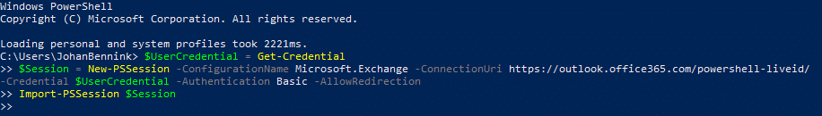

# Calendarsync instellingen Office 365

Voor het inrichten van CalendarSync is medewerking van de opdrachtgever
nodig. In de Office 365 Tenant moeten aanpassingen worden gedaan die het
mogelijk maken dat het call center vanuit CallPro afspraken plaatst in
de agenda’s van de buitendienst medewerkers van de opdrachtgever.

Een aantal stappen is te doen vanuit de Office 365 Admin portal, maar
enige instellingen zijn alleen uit te voeren via Powershell.

# Maak een nieuwe gebruiker aan die gebruikt wordt door het call center


Deze gebruiker geven we de rechten die nodig zijn om afspraken te
plaatsen in de agenda’s van de buitendienst medewerkers.

# Maak een extra admin role aan

Deze rol krijgt de benodigde “ApplicationImpersonation” rechten en we
plaatsen hier de nieuwe account “svcServiceAccount” in.


De svcServiceAccount heeft nu de benodigde rechten. Geef de
gebruikersnaam (incl. de volledige tenant suffix die we hier overal weg
blurren) en het wachtwoord door aan het callcenter.

Geef ze ook een lijst met gebruikers die gekoppeld moeten worden aan een
agenda in CallPro in het call center. Meestal is dit het primaire email
adres (en ook meestal de gebruikersnaam voor deze medewerkers).

# Extra beperking op ApplicationImpersonation

Hoewel dit voor de meeste klanten voldoende is omdat de
svcServiceAccount alleen te gebruiken is vanuit onze software zijn er
klanten die de rechten specifieker willen toekennen. Dit vergt enige
extra stappen die helaas grotendeels via Powershell moeten worden
uitgevoerd.

## Stap 1 – Maak een security group

Als eerste stap maken we een security group in de admin portal waar we
alle buitendienst medewerkers in zetten die we straks vanuit CallPro
willen bedienen. De svcServiceAccount kan dan alleen bij deze mailboxen.

Ga hiervoor in de admin portal naar “Recipients” en dan het tabblad
“groups” en kies de optie “Mail-enabled security group”


Maak nu een security group als aangegeven. Bij owner staat de ingelogde
gebruiker/administrator die deze taak uitvoert. Vul bij Member alle
mailboxen in die straks via CallPro van afspraken moeten worden
voorzien. Als voorbeeld staat hier de gebruiker “Ad Viseur”

 


## Stap 2- Verberg de security groep uit adreslijsten

Na het maken kan deze groep nog worden verborgen in adreslijsten van
Exchange zodat deze niet voor reguliere gebruikers zichtbaar is.


Helaas kunnen via de admin portal geen beperkende instellingen worden
gedaan. Hiervoor is Powershell nodig.

Om de Impersonation rechten die zojuist zijn uitgedeeld aan de
“svcServiceAccount” gebruiker te beperken tot specifieke mailboxen via
de security groep “SecurityGroup-CallPro Calendar Access” is powershell
nodig.

## Stap 3 - Powershell

Open een Powershell venster en gebruik onderstaande commando om in te
loggen op de tennant


```
$UserCredential = Get-Credential

$Session = New-PSSession -ConfigurationName Microsoft.Exchange
-ConnectionUri https://outlook.office365.com/powershell-liveid/
-Credential $UserCredential -Authentication Basic -AllowRedirection

Import-PSSession $Session
```
Log in met een admin account die voldoende rechten heeft om de nieuwe
assignments te doen (dezelfde als die gebruikt is om in de Office 365
admin portal in te loggen).

## Stap 4 - Controleer of de svcServiceAccount de Impersonation rechten heeft

Als eerste stap is het goed om te controleren of de account die we gaan
gebruiken de benodigde rechten heeft. Omdat we zojuist via de admin
portal deze rechten hebben toegekend verwachten we dat we hier
resultaten zien. Dit wordt gecontroleerd met het volgende commando:
```
Get-ManagementRoleAssignment -RoleAssignee "svcServiceAccount" -Role
ApplicationImpersonation | fl
```
Als dit geen resultaten teruggeeft zijn de vorige stappen niet correct
doorlopen. Je zou uitvoer in de vorm van onderstaande verwachten.
Onthoud de Identity naam die hier wordt weergegeven.


## Stap 5 – Maak een nieuwe ManagementScope

Maak een nieuwe ManagementScope die is gekoppeld aan de security group
die we zojuist via de admin portal hebben gemaakt.

Haal een referentie naar de Security-group die we eerder via de Portal
hebben gemaakt en zet deze in een variabele.
```
$ADGroup = Get-Group -Identity "SecurityGroup-CallPro Calendar Access"

$ADGroup
```


Nu gebruiken we deze referentie om de ManagementScope met de juiste
instellingen te maken.
```
New-ManagementScope "Scope-CallPro Calendar Access"
-RecipientRestrictionFilter "MemberOfGroup -eq
'$($ADGroup.DistinguishedName)'"
```


Controleer dat het RecipientFilter staat ingesteld op de juiste
SecurityGroup in de uitvoer.

## Stap 6 – Koppel de nieuwe ManagementScope aan onze ManagementRole 

Nu zetten we deze ManagementScope op de eerder via de admin portal
aangemaakte ManagementRole om deze te begrenzen tot alleen gebruikers
die in de security groep zitten.
```
Set-ManagementRoleAssignment "ApplicationImpersonation-CallPro Calendar
Access" -CustomRecipientWriteScope "Scope-CallPro Calendar Access"
```


**LET OP\!** Hoewel we in de admin portal onze role group de naam
“CallPro Calendar Access” hebben gegeven heeft de portal onder water
als unieke naam iets anders gekozen die we eerder bij Identity zagen
staan. Die naam moet gebruikt worden.

## Stap 7 - Verificatie

De svcServiceAccount staat nu ingesteld met Impersonation rechten op de
gebruikers in de security group “SecurityGroup-Callpro Calendar Access”

Dit is ook te controleren door nogmaals de Get-ManagementRoleAssignment
commando uit te voeren:
```
Get-ManagementRoleAssignment -RoleAssignee "svcServiceAccount" -Role
ApplicationImpersonation | fl
```


En om te controleren wat deze Scope beperkt:
```
Get-ManagementScope "Scope-CallPro Calendar Access" | fl
```


# Alle instellingen ongedaan maken

Om alle instellingen ongedaan te maken kunnen de volgende commando’s
worden gebruikt.
```
Remove-ManagementScope "Scope-CallPro Calendar Access"
```


Hiermee is ook de ManagementRoleAssignment verwijderd. De
ApplicationImpersonation geldt nu weer voor alle mailboxen voor de
svcServiceAccount.

Verwijder nu via de portal de Security group die we hebben gemaakt of
gebruik Powershell:
```
Remove-DistributionGroup "SecurityGroup-CallPro Calendar Access"
```


En verwijder vervolgens via de portal de Admin role, of dia Powershell:
```
Remove-RoleGroup "CallPro Calendar Access"
```


En verwijder tenslotte de svcService Account gebruiker via de portal.

Nu zijn alle restanten van de CallPro service account en de instellingen die nodig waren om de CalendarSync te laten werken ongedaan gemaakt.
