# Calendarsync instellingen voor Google Calendar API
Om Google calendars te synchroniseren is een google account nodig. Log in met deze account op https://cloud.google.com de Google Cloud Console voor ontwikkelaar.
Gebruik de link op de welkom pagina om een nieuw project te maken.

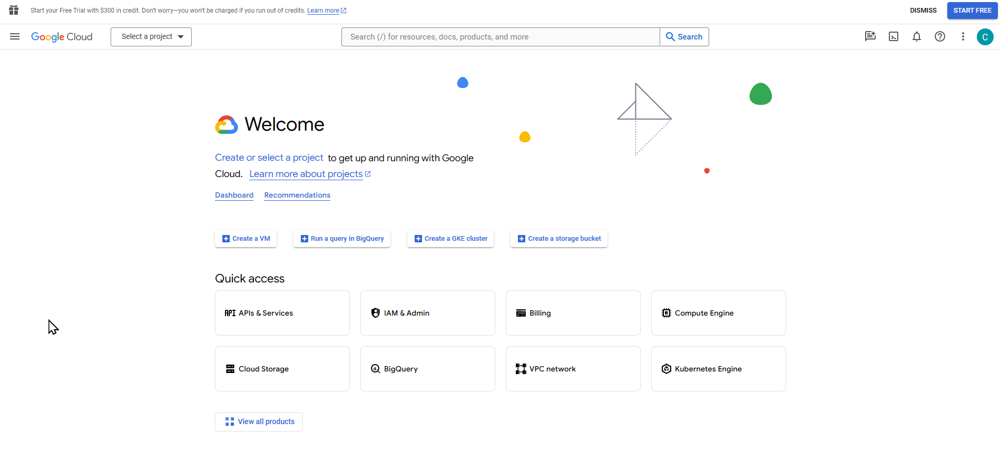

De lijst met projecten verschijnt, kiees hier "New project"

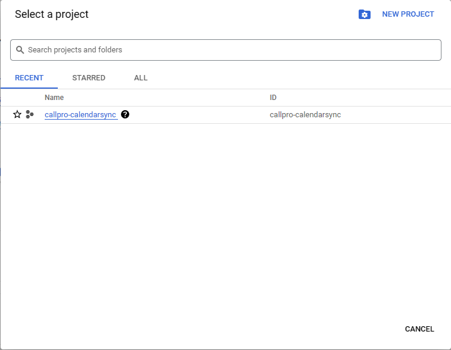

Geef het nieuwe project een naam `CallPro Agenda synchronisatie` zodat deze herkenbaar is.

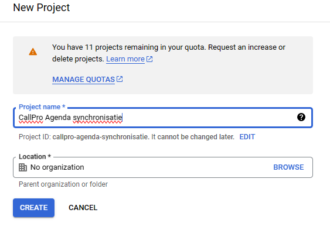

Je komt terug op de welkom pagina waar nu het project is geselecteerd. Voeg nu de `Google Calendar API` toe door bij Quick Access te kiezen voor `APIs & Services`. Het is mogelijk dat de API al in de lijst met beschikbare api's staat, ander gebruikt de button `+ ENABLE APIS AND SERVICES` om deze toe te voegen. Ander klik op de API, en dan klik op het vervolg scherm op `CREDENTIALS`

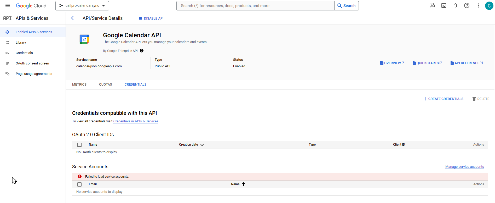

Voeg een oAuth 2.0 CLient ID toe met de button `+ CREATE CREDENTIALS` en kies in de popup voor Oauth Client ID.
Kies bij Application type voro ` Desktop App` en geeft opnieuw een naam. 

Als dit de eerste keer is dan komt er een melding om eerst een Consent screen te configureren.
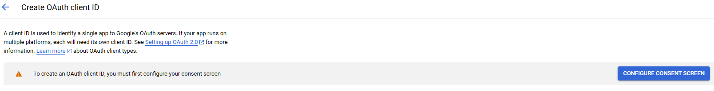

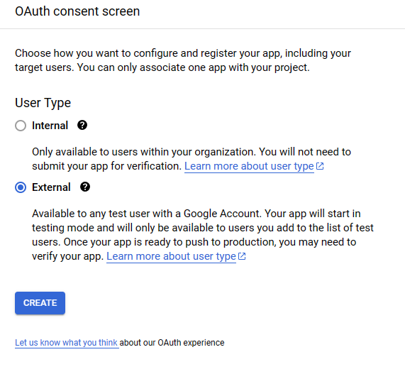
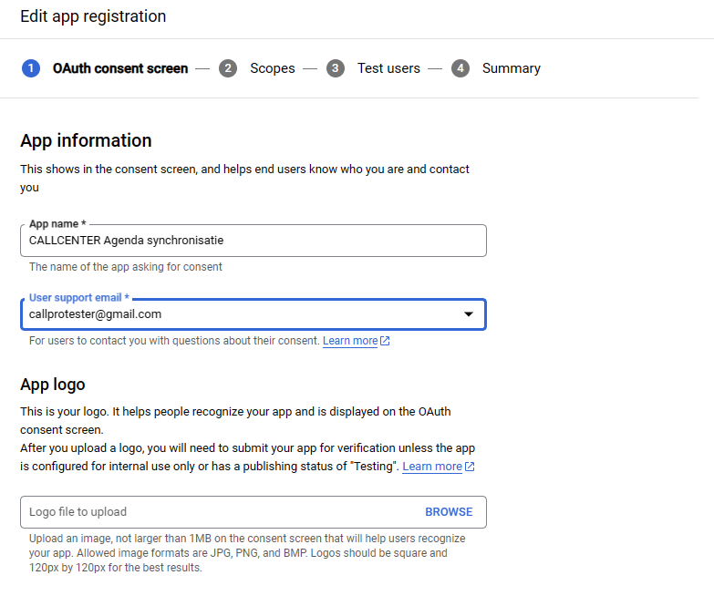
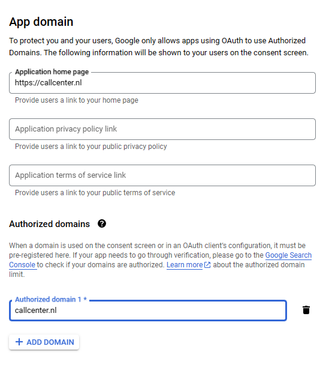
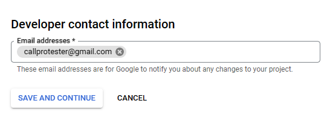

Druk op `SAVE AND CONTINUE`

Voeg nu de benodigde scopes toe, dit zijn de rechten die nodig zijn om afspraken te kunnen lezen en schreven in de Google Calendar.

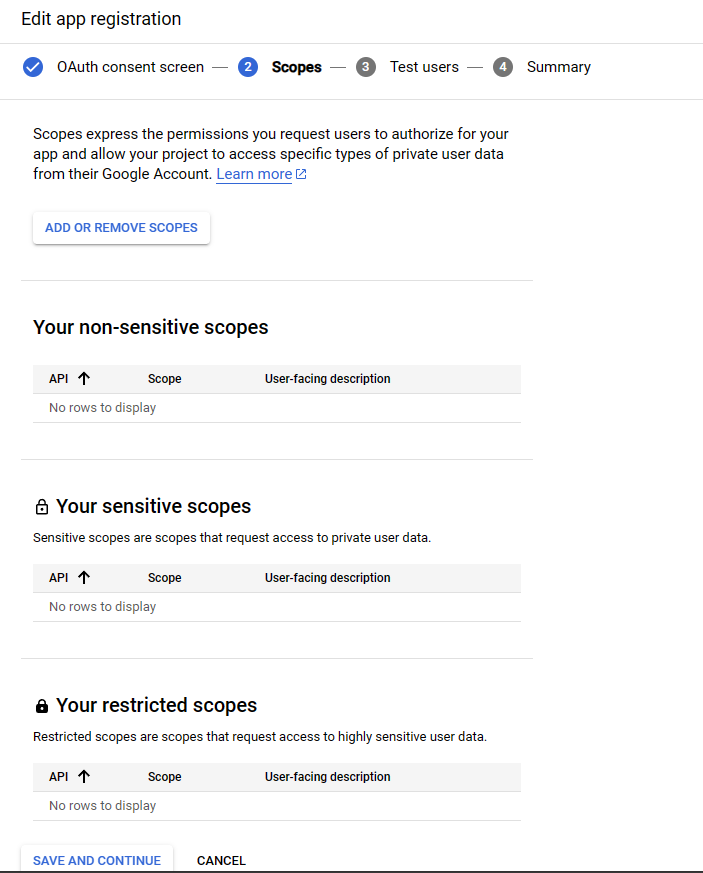

Gebruik de `ADD OR REMOVE SCOPES` knop om de volgende scopes toe te voegen.

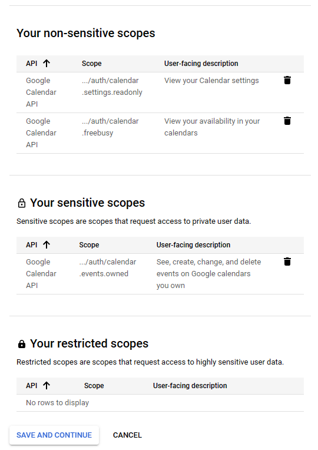

Kies nu voor een Test App waarbij elke agenda die benaderd moet worden (tot maximaal 100) in de lijst met Test users moet worden opgegeven. 

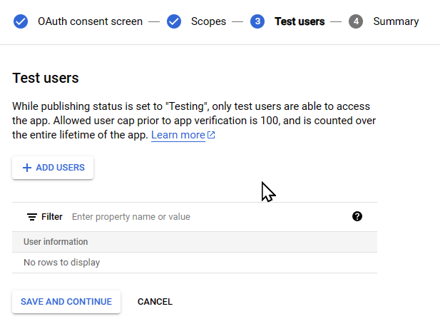

Of kies ervoor om de App te publishen nadat deze wizard is voltooid. 

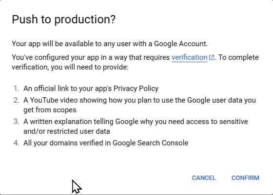

Hiervoor moetn wel dieverse extra acties worden voltooid en volgt een validatie door Google.

Nadat he tconsent screen is geconfigureerd keer terug naar de Credentials en kies opnieuw voor `+ CREATE CREDENTIALS` en kies `OAuth Client ID`

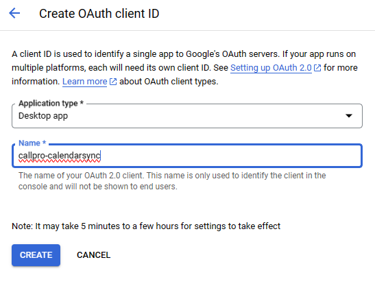

Nu verschijnen de `Client ID` en `Client secret` die aan Calway gegeven moetne wordne voor installatie in de Calendar Sync Service. Op dit moment kan de gebruiker dit niet zelf doen!

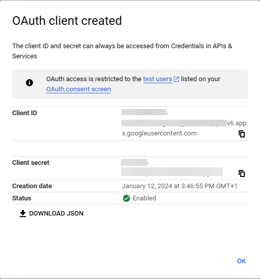

# CallPro Agenda instelling
Voor elke agenda die gesynchroniseert moet worden stel de Synchronisatie methode in op `Google calendar` en vul het email adres in bij `Gebruikersnaam`. Laat het `wachtwoord` veld leeg. Het systeeem stuurt nu een email naar het opgegeven email adres waar deze gebruiker een link heeft die geklikt moet worden om de configuratie te voltooien.

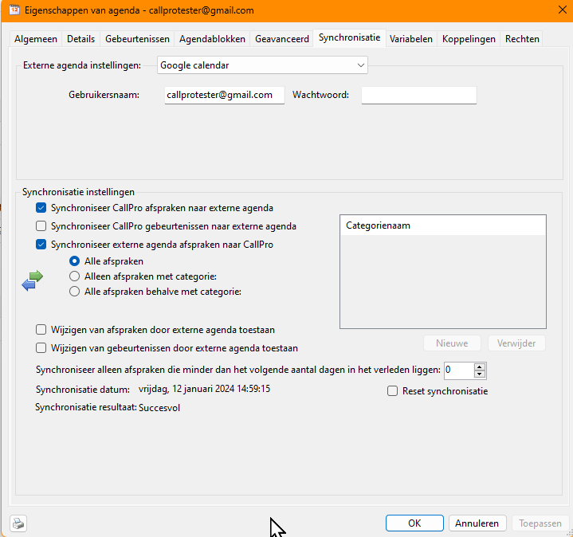

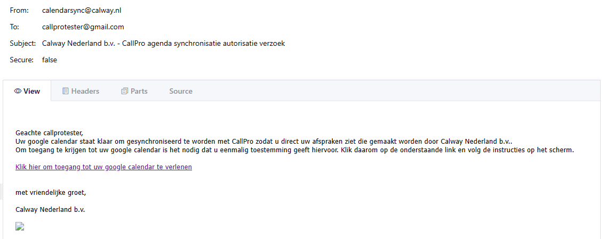

Indien de klant op de link in die email klikt volgt een Google authenticatie en wordt een token teruggegeven die wordt bewaard in CallPro voor de synchronisatie.

De gebruiker die op de link klikt komt op een pagina die vervolgens de Google Login oproept.

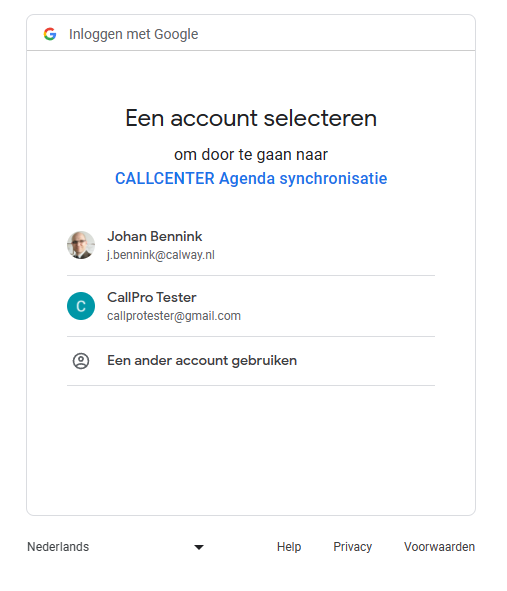

Afhankelijk of er meerdere accounts zijn worden deze getoodn. Kies het account dat gesynchroniseert gaat worden met CallPro.

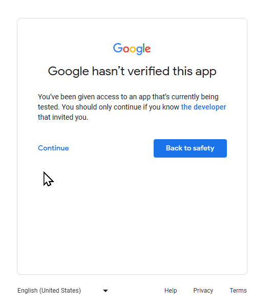

Afhankelijk of de App in productie is wordt een vervolg scherm getoond (dit is een Test App) Kies voor `Continue` 

Het is ook mogelijk als de gebruiker **niet** als Test user is opgevoerd dat deze melding komt.

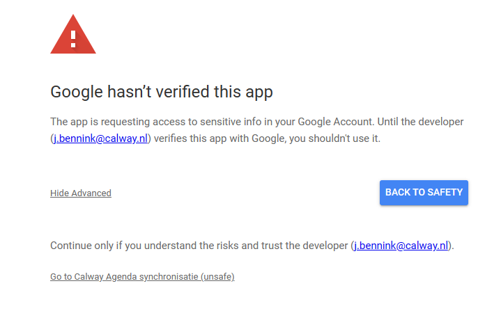

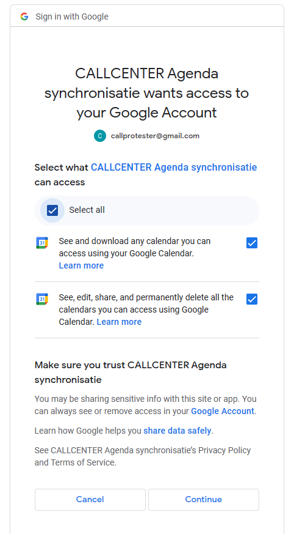

Nu wordt gevraagd om de rechten die nodig zijn voor het synchoniseren van de Agenda. De klant moet hier `Select all` kiezen.

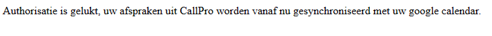

Nu is de Agenda synchronisatie correct ingesteld voor deze klant.