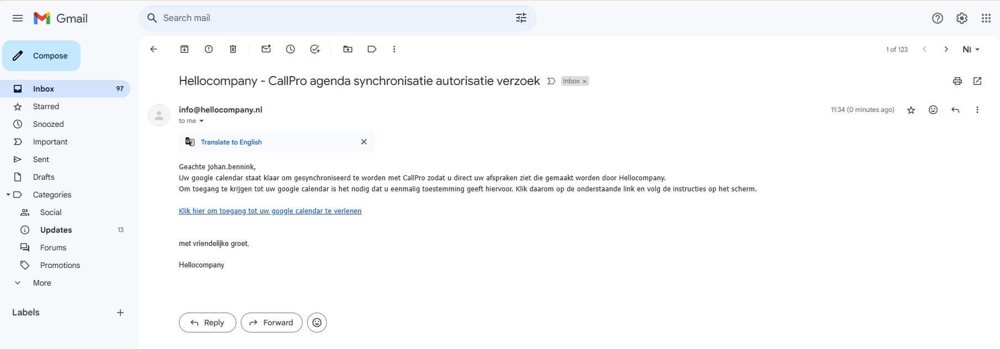
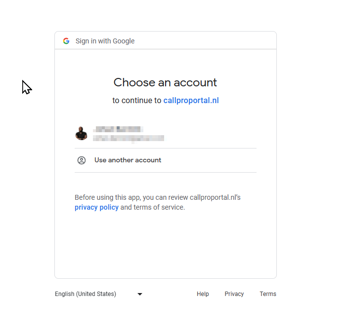
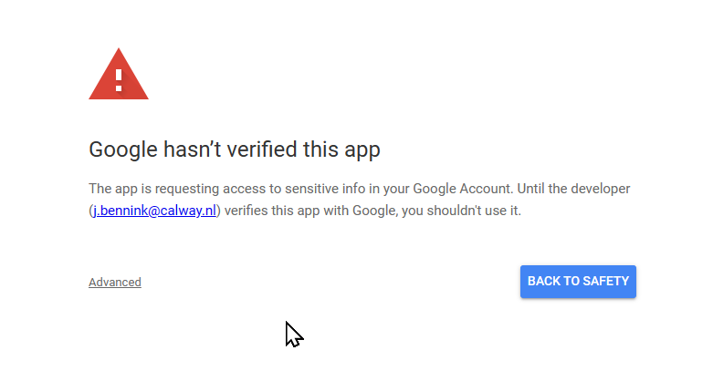
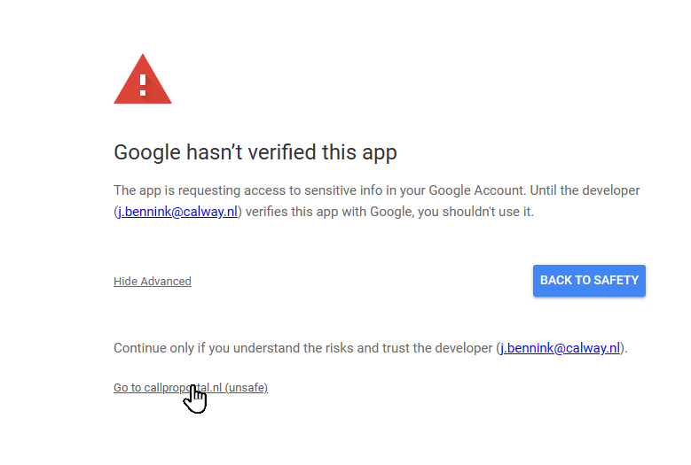
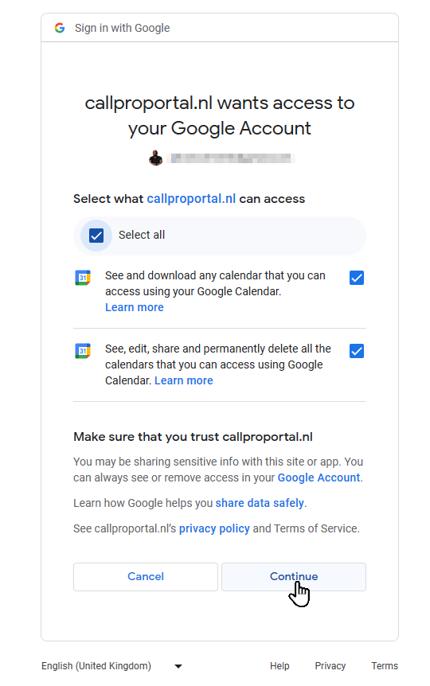
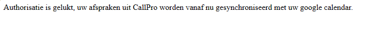

# Google Calendar gebruiker autorisatie
Als gebruik wordt gemaakt van de Google calendar synchronisatie dan ontvangt de eigenaar van de Google agenda en email met een autorisatie verzoek.

Klik op de link in deze email om het autorisatie proces te starten.

Kies de account uit de lijst, of log in met de account waarmee de agenda moet worden gesynchroniseert. Het is van belang dat dit wel het email adres is dat aan het call center is doorgegeven. CallPro synchroniseert op basis van dat opgegeven email adres dus kies hier de zelfde account.

Het kan zijn dat de Google App nog niet is geverifieerd, dan volgt bovenstaande melding. Deze kan veilig worden genegeerd door op de `advanced` link te klikken.

In dit voorbeeld is het developer emailadres een adres van Calway, de ontwikkelaar van CallPro, maar dit zou ook een email adres van het call center kunnen zijn.

Klik nu door op de `Go to callproportal.nl (unsafe)` om de autorisatie te starten.

Nu wordt aangegeven welke rechten de App nodig heeft en vraagt. Gebruik de `Select all` checkbox om alle rechten toe te staan. Deze zijn allemaal nodig om afspraken vanuit CallPro die door het call center zijn gemaakt in de Google calendar te zetten, en afspraken die zelf gemaakt worden in de Google calendar terug te synchroniseren naar het call center zodat geen dubbele afspraken gemaakt worden.

Als alles goed is verlopen volgt in de browser een simpele melding dat het is gelukt. Vanaf nu worden afspraken uit de Google Calendar naar CallPro gesynchroniseert, en worden toekomstige afspraken die in CallPro zijn gemaakt naar deze Google calendar gesynchroniseert.
