# Antwoordservice pagina

De antwoordservice module maakt gebruik van enkele extra velden die
nodig zijn in de scriptdefinitie. Verder is deze pagina grotendeels
gelijk aan de standaard autoscript pagina en kunnen de opties die
genoemd zijn ook worden toegepast.

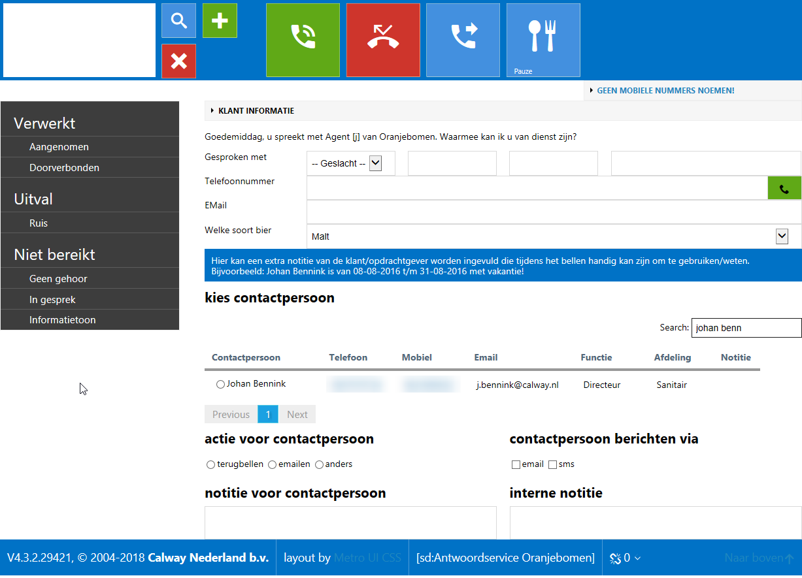

## Scriptvelden

De scriptdefinitie voor de antwoordservice bevat enkele verplichte
velden. Voor v4.3.2 was de opmaak vast met alle scriptvelden boven de
contactpersonen lijst en enkele vaste systeemvelden eronder. Vanaf
v4.3.2 is de opmaak gestuurd door de scriptdefinitie velden en kan
hierdoor ook worden aangepast.

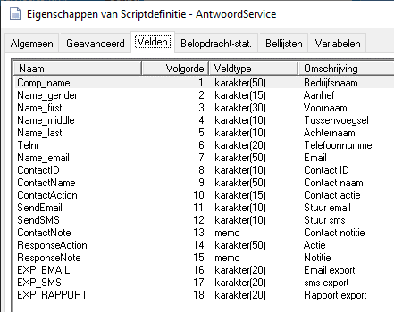

De velden die verplicht zijn voor de antwoordservice zijn: ContactID,
ContactName, ContactAction, SendEmail, SendSMS, ContactNote. De velden
ResponseAction en ResponseNote worden gebruikt vanuit de Customer Portal
login van de klant en worden niet weergegeven in het belscript. Ook de
drie EXP_EMAIL, EXP_SMS, EXP_RAPPORT velden zijn verplicht en worden
door de fulfilment procedure gebruikt.

### Contactpersonen (ContactID)

Bij de antwoordservice wordt voor een klant een lijst met
contactpersonen vastgelegd waarvoor notities kunnen worden aangenomen.
De geselecteerde contactpersoon wordt vastgelegd in het ContactID
scriptveld. Vanaf v4.3.2 wordt de contactpersonen lijst afgebeeld via
dit scriptveld. Hiervoor moet de standaard opmaak als volgt zijn
ingesteld, maar deze mag worden aangepast. Belangrijk blijft om
ContactID en ContactName te vullen met de gekozen contactpersoon.

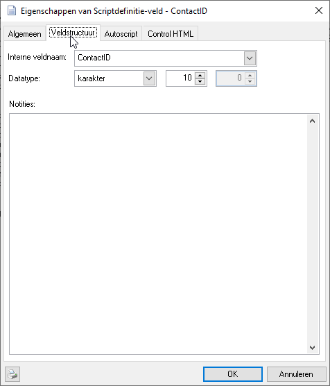
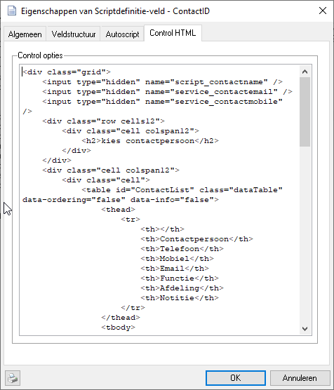

In het Control HTML veld staat de volgende standaard opmaak voor v4.3.2:
```
<div class="grid">
    <input type="hidden" name="script_contactname" />
    <input type="hidden" name="service_contactemail" />
    <input type="hidden" name="service_contactmobile" />

    <div class="row cells12">
        <div class="cell colspan12 fg-white" style="padding: 10px; background-color:\#0072c6;">
            %CURRENTCUSTOMER.SCRIPTTEXT2%
        </div>
    </div>
    <div class="row cells12">
        <div class="cell colspan12">
            <h2>kies contactpersoon</h2>
        </div>
    </div>
    <div class="cell colspan12">
        <div class="cell">
            <table id="ContactList" class="dataTable striped" data-ordering="false"
            data-info="false">
            <thead>
            <tr>
            <th></th>
            <th>Contactpersoon</th>
            <th>Telefoon</th>
            <th>Mobiel</th>
            <th>Email</th>
            <th>Functie</th>
            <th>Afdeling</th>
            <th>Notitie</th>
            </tr>
            </thead>
            <tbody>
            <!-- placeholder-->
            </tbody>
            </table>
        </div>
    </div>
</div>
<script>
var table;
$(document).ready(function() {
table = $('#ContactList').DataTable({
    "processing": true,
    "serverSide": true,
    "ajax": {
        "url":
        "/api/services/GetCustomerContacts?customerid=%CURRENTCUSTOMER.RESID%",
        "type": "GET",
    },
    "dom": "ftp",
    "columns": [
        { "data": "ResID" },
        { "data": "FullName" },
        { "data": "PhoneNumber" },
        { "data": "MobileNumber" },
        { "data": "Email" },
        { "data": "JobFunction" },
        { "data": "Department" },
        { "data": "Notes" },
    ],
    "columnDefs": [
        {
            "visible": false,
            "targets": [0]
        },
        {
            "render": function (data, type, row) {
                return "<input type='radio' class='DefaultRadioInput'
                name='script_contactid' value='" + row.ResID + "'
                onclick='setContactExtra("+row.ResID+")' />" + data
            },
            "targets": 1
        },
        {
            "render": function (data,type,row){
                return "<a href='\#' class='telnr' title='Gesprek doorverbinden'
                onclick='CallTransferBegin(" + '"' + data + '"' + ")'>" + data +
                "</a>";
            },
            "targets": [2,3]
        },
        {
            "render": function (data, type, row) {
                if(data==null || data=="")
                return "";
                else
                return "<a href='#' title='" + data + "'>Notitie</a>";
            },
            "targets": 7
        }
    ],
    "lengthMenu": [[10, 25], [10, 25]]
    } );
} );
</script>
```
In deze HTML opmaak is ook te zien dat gebruik wordt gemaakt van
server-side variabelen in de vorm van %CURRENTCUSTOMER.SCRIPTTEXT2% Deze
variabelen zijn op de server bekend ten tijde van het opmaken van de
pagina en zijn in de Fulfilment “merge-syntax”.

### Acties (ContactAction)

De actie voor de gekozen contactpersoon wordt bepaald via dit
scriptveld. Ook hier kan de standaard invullen worden aangepast. De
gekozen actie wordt direct overgenomen in de notificatie.

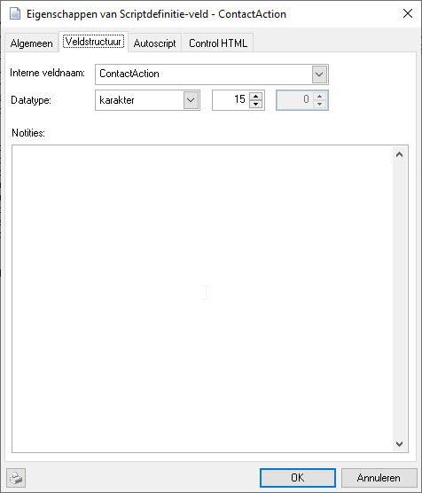 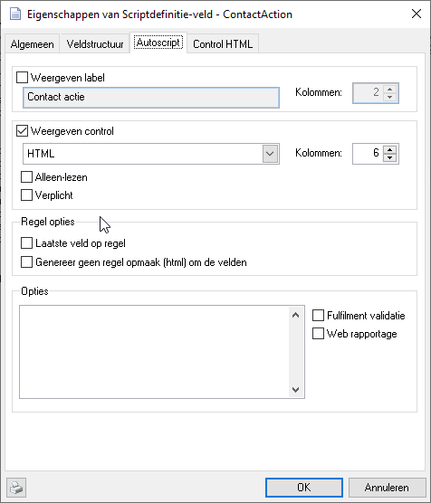
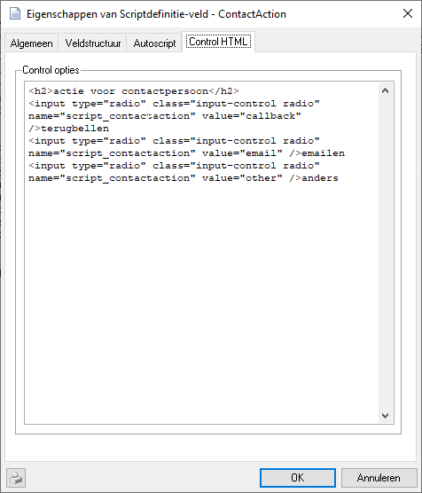

Ook hier wordt de opmaak gemaakt met een Control HTML blok:
```
<h2>actie voor contactpersoon</h2>

<input type="radio" class="input-control radio" name="script_contactaction" value="callback" />terugbellen

<input type="radio" class="input-control radio" name="script_contactaction" value="email" />emailen

<input type="radio" class="input-control radio" name="script_contactaction" value="other" />anders
```
Extra keuzemogelijkheden kunnen worden toegevoegd door meer radio regels
op te nemen.

### Contactpersoon berichten via (SendEmail, SendSMS)

De volgende twee velden bepalen op welke manier de notificatie wordt
verstuurd. Ook hier kunnen nieuwe methodes worden toegevoegd.

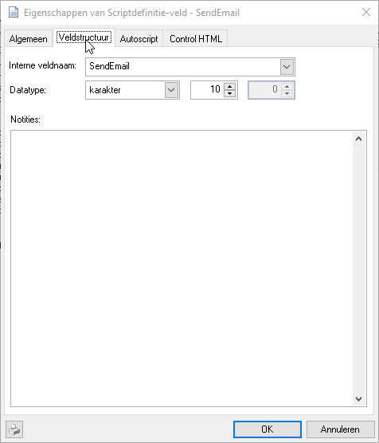 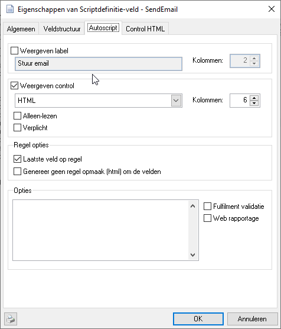
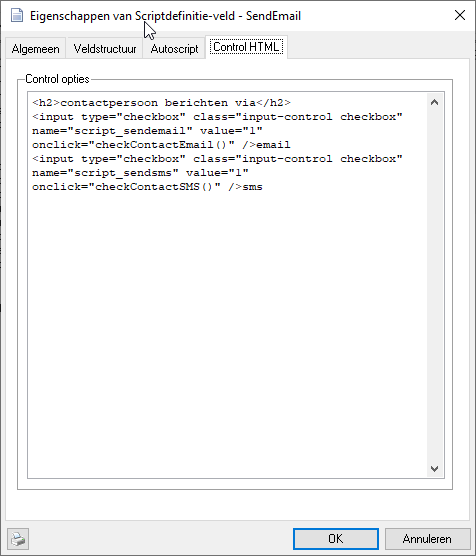

De opmaak wordt gemaakt met het SendEmail veld, bij het SendSMS veld
staat de optie “Weergeven control” uit.
```
<h2>contactpersoon berichten via</h2>

<input type="checkbox" class="input-control checkbox" name="script_sendemail" value="1" onclick="checkContactEmail()" />email

<input type="checkbox" class="input-control checkbox" name="script_sendsms" value="1" onclick="checkContactSMS()" />sms
```

### Notitie voor contactpersoon (ContactNote)

Bij de notificatie wordt een notitie meegestuurd. Daarnaast kan de agent
een interne notitie (entrynote) invullen. Voor de entrynote wordt niet
de standaard weergave gebruikt maar een compacte weergave voor de
antwoordservice.

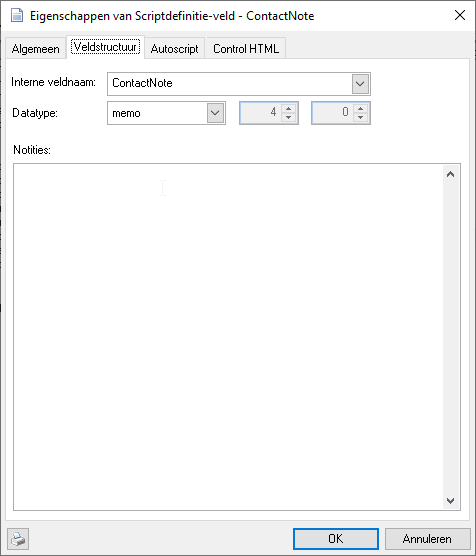 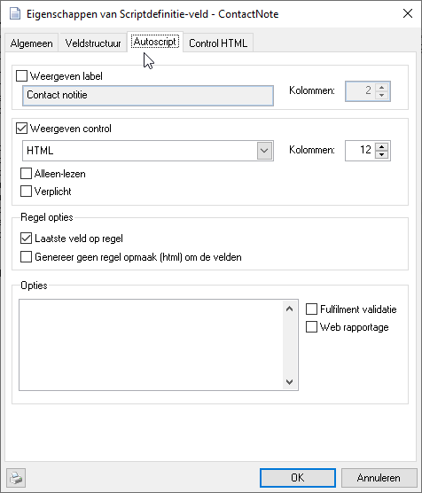
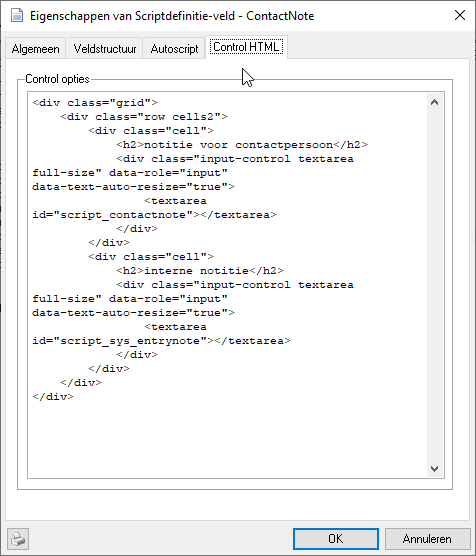

Ook hier wordt een Control HTML opmaak gebruikt:
```
<div class="grid">
    <div class="row cells2">
        <div class="cell">
            <h2>notitie voor contactpersoon</h2>
            <div class="input-control textarea full-size" data-role="input" data-text-auto-resize="true">
            <textarea id="script_contactnote"></textarea>
            </div>
        </div>
        <div class="cell">
            <h2>interne notitie</h2>
            <div class="input-control textarea full-size" data-role="input" data-text-auto-resize="true">
            <textarea id="script_sys_entrynote"></textarea>
            </div>
        </div>
    </div>
</div>
```
## Aanpassen scriptweergave

Hoewel de genoemde verplichte velden niet kunnen worden verwijderd uit
de scriptdefinitie kunnen velden wel onzichtbaar worden gemaakt. Ook kan
de volgorde van weergave en gebruik worden aangepast.

### Weergave introductie tekst

Bij de antwoordservice klant kunnen enkele velden worden vastgelegd die
in het belscript worden afgebeeld. De Introductietekst, of openingszin
is hier een van die in het belscript als volgt via de variabele
SCRIPT.INFO kan worden opgenomen in het belscript:

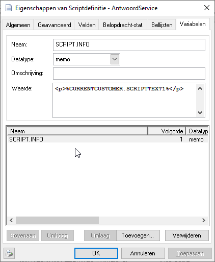
