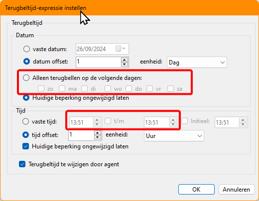
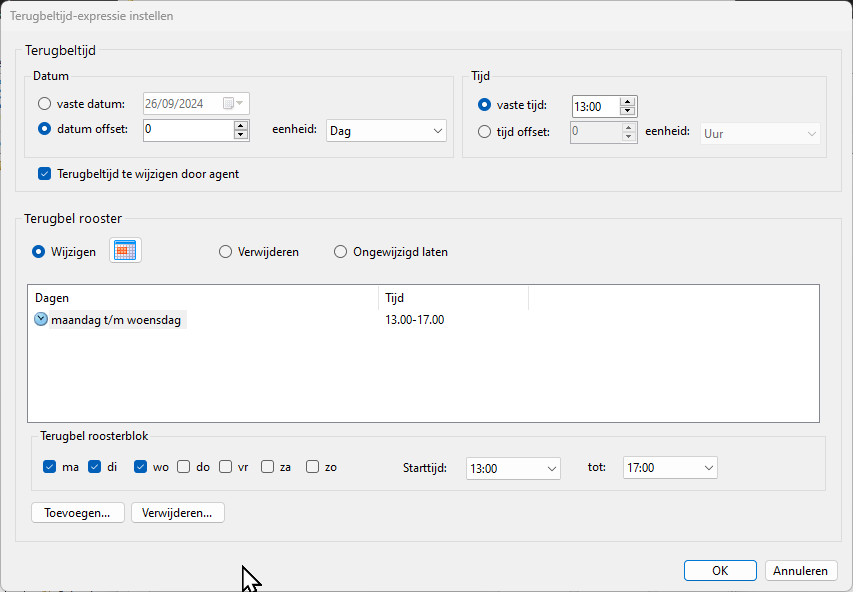
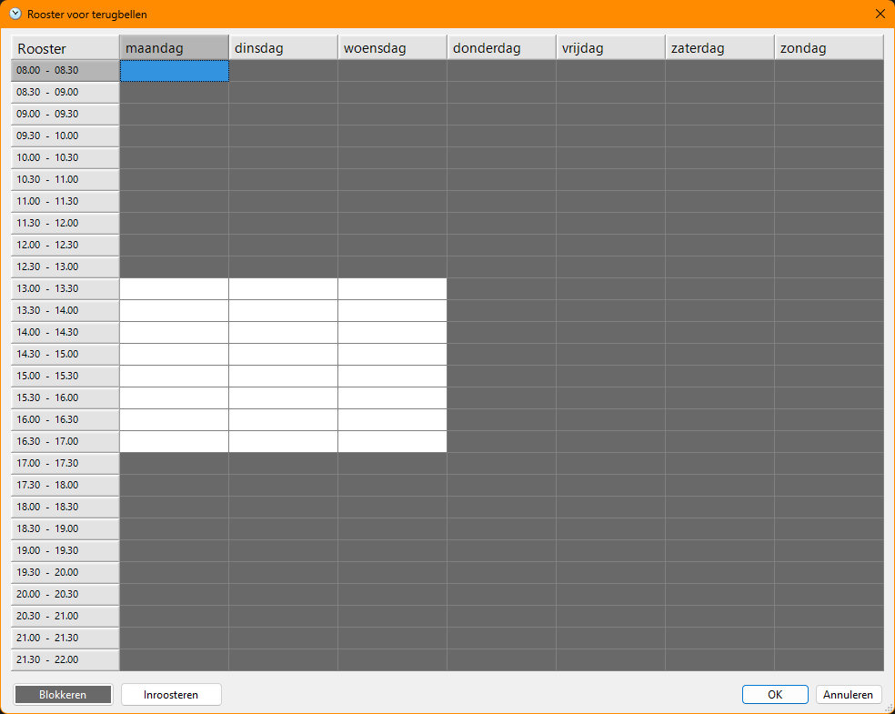
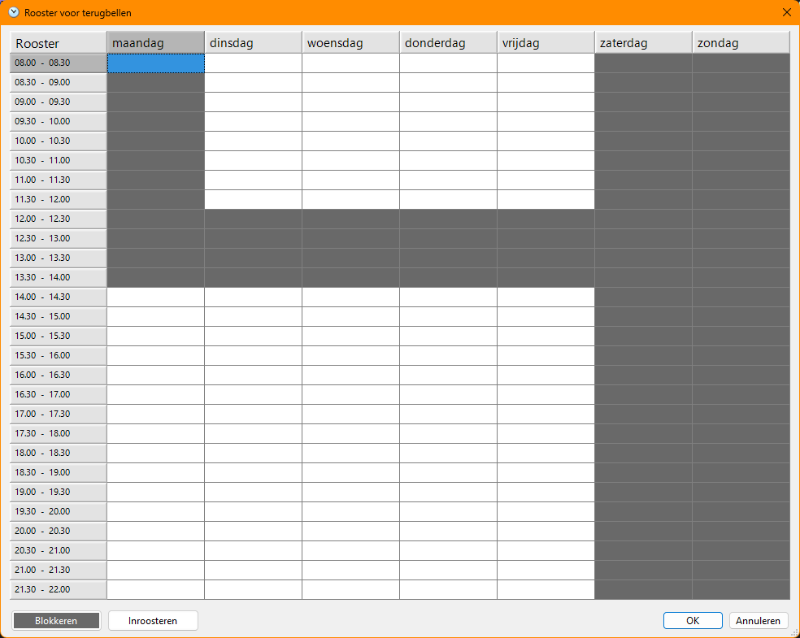
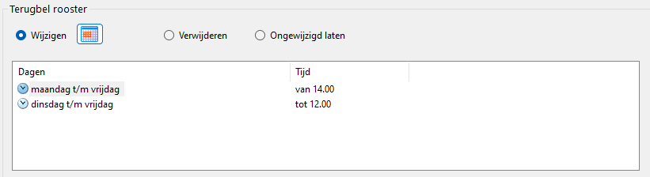
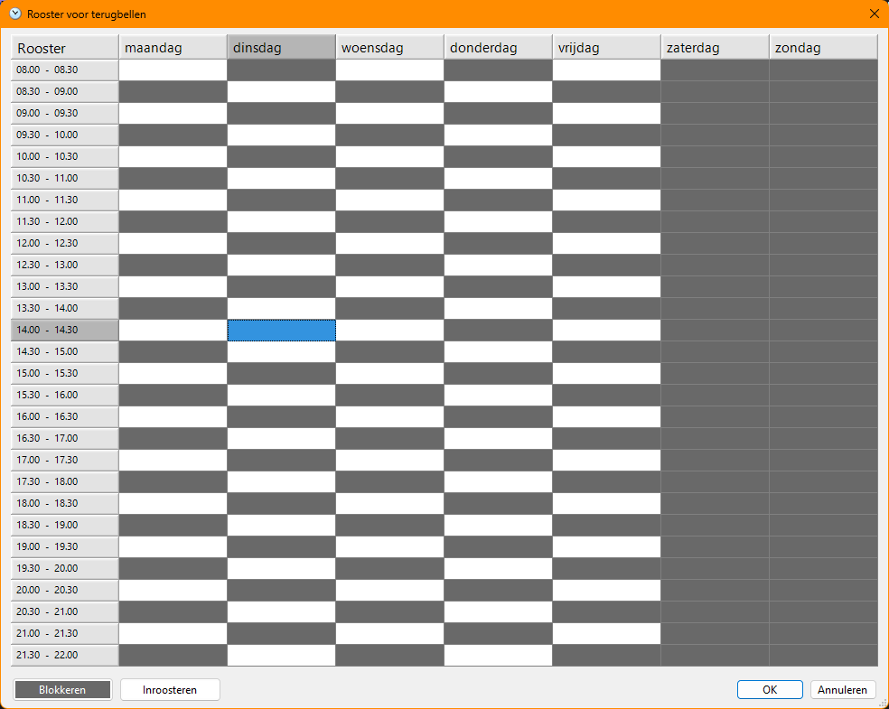

# Uitgebreide terugbel rooster instellingen
Het gedrag van CallPro met wanneer een belopdracht aangeboden kan worden zal worden aangepast. Op dit moment (CallPro database versie 4.3.2 en 5.0.0) zijn er twee opties die gebruikt kunnen worden om qua beldagen en tijdsreeks een beperking te zetten op het aanbieden van een belopdracht. Als de ingestelde terugbeltijd voor een belopdracht is verstreken kan het aanbieden verder worden begrensd door deze instellingen.

Een beperking bij deze werkwijze is dat je alleen een tijdreeks met begin en eindtijd kunt opgeven die voor elke dag geldt. Ook heeft elke dag dezelfde begrenzing.

Als iemand zegt "Op maandagochtend zijn wij gesloten en tussen 12:00 en 14:00 hebben we liever geen telefoontjes" dan is dat niet mogelijk.

Deze schema's zijn alleen op de status in te stellen, of via afcodeer hyperlinks in het belscript te plaatsen en zo zijn er nog wat kleinere beperkingen.

## Nieuwe Terugbel tijdschema's CallPro 5.1.0
Vanaf CallPro database versie 5.1.0 wordt een nieuwe manier van terugbel tijdschema's geintroduceerd. 

We introduceren een nieuwe manier van terugbel tijdschema's waarbij voor elke dag van de week tussen 08:00 en 22:00 per half uur kan worden aangegeven of er gebeld mag worden of niet.

Het nieuwe terugbel rooster sectie bevat dezelfde mogelijkheden als het oude venster -- de rood onlijnde delen -- alleen met veel meer mogelijkheden.

Door meerdere regels te maken kunnen verschillende tijdsbegrenzingen voor verschillende dagen worden gemaakt. Nog eenvoudiger kan dit worden ingesteld door de calendar button achter **Wijzigen** te drukken. Nu kan in een grid layout per half uur worden ingesteld of er gebeld kan worden (inroosteren) of niet (Blokkeren).

In bovenstaande voorbeeld staat het schema "maandag t/m woensdag van 13:00-17:00" afgebeeld.

Het eerdere voorbeeld "Op maandagochtend zijn wij gesloten en tussen 12:00 en 14:00 hebben we liever geen telefoontjes" ziet er dan zo uit:

En als dit staat ingesteld op een belopdracht zie je dat in de eigenschappen zo:

Deze belopdracht wordt na 27 september om 14:00 voor het eerst aangeboden. Lukt het op Vrijdag niet, dan komt deze alleen van maandag t/m vrijdag na 14:00 of dinsdag t/m vrijdag tot 12:00 aan bod.

En ja je kunt hier onnodig complexe roosters mee maken die in de praktijk niet voorkomen, maar elk vreemd scenario zou hier binnen passen. Omdat het kan hoef je dit nog niet te doen!

## Gebruik het terugbel rooster in een belscript
Om het terugbel rooster vanuit het belscript direct weer te geven of te wijzigen kan deze guide worden gebruikt: [Stel een callback rooster in op een belopdracht](../../guides/autoscript/autoscript-set-callback-schedule-for-entry.md)