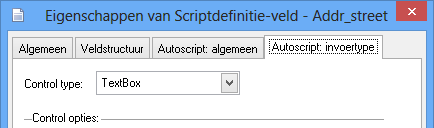

# Inhoudsopgave

[Het autoscript](#het-autoscript)

[Toolbar](#toolbar)

[Belopdrachtstatussen](#belopdrachtstatussen-1)

[Scriptvelden](#scriptvelden)

[Belopdrachtnotitie](#belopdrachtnotitie)

[Pagina footer](#pagina-footer)

[Scriptdefinitie instellingen](scriptdefinitie-instellingen.md#scriptdefinitie-instellingen)

[Extra autoscript instellingen](scriptdefinitie-instellingen.md#extra-autoscript-instellingen)

[Globale campagne instellingen](scriptdefinitie-instellingen.md#globale-campagne-instellingen)

[Agentgroup instellingen](scriptdefinitie-instellingen.md#agentgroup-instellingen)

[Campagne instellingen](scriptdefinitie-instellingen.md#campagne-instellingen)

[Status instellingen](scriptdefinitie-instellingen.md#status-instellingen)

[Veld weergave](#veld-weergave)

[Textbox](#textbox)

[Textarea](#textarea)

[Radiobutton](#radiobutton)

[Checkbox](#checkbox)

[Combobox](#combobox)

[Label](#label)

[HTML](#html)

[Hidden](#hidden)

[Weergave opties](#weergave-opties)

[Datum velden](#datum-velden)

[Naam velden](#naam-velden)

[Overige functies](#overige-functies)

[Opmaak](#opmaak)

[Geavanceerde opmaak met het autoscript](#fulfilment-variabelen-voor-server-side-opmaak)

[Maatwerk opmaak voor invoervelden](#maatwerk-opmaak-voor-invoervelden)

[Plaats velden binnen een tabcontrol](#plaats-velden-binnen-een-tabcontrol)

[Belhistorie resultaten aanpassen met CSS opmaak](#belhistorie-resultaten-aanpassen-met-css-opmaak)

[Afcoderingen verbergen in de statuslijst met CSS opmaak](#afcoderingen-verbergen-in-de-statuslijst-met-css-opmaak)

[Custom validatie tijdens afcoderen](#custom-validatie-tijdens-afcoderen)

[Antwoordservice pagina](#antwoordservice-pagina)

[Scriptvelden](#scriptvelden-1)

[Contactpersonen (ContactID)](#contactpersonen-contactid)

[Acties (ContactAction)](#acties-contactaction)

[Contactpersoon berichten via (SendEmail, SendSMS)](#contactpersoon-berichten-via-sendemail-sendsms)

[Notitie voor contactpersoon (ContactNote)](#notitie-voor-contactpersoon-contactnote)

[Aanpassen scriptweergave](#aanpassen-scriptweergave)

[Weergave introductie tekst](#weergave-introductie-tekst)

[Pauze pagina](#pauze-pagina)

[Belscripts maken voor gevorderden](#Belscripts-maken-voor-gevorderden)

[Script systeemacties](#script-systeemacties)

[Terugbellenscherm](#terugbellenscherm)

[Verwerkscherm](#verwerkscherm)

[Niet-bereikt scherm](#niet-bereikt-scherm)

[Belopdracht afcoderen](#belopdracht-afcoderen)

[Starten windows applicatie](#starten-windows-applicatie)

[Herstellen/annuleren wijzigingen](#herstellenannuleren-wijzigingen)

[Aanmelden](#aanmelden)

[Pauze](#pauze)

[Uitloggen](#uitloggen)

[Telefoonnummer kiezen](#telefoonnummer-kiezen)

[Beëindig gesprek](#beëindig-gesprek)

[Doorschakelen naar Bel-me-niet IVR](#doorschakelen-naar-bel-me-niet-ivr)

[Beantwoord gesprek](#Beantwoord-gesprek)

[Dialing configuratie](#dialing-configuratie)

[Verander wachtwoord](#verander-wachtwoord)

[Nieuwe belopdracht](#nieuwe-belopdracht)

[Zoek belopdracht](#zoek-belopdracht)

[Terug navigeren](#terug-navigeren)

[Vooruit navigeren](#vooruit-navigeren)

[Belopdracht eigenschappen](#belopdracht-eigenschappen)

[Oproep agendamodul3](#oproep-agendamodule)

[Volgende belopdracht](#volgende-belopdracht)

[Call blending; overschakelen op andere dial mode](#call-blending-overschakelen-op-andere-dial-mode)

[Work modus van agent; het plaatsen van een agent in een work modus](#work-modus-van-agent-het-plaatsen-van-een-agent-in-een-work-modus)

[Cancel belopdracht; de belopdracht wordt beëindigd zonder te bewaren](#cancel-belopdracht-de-belopdracht-wordt-beëindigd-zonder-te-bewaren)

[Speciale hyperlink anchors](#speciale-hyperlink-anchors)

[Opnemen gesprek](#opnemen-gesprek)

[Gesprek direct doorschakelen (blind transfer)](#gesprek-direct-doorschakelen-blind-transfer)

[Gesprek met ruggespraak doorverbinden (attended transfer)](#gesprek-met-ruggespraak-doorverbinden-attended-transfer)

[Doorverbinden met ruggespraak annuleren](#doorverbinden-met-ruggespraak-annuleren)

[Doorverbinden met ruggespraak voltooien](#doorverbinden-met-ruggespraak-voltooien)

[Doorverbinden wissel gesprekken](#doorverbinden-wissel-gesprekken)

[Verstuur DTMF-tonen](#verstuur-dtmf-tonen)

[Zet een gesprek on hold](#zet-een-gesprek-on-hold)

[Belscript (querystring) parameters](#belscript-querystring-parameters)

[Belscript startpagina](#belscript-startpagina)

[Pauze pagina](#pauze-pagina-1)

[Inbound pagina](#inbound-pagina)

[Belscript systeemvelden (OBSOLETE)](#belscript-systeemvelden-deprecated)

[Object hiërarchische velden](#object-hiërarchische-velden)

[Basis eigenschappen](#basis-eigenschappen)

[oEntry](#oentry)

[oAttempt](#oattempt)

[oCallList](#ocalllist)

[oDialer](#odialer)

[oAgent](#oagent)

[oCallstatus](#ocallstatus)

[oAppointment](#oappointment)

[CallPro objectmodel](#callpro-objectmodel)

# Belscripts maken voor beginners

CallPro wordt geleverd met een autoscript. Met het autoscript wordt een
eenvoudige callflow op basis van de velden in de scriptdefinitie
gemaakt. Hiermee kan een basis campagne zeer snel worden opgestart. Dit
hoofdstuk hoort bij de cursus “Belscript maken voor beginners”.

# Het autoscript

Het autoscript bestaat uit een aantal vaste onderdelen zoals in
onderstaand afbeelding weergegeven.


## Toolbar

In de toolbar wordt campagne en belopdracht informatie afgebeeld.
Helemaal links staat het logo dat is ingesteld op de scriptdefinitie. Op
deze manier kan per opdracht(gever) een eigen identiteit aan de campagne
gegeven worden. Zorg ervoor dat een afbeelding met formaat 310x150 wordt
gebruikt, of een verhouding die hieraan gelijk is.


De tweede tile geeft informatie over de laatste belpoging weer. Daarna
komt een optionele tile om de agendamodule te openen. Deze tile wordt
alleen afgebeeld als er een afspraak status wordt gebruik in de lijst
met belopdrachtstatussen.

Daar weer naast staan 4 tiles voor het bellen, ophangen, doorschakelen
en optioneel een bel-me-niet tile. Helemaal rechts staat de Pauze tile.

Als gebruikt wordt gemaakt van een CTI-koppeling kan met de “Bel nummer”
knop (groen) het gesprek worden gestart, met “Ophangen” (rood) kan het
telefoongesprek worden beëindigd. De doorverbinden tile toont een popup
met doorverbinden met of zonder ruggespraak.


De “Bel-me-niet” tile (hier niet afgebeeld) kan indien beschikbaar het
gesprek worden doorgezet naar de bel-me-niet IVR.

Aanvullend kan ook Campagne informatie worden afgebeeld die in het
informatiebord bij de campagne staat ingesteld (weergeven in belscript).
Als extra kan ook een variabele SCRIPT.INFO worden gebruikt om
informatie hier te plaatsen.


Voor de weergave wordt gebruik gemaakt van een accordion.

## Belopdrachtstatussen

De voor de scriptdefinitie geactiveerde belopdrachtstatussen worden links in de groepen waarin ze binnen CallPro zijn gedefinieerd afgebeeld. 


Voor de groepering wordt gebruik gemaakt van de status groep waar de betreffende statussen in zijn aangemaakt. Subgroepen met zelfde naam worden samengevoegd. De volgorde van de statussen kan worden bepaald met de Resource Explorer. Ga op de groep “Belopdracht statussen” staan en right-click. Kies “Volgorde groepen…” om de weergave volgorde van de groepen te bepalen, en “Volgorde…”om de volgorde van de statussen te bepalen binnen deze groepen.

| | |
| --- | --- |
|  |  |

## Scriptvelden

Alle velden uit de scriptdefinitie worden in een standaard opmaak
afgebeeld. Vanaf V4.30 wordt het onderscheid tussen een blok met NAW en
BODY afgeschaft. Alle velden komen in 1 blok te staan in de volgorde
zoals ze in de scriptdefinitie staan. Hoewel de SCRIPT.NAW en
SCRIPT.BODY variabelen in de huidige versie nodig wel werken worden die
in de toekomst verwijderd en adviseren wij om nu al het gebruik af te
bouwen.


De scriptvelden worden standaard in de volgorde
uit de scriptdefinitie met 1 veld per regel weergegeven. Met de optie
“Laatste veld op de regel” wordt bepaald op het volgende veld op een
nieuwe regel komt, door dit bij een veld uit te zetten komt het volgende
veld ook op dezelfde horizontale regel.


Of weergave op 1 regel met de velden achter elkaar:

| | |
| --- | --- |
|  |  | 

## Belopdrachtnotitie

Hier kan een notitie worden vastgelegd door de telemarketeer. Tevens
wordt eronder een lijst afgebeeld met voorgaande belpogingen, alleen de
laatste is zichtbaar, de overige kunnen worden getoond door de blauwe
knoppen te gebruiken. In het grijze vlak staat de huidige notitie. In
het lege veld kan een nieuwe notitie worden gezet. Via knippen en
plakken kan ook informatie uit de vorige notitie worden overgenomen.


## Pagina footer

In de pagina footer wordt het versienummer van het autoscript afgebeeld
en staat tussen haakjes \[ \] de naam van de scriptdefinitie afgebeeld.
Helemaal rechts is een knop om snel naar boven te springen.


Met het hyperlink symbool gevolgd door een cijfer wordt aangegeven of
deprecated opties of ander problemen zijn herkend met de gebruikte
autoscript opties. Klik op dit item om een venster te openen met de
details.

## [Scriptdefinitie instellingen](scriptdefinitie-instellingen.md)


## Veld weergave

Het autoscript maakt gebruik van de informatie uit het tabblad
“Autoscript: invoertype” voor het afbeelden van de scriptvelden. De
volgende invoertypes worden ondersteund.

### Textbox

Dit maakt een invoerveld met 1 regel waar vrije tekst van een beperkte
lengte in kan worden ingevoerd. Zie als voorbeeld de **bedrijfsnaam**,
**voornaam**, **achternaam** en **plaats** velden.

### Textarea

Dit invoertype wordt gebruikt voor velden waar meer, en meerdere regels
aan vrije tekst worden ingevuld. Voor de opslag kan het beste een veld met datatype "memo" gebruikt worden. CallPro maakt zelf voor de belopdracht notitie ook gebruik van die invoertype.

### Radiobutton

Een radiobutton geeft meerdere keuzes (minimaal 2) waarbij slechts 1
keuze gemaakt kan worden. Het veld Q1 is een voorbeeld van een
radiobutton. Meestal gaat het om Ja/Nee, of Groen/Geel/Rood keuzes
waarbij altijd 1 antwoord/keuze de juiste is.

### Checkbox

De checkbox geeft de mogelijkheid om 1 of meer
keuzes waarbij het mogelijk is om, anders dan bij de radiobutton, ook
meerdere keuze te selecteren. Meestal gaat het om vragen over
kennisgebieden zoals “welke merken kent u”.

### Combobox

Een combobox werkt op dezelfde manier als een
radiobutton, er is slechts 1 keuze mogelijk. Qua weergave biedt de
combobox een compacte weergave indien de lijst met opties erg lang is.

### Label

Inde de inhoud van het scriptveld alleen hoeft te worden afgebeeld, maar
het niet nodig is om de waarde te wijzigen kan gebruik worden gemaakt
van een label. Het autoscript gebruikt in de Pagina header bijvoorbeeld
labels voor het weergaven van de waarden.

### HTML

Voor situaties waarbij een complexe of samengestelde weergave wenselijk
is die niet met de voorgenoemde invoertypes mogelijk is kan Custom HTML
worden gebruikt. Met dit type moet de scriptbouwer zelf de HTML opmaak
invullen voor weergave van een scriptveld.

### Hidden

Als het veld wel gebruikt wordt in javascript dan kan het type hidden
worden gebruikt. Hiermee wordt het veld onzichtbaar op de pagina gezet.

## Weergave opties


Het autoscript ondersteund speciale opties die de weergave beïnvloeden.
Deze worden opgegeven in het Opties veld. In dit veld kan een json object worden geplaatst met custom instellingen. Voor backward compatibility wordt tot 4.3.3 het noemen van de @functies driect in het veld ondersteund.

De opmaak is als volgt:
```
{  
“Version”: “1.0”,  
“DisplayFormat”: “\<format-strings\>”  
}
```
Voor \<format-strings\> kunnen vervolgens de volgende functies worden
gebruikt.

### Datum velden

Als een scriptveld van het datatype “Datum” is wordt bij het betreden
van het veld automatisch een kalender weergegeven. Voor bijvoorbeeld
karakter velden kan deze weergave worden geforceerd door bij de opties
de code @F(Date) in te vullen.

### Naam velden

Voor de weergave van namen zijn de volgende speciale format-strings
beschikbaar. Hiermee wordt de veldinhoud opgemaakt conform weergave
opties voor namen.

| Functie      | Werking                                                                                                  |
| ------------ | -------------------------------------------------------------------------------------------------------- |
| @F(Initials) | Weergave van initialen in hoofdletters met puntjes tussen de letters.                                    |
| @F(First)    | Weergave van de voornaam waarbij elke 1<sup>e</sup> letter van de naam in hoofdletters wordt gezet.      |
| @F(Middle)   | Weergave van tussenvoegsel in kleine letters.                                                            |
| @F(Last)     | Weergave van de Achternaam waarbij elke 1<sup>e</sup> letter van de naam in hoofdletters wordt gezet.    |
| @F(Lower)    | Weergave van tekst in kleine letters                                                                     |
| @F(Upper)    | Weergave van tekst in hoofdletters                                                                       |
| @F(Proper)   | Weergave van tekst met 1<sup>e</sup> letter van elk woord in hoofdletters, en de rest in kleine letters. |
| @F(TelNr)    | Forceer dat er een dialer knopje achter het veld wordt gezet                                             |
| @F(TelNr,M)  | Als voorgaande, maar nu met een mobiel icoon                                                             |

### Overige functies

Voor enkele andere velden zijn ook speciale format-strings beschikbaar.

<table>
<thead>
<tr class="header">
<th>Functie</th>
<th>Werking</th>
</tr>
</thead>
<tbody>
<tr class="odd">
<td>@F(Url)</td>
<td>Weergave van een wereldbol icoon knop achter het veld. Deze knop opent de website uit het veld in een popup venster.</td>
</tr>
<tr class="even">
<td>@F(Email)</td>
<td>Opmaak en controle van email adres invoer.</td>
</tr>
<tr class="odd">
<td>@F(IBAN)</td>
<td>Doe een IBAN check op een ingevoerd rekeningnummer. Dit is nog geen garantie dat het nummer correct is, of van de persoon die het nummer opgeeft!</td>
</tr>
<tr class="even">
<td>@F(ADDRESSPRO)</td>
<td><p>Voeg een knop achter het veld toe dat de systeem adres velden gebruikt voor een controle via de addresspro validatie service (hiervoor is een aparte licentie nodig).</p>
<p>Voor de validatie wordt het addr_zip en addr_number veld gebruikt om de addr_street en addr_city op te zoeken.</p></td>
</tr>
</tbody>
</table>

## Opmaak

De scriptvelden maken gebruik van een simpele opmaak. Elke scriptveld
wordt in een kolom gezet met een **Vraag** gevolgd door een **control**.
De Vraag komt uit het betreffende veld van het tabblad “Autoscript:
algemeen”. De control maakt gebruik van het op het tabblad “Autoscript:
invoertype” ingestelde invoertype.



De tekst uit het Vraag veld kan worden opgemaakt met standaard html
opmaak. De gebruikte MetroUI stijl die wordt gebruikt biedt een aantal
speciale opmaakcodes. Voor nu wordt enkel verwezen naar de webpagina van
het Metro UI project: <https://metroui.org.ua/v3/typography.html>

## Fulfilment variabelen voor server-side opmaak

Ook in het autoscript zijn enkele fulfilment variabelen beschikbaar die
op de server worden uitgevoerd en in de pagina worden gezet. Deze velden
kunnen op de meeste plaatsen waar html of tekst kan worden geplaatst
worden gebruikt.

| Veld                | Waarde |
| ------------------- | ------ |
| %AGENT.RESID%    | Unieke ID van de Agent |
| %AGENT.RESNAME%  | Naam van de Agent |
| %AGENT.RESDESCR% | Omschrijving die bij de Agent is ingevuld |
| %AGENT.PARENTID% | Unieke ID van de agentgroep waar deze Agent in staat |
| %AGENT.ACCOUNT% | Account naam |
| %AGENT.EMAIL% | Email adres |
| %AGENT.GENDER% | Geslacht M/V | 
| %AGENT.MOBILETELNR% | Mobiele telefoonnummer | 
| %AGENT.HOMETELNR% | Vast telefoonnummer | 
| %AGENT.\_\_\_\_\_% | Aanvullend worden alle variabelen die bij de agent zijn vastgelegd ook opgenomen. **LET OP! Indien een variabele naam overeenkomt met een van de bovenstaande velden wordt deze waarde overschreven!** | 

| Veld                | Waarde |
| ------------------- | ------ |
| %CAMPAIGN.RESID%    | Unieke ID van de Campagne |
| %CAMPAIGN.RESNAME%  | Naam van de Campagne |
| %CAMPAIGN.RESDESCR% | Omschrijving die bij de Campagne is ingevuld |
| %CAMPAIGN.PARENTID% | Unieke ID van de campagnegroep waar deze Campagne in staat |

| Veld                | Waarde |
| ------------------- | ------ |
| %CALLLIST.RESID%    | Unieke ID van de Bellijst |
| %CALLLIST.RESNAME%  | Naam van de Bellijst |
| %CALLLIST.RESDESCR% | Omschrijving die bij de Bellijst is ingevuld |
| %CALLLIST.PARENTID% | Unieke ID van de bellijstgroep waar deze Bellijst in staat |
| %CALLLIST.SCRIPTID% | Unieke ID van de scriptdefinitie waar deze bellijst op is gebaseerd |

| Veld                 | Waarde |
| -------------------- | ------ |
| %ENTRY.CLENTRYID%    | Unieke ID van de belopdracht |
| %ENTRY.STATID%       | Unieke ID van de belopdrachtstatus |
| %ENTRY.STATPRIORITY% | Statusprioriteitwaarde voor belopdracht |
| %ENTRY.TELNR%        | 1e Telefoonummer van de belopdracht |
| %ENTRY.TELNRID%      | ID die aangeeft welk telefoonnummer veld actief is |
| %ENTRY.NOTES%        | Agent notitie van deze belopdracht |

| Veld                  | Waarde |
| --------------------- | ------ |
| %STATUS.STATID%       | Unieke ID van de Status |
| %STATUS.STATCODE%     | Verkorte statuscode |
| %STATUS.RESNAME%      | Status naam |
| %STATUS.STATPRIORITY% | Status prioriteit |

| Veld                | Waarde                                                   |
| ------------------- | -------------------------------------------------------- |
| %SCRIPT.\_\_\_\_\_% | Voor elk veld uit de scriptdefinitie is er een variabele |

| Veld                | Waarde                                                   |
| ------------------- | -------------------------------------------------------- |
| %VARIABLE.\_\_\_\_\_% | Voor elke variabele dis is gedefinieerd op de scriptdefinitie is er een waarde. Daarna worden de variabelen op de campagne opgenomen. ** LET OP! Als op de campagne variabelen met dezelfde naam als op de scriptdefinitie zijn gedefinieerd dan worden deze waarden overschreven en blijft de waarde die is gedefinieerd bij de campagne over. ** |


## [Geavanceerde opmaak met het autoscript](geavanceerde-autoscript-opmaak.md)

# [Antwoordservice pagina](antwoordservice-autoscript.md)

# [Pauze pagina](pauze-autoscript.md)

# [Belscripts voor gevorderen](belscripts-maken-voor-gevorderden.md)

# Belscript systeemvelden (deprecated)

In het belscript worden de velden voorafgegaan door een speciale prefix
**script\_**. De waarden van deze velden worden in de CallPro-database
opgeslagen. De prefix wordt in het belscript toegevoegd aan de veldnaam
om duidelijk het onderscheid aan te geven tussen bellijstvelden en
overige velden in het script.

Belscript-systeemvelden worden aan het belscript meegegeven. De waarden
van deze velden zijn dus beschikbaar in het belscript. Ze zijn te
herkennen aan de prefix **script\_sys\_** en worden gezet door
**CallPro**.

Wij raden af om deze methode te gebruiken en adviseren in de plaats
daarvan de object hierarchische velden in te zetten.

| Systeemveld                      | Hierarchisch veld                                            | Betekenis                                                                                                                                                                                                                                                                                                                                                                                                                                                                                                              |
| -------------------------------- | ------------------------------------------------------------ | ---------------------------------------------------------------------------------------------------------------------------------------------------------------------------------------------------------------------------------------------------------------------------------------------------------------------------------------------------------------------------------------------------------------------------------------------------------------------------------------------------------------------- |
| script\_sys\_agentid             | script\_sys\_oagent\_id                                      | Dit is de unieke code van de agent die op dit moment contact legt met het telefoonnummer.  |
| script\_sys\_agentname           | script\_sys\_oagent\_name                                    | Dit is de naam zoals die voor de agent is vastgelegd.  |
| script\_sys\_clentryid           | script\_sys\_oentry\_id                                      | De unieke identificatie van de huidige item dat wordt weergegeven door het belscript. |
| script\_sys\_callagentid         | script\_sys\_oentry\_ocallbackagent\_id                      | De unieke code van de agent die de vorige belpoging heeft gedaan. |
| script\_sys\_callagentname       | script\_sys\_oentry\_ocallbackagent\_name                    | De naam van de agent die de vorige belpoging heeft gedaan.  |
| script\_sys\_callbegindatetime   | script\_sys\_                                                | De datum + tijd van de start van het gesprek. Dit is het tijdstip waarop het bellijstitem is aangeboden bij de agent. Dit komt niet exact overeen met het tijdstip waarop de agent contact legt.  |
| script\_sys\_callbegindate       | script\_sys\_                                                | Het datum-deel van het veld CallBegin.  |
| script\_sys\_callbegintime       | script\_sys\_                                                | Het tijd-deel van het veld CallBegin. |
| script\_sys\_scriptname          | script\_sys\_                                                | De naam van het belscript dat wordt weergegeven in de Script Explorer.  |
| script\_sys\_calllistid          | script\_sys\_ocalllist\_id                                   | De unieke code van de bellijst waaruit het huidige weergegeven item komt.  |
| script\_sys\_calllistname        | script\_sys\_ocalllist\_name                                 | De naam van de bellijst.  |
| script\_sys\_importid            | script\_sys\_oentry\_importid                                | De unieke code van de Import die het huidige item heeft toegevoegd aan de bellijst.  |
| script\_sys\_callstatusid        | script\_sys\_oentry\_ocallstatus\_id                         | De belopdrachtstatus die het item had op het moment dat het aan de Agent is aangeboden. De standaard bij CallPro geleverde belopdrachtstatussen hebben de volgende id's: nieuwe belopdracht (0), verwerkt (1), sit tone (2), geen gehoor (3), voicemail (4), fax/modem (5), in gesprek (6), terugbellen (7), afspraak (8) (bij de agendamodule). |
| script\_sys\_callstatusname      | script\_sys\_oentry\_ocallstatus\_name                       | De omschrijving van de belopdrachtstatus. |
| script\_sys\_callstatusdatetime  | script\_sys\_oentry\_callstatdatetime                        | De datum + tijd waarop de belopdrachtstatus is gezet. In het belscript kan dit veld worden gebruikt om te refereren naar het vorige contact. |
| script\_sys\_callpriority        | script\_sys\_oentry\_statpriority                            | De prioriteit van het item in de bellijst. Des te hoger de waarde, des te lager de prioriteit. Voor meer uitleg over Statusprioriteiten. |
| script\_sys\_noreachflag         | script\_sys\_oentry\_noreachflag                             | Met deze vlag wordt aangegeven of het item een **Niet bereikt**-status had op het moment dat het aan de Agent is aangeboden. Dit veld kan worden gebruikt in het belscript om een gewijzigde tekst weer te geven. |
| script\_sys\_callstatuscatid     | script\_sys\_                                                | De unieke code van de prioriteit van de belopdrachtstatus. Er zijn vier categorieën: Niet bereikt (waarde=1), terugbellen (waarde=2), verwerkt (waarde=3) en nieuwe belopdracht (waarde=4). De prioriteit bepaalt de verwerkingsvolgorde van de belopdrachten.  |
| script\_sys\_nrofattempts        | script\_sys\_oentry\_nrofattempts                            | Dit veld geeft het totaal aantal belpogingen aan op dit telefoonnummer. |
| script\_sys\_nrofnoreach         | script\_sys\_oentry\_nrofnoreach                             | Dit veld geeft het aantal belpogingen waarbij voor de optie **Niet bereikt** is gekozen sinds het laatste contact. Telkens als contact is geweest en het gesprek wordt beëindigd met **Verwerk** of **Terugbellen** wordt deze telling op 0 gezet.  |
| script\_sys\_entrynote           | script\_sys\_oentry\_notes                                   | Opmerkingen die aan een belopdracht kunnen worden toegevoegd. |
| script\_sys\_campaignid          | script\_sys\_ocampaign\_id                                   | De unieke code van de campagne waarin de huidig geactiveerde bellijst staat. |
| script\_sys\_campaignname        | script\_sys\_ocampaign\_name                                 | De naam van de campagne. |
| script\_sys\_cli                 | script\_sys\_odialer\_                                       | Voor het inbound CLI-nummer. |
| script\_sys\_ddi                 | script\_sys\_odialer\_                                       | Voor het inbound DDI-nummer.  |
| script\_sys\_dialmode            | script\_sys\_odialer\_                                       | De dial-mode van de agent; 1=outbound, 5=inbound.  |
| script\_sys\_lastcontactdatetime | script\_sys\_oentry\_olastcontactattempt\_ callbegindatetime | Dit veld geeft de tijd aan waarop het laatst contact is geweest met de klant/prospect.  |

# Object hiërarchische velden

Naast de belscript systeemvelden is er nog een methode om systeemvelden
op te vragen. Deze methode maakt gebruik van een naam die het volledige
pad uit het CallPro scripting objecten gebruikt. De volgende scripting
objecten worden ondersteund:

| Object            | Betekenis                                                                 |
| ----------------- | ------------------------------------------------------------------------- |
| oAgent            | De agent die is ingelogd                                                  |
| oSeat             | De werkplek waarop is ingelogd                                            |
| oEntry            | De huidige belopdracht die op het scherm staat en wordt bewerkt           |
| oCampaign         | De campagne waar de huidige belopdracht uit afkomstig is                  |
| oCallList         | De bellijst waar de huidige belopdracht zich bevindt                      |
| oCallListShortcut | De bellijst koppeling in de campagne waaruit de belopdracht is aangeboden |
| oDialer           | Het dialer object dat wordt gebruikt                                      |

Sommige objecten zijn afhankelijk van de context waarin ze worden
gebruikt. Bijvoorbeeld script\_sys\_oagent\_name Geeft de naam van de
agent dis is ingelogd. Terwijl script\_sys\_oentry\_ocallbackagent\_name
de naam geeft van de agent die op de huidige belopdracht staat ingesteld
als terugbelagent.

TODO verder uitwerken van de properties en sub-objecten (de hiërarchie)

## Basis eigenschappen

| Object  | Betekenis                                                |
| ------- | -------------------------------------------------------- |
| Name    | De naam (identificatie) van de CallPro resource          |
| ID      | Unieke identificatie van de CallPro resource             |
| Descr   | De omschrijving die is ingevuld voor deze resource       |
| Enabled | Is deze resource actief of niet                          |
| Path    | Volledige pad waar deze resource zich in CallPro bevind. |

## oEntry

Naast de basis eigenschappen heeft het oEntry object de volgende
aanvullende objecten en properties die kunnen worden uitgelezen.

| Object/Property           | Betekenis                                                                                                                                                                                      |
| ------------------------- | ---------------------------------------------------------------------------------------------------------------------------------------------------------------------------------------------- |
| oCallList                 | De bellijst waar deze belopdracht toe behoort.                                                                                                                                                 |
| oCallbackAgent            | De ingestelde terugbelagent                                                                                                                                                                    |
| oCallstatus               | De status die deze belopdracht op dit moment heeft                                                                                                                                             |
| oLastContactAttempt       | Een verwijzing naar de belpoging die correspondeert met het voorgaande live contact (op basis van de toegekende status)                                                                        |
| oFirstCurrentAppointment  |                                                                                                                                                                                                |
| oLastPassedAppointment    |                                                                                                                                                                                                |
| CallStatDateTime          | De datum/tijd die is ingesteld tijdens het afcoderen. Dit kan de datum van afcoderen zijn, maar voor Terugbellen/Niet bereikt staat hier de datum waarop de belopdracht weer wordt aangeboden. |
| CallbackDateTime          | Dit is de datum/tijd die is ingesteld op het moment van de vorige afcodering met ene terugbellen status                                                                                        |
| StatPriority              | De voor deze belopdracht geldende status prioriteit. Deze waarde bepaalde de volgorde van aanbieden. Hoe lager de waarde hoe eerder deze belopdracht wordt aangeboden.                         |
| NrOfAttempts              | Het huidige aantal voorgaande belpogingen                                                                                                                                                      |
| NrOfNoReach               | Het huidige aantal voorgaande Niet bereikt afcoderingen. Telkens nadat een Terugbellen wordt afgecodeert wordt dit getal weer op 0 gezet.                                                      |
| CallbackDelay             |                                                                                                                                                                                                |
| CallbackDelayDescr        |                                                                                                                                                                                                |
| InitialCallbackDelay      |                                                                                                                                                                                                |
| InitialCallbackDelayDescr |                                                                                                                                                                                                |
| NoReachFlag               |                                                                                                                                                                                                |
| ImportID                  |                                                                                                                                                                                                |
| Notes                     | De huidige belopdracht notitie                                                                                                                                                                 |
| TelNr                     | Het telefoonnummer (opgemaakt)                                                                                                                                                                 |
| SelectedTelNr             | Het telefoonnummer dat CallPro op dit moment actief benaderd                                                                                                                                   |
| SelectedRAWTelNr          | De RAW versie van het actieve telefoonnummer                                                                                                                                                   |
| RAWTelNr                  | Het telefoonnummer zoals het in de database is opgeslagen                                                                                                                                      |

## oAttempt

| Object/Property   | Betekenis |
| ----------------- | --------- |
| oCallstatus       |           |
| CallStatsDateTime |           |
| CallBeginDateTime |           |
| CallSetupDateTime |           |
| CallEndDateTime   |           |

## oCallList

Een CallPro bellijst resource

| Object/Property | Betekenis |
| --------------- | --------- |
|                 |           |

## oDialer

Het Dialer object geeft toegang tot diverse dialer instellingen

| Object/Property | Betekenis |
| --------------- | --------- |
| CLI             |           |
| CallerNumber | | 
| DDI             |           |
| DialMode        |           |
| IsAgentReady    | |
| AgentState | |
| AgentStateDescr | | 
| IsQueriedAgentReady | | 
| QueriedAgentState | |
| QueriedAgentStateDescr | |

## oAgent

Het Agent resource wordt meestal genoemd icm de specifieke toepassing.
Bijvoorbeeld oCreatedUser of oModifiedUser of zelfs oCallbackAgent. Wij
benoemen het object hier bij zijn algemene naan oAgent.

| Object/Property | Betekenis |
| --------------- | --------- |
| UserName        |           |

## oCallstatus

De CallPro belopdrachtstatus resource.

| Object/Property | Betekenis |
| --------------- | --------- |
|                 |           |

## oAppointment

Het Appointment resource wordt meestal genoemd icm de specifieke
toepassing. Bijvoorbeeld oFirstCurrentAppointment of
oLastPassedAppointment.

| Object/Property | Betekenis |
| --------------- | --------- |
|                 |           |

# CallPro objectmodel

Het CallPro objectmodel dat door de windows client wordt beschikbaar
gesteld.

TODO ook dit uitwerken met javascipt voorbeelden

In de nieuwe script module is een reference te krijgen via
“window.external”
