# CallPro FAQ

[Programma meldingen](#programma-meldingen)

[Melding bij aanmelden](#melding-bij-aanmelden)

[Dubbel opstarten Scriptmodule](#dubbel-opstarten-scriptmodule)

[Ik krijg de melding “Belopdracht is al in gebruik” hoe kan dat?](#ik-krijg-de-melding-belopdracht-is-al-in-gebruik-hoe-kan-dat)

[Hoe voorkom ik dat de klok op de werkstations fout staan ingesteld](#hoe-voorkom-ik-dat-de-klok-op-de-werkstations-fout-staan-ingesteld)

[Optie “Processen opruimen” of “Markeer als crashed” werkt niet](#optie-processen-opruimen-of-markeer-als-crashed-werkt-niet)

[Terminalserver ondersteuning CallPro](#terminalserver-ondersteuning-callpro)

[Kan de agent zien in welke fase hij/zij zit?](#kan-de-agent-zien-in-welke-fase-hijzij-zit)

[Ik open een venster maar deze zie ik niet op de monitor verschijnen](#ik-open-een-venster-maar-deze-zie-ik-niet-op-de-monitor-verschijnen)

[Vensters met icoon in de linker bovenhoek](#vensters-met-icoon-in-de-linker-bovenhoek)

[Overige vensters](#overige-vensters)

# Programma meldingen

## Melding bij aanmelden

Als bij het aanmelden vanuit pauze de volgende melding komt kan dit twee
oorzaken hebben.

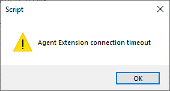

1.  De agent heeeft de oproep van zijn toestel (softphone) niet tijdig
    beantwoord. CallPro laat het toestel ongeveer 20 seconden overgaan.

2.  Het toestel bij de werkplek ging helemaal niet over. Ook dit kan
    weer meerdere oorzaken hebben.
    
    1.  Controleer eerst of het juiste toestelnummer is gebruikt
    
    2.  Controleer of het toestel kan bellen en gebeld worden op het
        nummer.

Na het oplossen van de problemen kan het aanmelden opnieuw worden
geprobeerd.

## Dubbel opstarten Scriptmodule

Als bij het opstarten van de Scriptmodule de onderstaande melding volgt
dan kan dit verschillende oorzaken hebben:

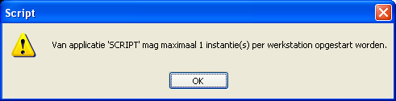

Voor Windows werkstations gelden de volgende stappen:

1.  Kijk in de statusbalk in windows of er niet al een Scriptmodule is
    gestart. 

2.  Open de Taskmanager en kijk of er nog een script.exe proces extra
    is. 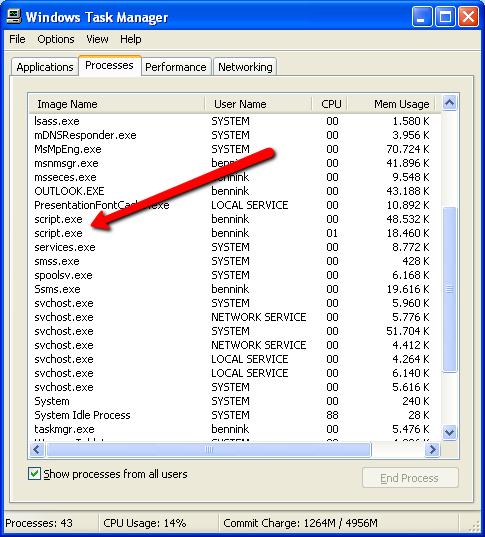

3.  Start de computer opnieuw en probeer de scriptmodule te starten. Als
    zich het probleem blijft voordoen dan is op de server (SQL Server)
    een proces voor dit werkstation blijven hangen). Start de Resource
    Explorer, ga naar de Werkplek resource toe, open de eigenschappen en
    ga naar het tabblad Inlogstatus. Gebruik nu de knop “Opruimen
    processen” of “Markeer als crashed” om de server processen op te
    ruimen.  
    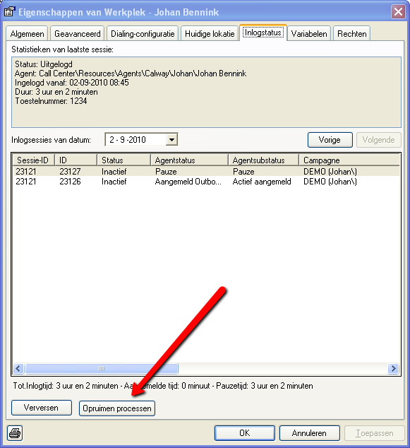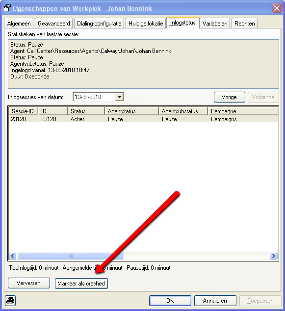

Voor Terminalserver thin-clients gelden de volgende stappen:

1.  Kijk op de terminal server of er een gedisconnecte sessie is voor de
    betreffende thin-client waar deze melding optreedt. Log deze sessie
    uit. Deze actie is meestal voorbehouden aan een windows gebruiker
    met administrator rechten. Het inloggen zou daarna weer mogelijk
    moeten zijn.

2.  Eventueel kan het nog nodig zijn om in de Resource Explorer met de
    optie “Processen opruimen” of “Markeer als crashed” de werkplek vrij
    te geven voor opnieuw inloggen.

## Ik krijg de melding “Belopdracht is al in gebruik” hoe kan dat?

Deze melding betekent dat de betreffende belopdracht die wordt geopend
of bewerkt al als “in gebruik” gemarkeerd staat door de Scriptmodule (of
de dialer). Meestal is de belopdracht op dat moment dan in het
callcenter in gebruik en moet er niets met deze melding worden gedaan.
Wacht tot de belopdracht is vrijgegeven en probeer het dan opnieuw.

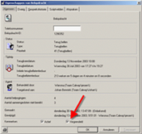Als het zeker is dat de belopdracht niet in het
callcenter in gebruik is, en ook de dialer de belopdracht niet actief
geladen heeft, dan kan het zijn dat de belopdracht vergrendeld is
gebleven nadat een gebruiker zijn Scriptmodule niet netjes heeft
afgesloten (crash). Als dit gebeurd en deze gebruiker start de
scriptmodule opnieuw en logt in dan zal CallPro de belopdracht
automatisch vrijgeven/ontgrendelen. Mocht dit om wat voor reden dan ook
niet gebeuren dan kan de belopdracht ook handmatig worden ontgrendeld.

Gebruik de zoeken belopdrachten applet om de belopdracht op te zoeken.
Dubbelklik de belopdracht om de eigenschappen te openen. Verwijder nu
het vinkje bij “Vergrendeld” om de belopdracht handmatig vrij te geven.
Druk dan op toepassen, of OK om de wijziging op te slaan.

## Hoe voorkom ik dat de klok op de werkstations fout staan ingesteld

CallPro heeft geen controle over de klok op de werkstations. Wel kan
CallPro een waarschuwing geven als de klok op het werkstation afwijkt
van de klok op de SQL Server.

De instelling hiervoor zit in het control panel van de Resource
Explorer. Ga naar Systeemconfiguratie en dan het tabblad Diagnose. Hier
wordt voor het werkstation de huidige afwijking van de lokale klok met
de SQL Server weergegeven. Ook kan hier de maximale afwijking worden
vastgelegd en of hier een waarschuwing voor moet worden gegeven bij het
opstarten van de Resource Explorer (en Script module).

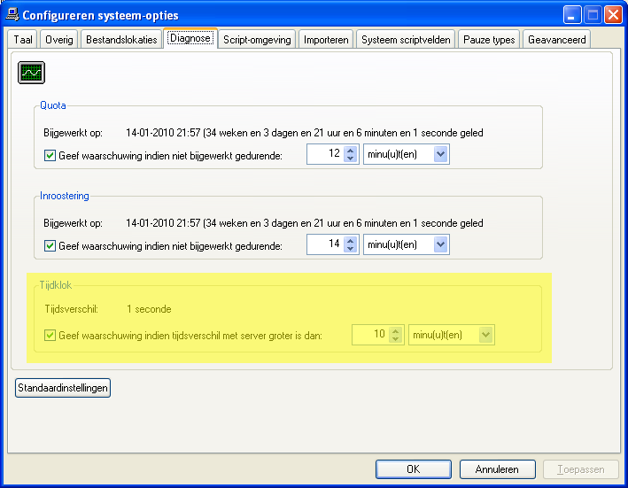

Het is belangrijk dat de klok op de werkstations gelijk lopen omdat de
terugbelafspraken anders niet correct worden aangeleverd en ingesteld.
Immers, als de klok op het werkstation 1 uur achterloopt en een agent
maakt een terugbelafspraak voor over een uur, dan zal CallPro deze
belopdracht direct weer aanleveren omdat de terugbeltijd die de agent
zal ingeven 1 uur achterloopt ten opzichte van de klok op de server.

Het is verstandig om via netwerk policies en Active Directory de rechten
van lokale gebruikers om de klok op het werkstation te wijzigen uit te
schakelen. Ook dient de klok op de werkstations en server te worden
gesynchroniseerd met 1 centrale klok in het netwerk (ntp).

## Optie “Processen opruimen” of “Markeer als crashed” werkt niet

Bij de installatie van CallPro worden op de database de juiste
instellingen gedaan om deze functies te laten werken. Als er iets met de
SQL Server gebeurd is of door andere software gewijzigd is kan het
gebeuren dat deze opties niet meer werken. Controleer dan de volgende
instellingen en corrigeer ze.

Open de Enterprise manager en ga naar Security\\Logins. Dubbelklik de
CALLPRO gebruiker.

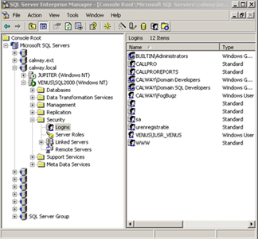 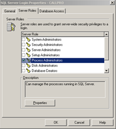

Controleer dat de CALLPRO gebruiker een vinkje heeft staan bij “Process
administrator” zoals aangegeven.

P.S. De hier gebruikte screenshots zijn van SQL Server 2000. Voor
nieuwere versies van SQL Server zien de schermen er anders uit, maar de
werking is gelijk.

## Terminalserver ondersteuning CallPro

CallPro kan worden gebruikt via Terminalserver (of Citrix). Voor de
correcte werking van CallPro dient wel rekening te worden gehouden met
de volgende voorwaarden:

1.  CallPro dient niet te worden gestart
    vanuit een console sessie.

2.  CallPro dient netjes te worden afgesloten en de sessie dient ook te
    worden uitgelogd (niet gedisconnect). Als een gebruiker ingelogd
    staat in CallPro en de sessie afsluit zonder uit te loggen dan
    blijft deze sessie bij de meeste Terminalserver installaties
    bestaan. Een volgende gebruiker die inlogt (waarbij de bestaande
    sessie niet wordt hergebruikt) kan CallPro niet opstarten omdat er
    al iemand op deze thin-client is ingelogd in CallPro.

Callpro gebruikt op Terminalserver de environment variabele CLIENTNAME
om te bepalen welke seat moet worden gebruikt. Windows zet deze
standaard op de naam van de RDP client die verbindt met de server, maar
dit kan ook voor het starten van de scriptmodule worden gewijzigd.

## Kan de agent zien in welke fase hij/zij zit?

Ja, de actuele gespreksfase wordt in de statusbalk van de Scriptmodule
weergegeven. Na het inloggen wordt hier de actuele pauzetijd
weergegeven. Als de agent is aangemeld wordt hier de gespreksfase
“Wachten”, “Setup”, “Call”, “Wrapup” weergegeven met de tijd dat de
agent in deze fase actief is.

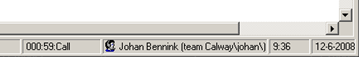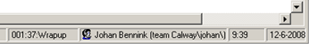

## Ik open een venster maar deze zie ik niet op de monitor verschijnen

CallPro onthoudt de locatie van vensters. Als je monitor van resolutie
veranderd, of je ontkoppelt een monitor die je eerder wel had dan kan
het gebeuren dat vensters buiten het scherm staan, of op de monitor die
niet meer aanwezig is.

Omdat sommige vensters “modaal” openen lijkt het of CallPro vast zit
omdat de nog wel zichtbare venster niet meer regeren op muisklikken.

Om dit op te lossen zijn diverse Windows sneltoetsen die kunnen worden
gebruikt.

### Vensters met icoon in de linker bovenhoek

Voor vensters waarbij in de linkerbovenhoek een icoon staat zijn
vensters met het toetsenbord te verplaatsen door Alt-Spatie daarna
Pijltje naar beneden en dan Enter te drukken.

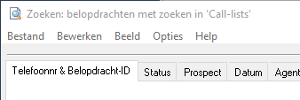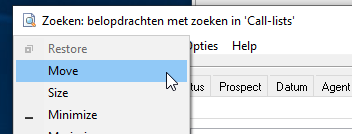

Dit zet het “onzichtbare” venster in Verplaatsen mode. Nu kan met de
pijtjes toetsen het venster links en rechts worden verplaatst. Als de
monitor die is verwijderd rechts van de actieve monitor stond moet het
venster naar links worden verplaatst netzolang totdat dit op de actieve
monitor in beeld komt.

### Overige vensters

Voor vensters zonder icoon is er ook een optie om het venster tussen de
monitoren te verplaatsen. Druk hiervoor Windows-key+Shift ingedrukt en
gebruik vervolgens de links en rechts pijltjes om een venster tussen de
monitoren te wisselen.
