# De Resource Explorer

De Resource Explorer is de centrale interface voor het beheer van
CallPro. Afhankelijk van de verantwoordelijkheden van de supervisor
kunnen meer of minder onderdelen worden gebruikt.

## Control panel

In het control panel zijn de diverse (systeem) instellingen van CallPro
verzameld.

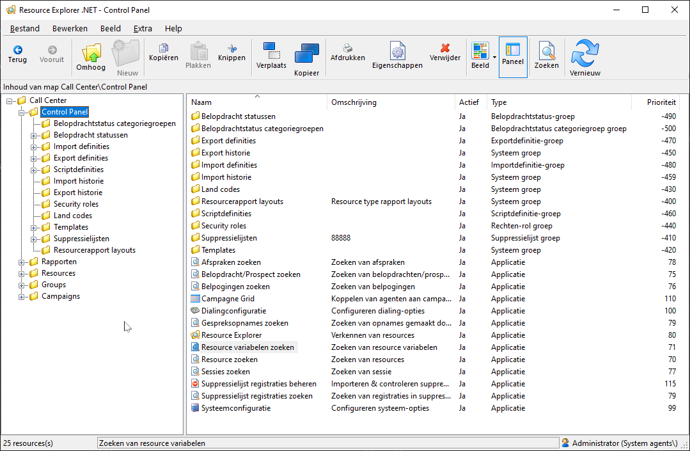

### [Belopdrachtstatussen](./controlpanel-belopdrachtstatussen.md)
### [Scriptdefinities](./controlpanel-scriptdefinities.md)
### [Importdefinities](./controlpanel-importdefinities.md)
### [Exportdefinities](./controlpanel-exportdefinities.md)

### Zoeken tools

Voor supervisie staan hier een aantal handige zoek tools zoals de
Belopdracht/Prospect zoeken, Belpogingen zoeken, Afspraken zoeken,
Resources zoeken, Sessies zoeken en bel-me-niet registraties zoeken.

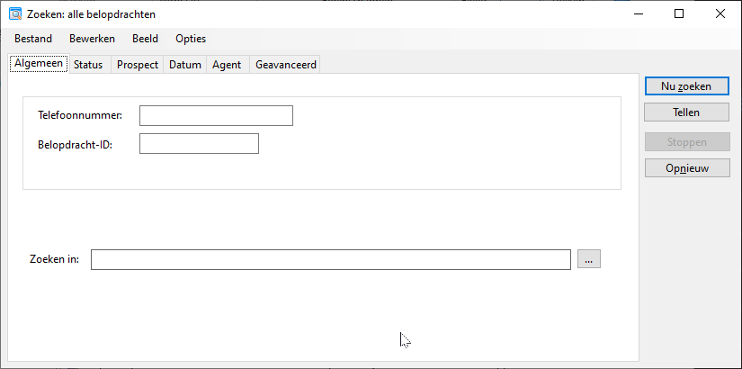

### Campagne grid

Ook het Campagne Grid is een handige tool om agents snel op andere
campagnes in te delen, of om overzicht te houden over de campagnes en
agents die hieraan zijn toegekend.

Via het context-menu kunnen speciale acties worden ingesteld zoals
“alleen terugbellers” of “morgen”. Via dubbelklikken kan snel een
Agent aan of uit worden gezet voor een specifieke campagne.

De speciale opties Vandaag en Morgen stellen de campagne koppeling zo in
dat de Agent alleen vandaag, of morgen actief is voor de betreffende
campagne. Ook kunnen alle koppeling voor 1 campagne, of alle koppeling
van 1 agent in een keer worden ingesteld. Activeer hiervoor het
context-menu op resp. de campagne of de agent naam.

Meerder campagne grid instellingen kunnen als template worden bewaarde.
Bijvoorbeeld om meerdere teams overzichtelijk in hun eigen overzicht te
gebruiken.

## Systeemconfiguratie

#### Algemeen

Hier kunnen enkele losse instellingen worden gedaan zoals het
verversingsinterval voor de Quota. Deze staat standaard op 2 minuten.
Door dit op een langer interval te zetten worden de quota’s minder vaak
herberekend, dit ontlast de SQL server. Het nadeel hiervan is dat de
quota’s meer over de grens heen gaan omdat de controle minder vaak wordt
gedaan.

Standaard geeft CallPro voorrang aan terugbelopdrachten over alle
campagnes waar een Agent op belt. Dus zelfs al een campagne met een
lagere prioriteit (hogere prioriteit waarde) is gekoppeld zal een
terugbeller in die campagne toch voorrang krijgen. Als dit niet gewenst
is, maar puur op Prioriteitsvolgorde gestuurd moet worden dan dient het
vinkje bij deze instelling uitgeschakeld te worden.

De passieve tijdregistratie instelling bepaald of CallPro indien een
Agent enige tijd (instelbaar) niets doet met zijn muis of toetsenbord
een passief sessie record start. CallPro werkt met pauze en aangemelde
sessie records die kunnen worden gebruikt voor een eenvoudige inlog-
uitlog tijdsregistratie. Om misbruik van de wrapup fase te voorkomen kan
deze instelling worden geactiveerd. CallPro markeert de tijd dat een
Agent niets doet dan als “Passief” die apart in de sessie rapportage
zichtbaar wordt.

CallPro is een Nederlands programma en de taal staat dan ook standaard
in het Nederlands. Overschakelen op Engels is ook mogelijk, maar de
derde taal (Frans) is niet vertaald.

Met de instelling serverbelasting kan de impact van een import op de SQL
Server worden beperkt. Zeker als er meer dan 20 Agenten zijn ingelogd is
het verstandig om deze instelling te verlagen. Standaard staat deze op
100%, de maximale importsnelheid. Een lagere waarde resulteert in een
iets lagere importsnelheid. Maar de lopende campagnes hebben er minder
last van.

Wij raden aan om deze instelling voor call center met 20 simultane
gebruikers op 60% te zetten en bij meer dan 60 ingelogde agenten op 20%
als tijdens het bellen ook een import wordt uitgevoerd.

#### Script-omgeving

Deze instelling bepaald de standaard pagina’s voor Pauze en inbound. Op
werkplek (Seat) niveau kunnen deze pagina’s anders worden ingesteld.

#### Diagnose 

TODO

#### Bestandslokaties

CallPro plaatst logbestanden in de Windows folder voor tijdelijke
bestanden (zie variabele TEMP). Dit is meestal de folder
C:\\WINDOWS\\TEMP of de Temp folder in de gebruikers profiel folder
c:\\documents and settings\\\<gebruiker\>\\temp.

Door hier een netwerkfolder te gebruiken worden alle logbestanden van
CallPro en alle error informatie bestanden naar die centrale plaats
geschreven. Zorg ervoor dat alle ingelogde gebruikers schrijfrechten
hebben op deze folder anders kunnen de logbestanden niet worden
aangemaakt.

#### Systeem scriptvelden

CallPro heeft weinig kennis van de velden die in bellijsten worden
gebruikt. Om toch bij bijvoorbeeld het zoeken een optie te kunnen geven
om op “Achternaam” te zoeken zijn een aantal systeemvelden aanwezig.
Extra velden kunnen worden toegevoegd die als “Zoekveld” zijn gemarkeerd
en door CallPro dan bij de optie “Zoeken belopdrachten” worden gebruikt.
Als een veld in de bellijst niet aanwezig is wordt het zoekveld grijs.

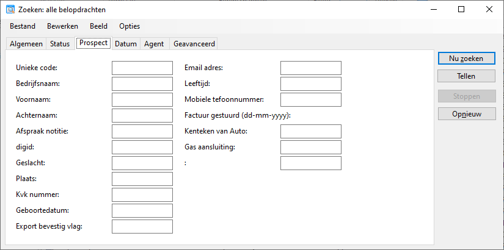

#### Pauze types

CallPro houdt de pauzetijd van Agenten bij. Telkens als wordt ingelogd
komt de Agent in pauze. Ook tijdens het bellen kan de Agent aangeven na
het huidige gesprek naar pauze te willen gaan. Met Pauze types kunnen
verschillende soorten pauze worden vastgelegd. Pauze types kunnen worden
gekoppeld aan een campagne zodat ook de pauzetijd aan een campagne kan
worden gerelateerd in (maatwerk) rapportages.

Alleen het Pauze type “Pauze” is standaard aanwezig. De keuze optie is
ook alleen zichtbaar als het vinkje bij “Gebruiker kan de volgende
(actieve) pauze types kiezen” is gezet.

Ook wordt hier ingesteld in welk pauze type CallPro begint na het
inloggen, en na het expliciet afmelden van de Agent en na het geforceerd
afmelden door CallPro.

#### Geavanceerd

Dit is een verzameling van specifieke instellingen die hier verder niet
worden behandeld. Pas deze instellingen alleen aan indien hier expliciet
door Calway om wordt gevraagd.

## Resources

De centrale plaats waar agents, call-lists (bellijsten) en Calendars
(agenda’s) worden aangemaakt en beheerd. Voor het overzicht kunnen
sub-folders worden gemaakt om agenten te groeperen per team of
vestiging, bellijsten te groeperen per opdrachtgever of campagne en
Agenda’s per opdrachtgever of regio. De indeling kan volledig op de
eigen werkwijze worden afgestemd.

Elke resource heeft een unieke code (ID) die op het eigenschappen scherm
wordt weergegeven. Daarnaast heeft een resource een Naam, een
omschrijving en een type. Ven een resource is te zien wie deze heeft
aangemaakt, en wanneer en door wie deze voor het laatst is gewijzigd.
Een resource kan actief zijn, of inactief waarmee het gebruik ervan kan
worden uitgesloten.

Afhankelijk van het type resource zijn er extra eigenschappen die kunnen
worden vastgelegd.

### Agent

Een Agent resource representeert een gebruiker, of account. Dit kan een
beller (telemarketeer) zijn, of een supervisor, een buitendienst
medewerker, of zelfs een externe klant. Bijna alle activiteiten worden
gekoppeld aan de gebruiker die deze activiteit uitvoert.

Een Agent heeft ook een account en password om mee in te loggen in de
diverse onderdelen van CallPro. Op basis van het account en de daaraan
gekoppeld Rollen wordt bepaald welke onderdelen van CallPro beschikbaar
zijn voor deze gebruiker. Voor een beller kan worden vastgelegd of de
gesprekken die hij/zij doet via de scriptmodule worden opgenomen of niet
(dit werkt alleen als de benodigde telefonie hardware aanwezig is en
geconfigureerd). Daarnaast kan van de Agent nog enige persoonlijke
gegevens worden vastgelegd:

 

Deze gegevens worden grotendeels in CallPro verder niet gebruikt en zijn
puur voor de administratieve vastlegging. Andere gegevens zijn alleen
voor bepaalde gebruikers van belang. Voor een buitendienst medewerker
die via CallPro Portal kan inloggen is de “Eigenaar van Agenda’s”
koppeling essentieel om zijn agenda te kunnen bekijken.

### Call-list

Een bellijst is een resource waar een lijst met belopdrachten aan is
gekoppeld. Ook belpogingen zijn gekoppeld aan de bellijst. Een bellijst
wordt gemaakt op basis van een scriptdefinitie en wordt gevuld door
bestanden te importeren met een importdefinitie. Bij het aanmaken van de
bellijst kan worden vastgelegd of de belopdrachten tijdens de import
moeten worden ontdubbeld op ene bepaald veld, of veldcombinatie.

De bellijst heeft diverse extra instellingen zoals de koppeling van
terugbelopdrachten aan de agenten, belpoging begrenzing instellingen en
actieve prioritietscategorieën. Deze instellingen worden deels via de
scriptdefinitie overgenomen, en deels ingesteld tijdens het aanmaken van
de bellijst. Veel van deze instellingen kunnen ook achteraf worden
gewijzigd, maar van sommige kan dat niet. Later in dit handboek gaan we
dieper in op deze instellingen.

 
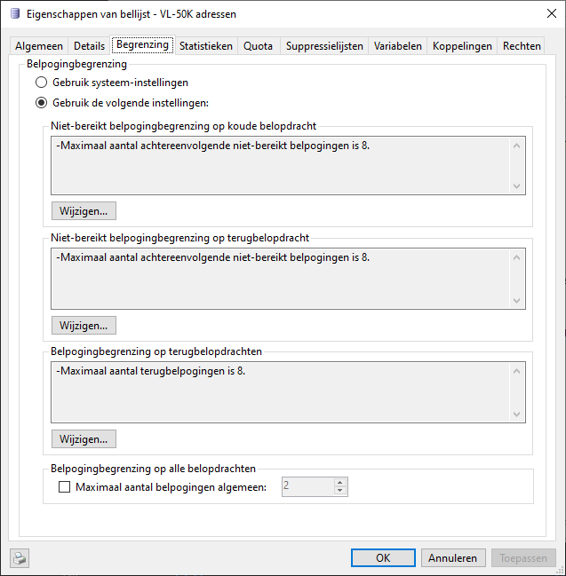

Van elke bellijst is te zien hoeveel adressen deze bevat en welke
belopdrachtstatus deze belopdrachten op dit moment hebben. Ook wordt
hier onderscheid gemaakt tussen actieve en inactief belopdrachten.
Inactieve belopdrachten staan wel in de bellijst, maar worden door
CallPro niet aangeboden voor outbound bellen.

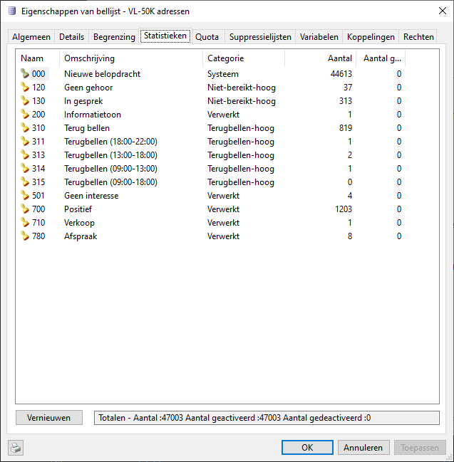 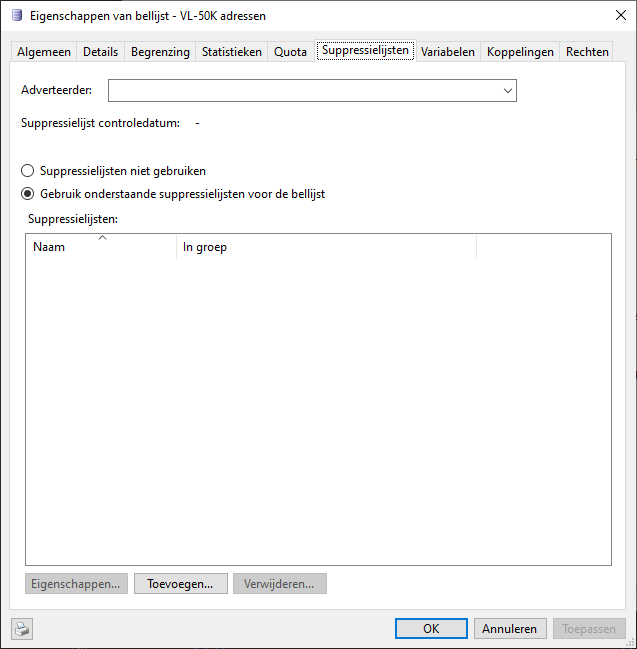

Bij de bellijst worden ook de suppressielijst instellingen bewaard die
worden gebruikt voor bel-me-niet.

### Calendar

De Calendar resource wordt gebruikt voor het inplannen van
bezoekafspraken voor een adviseur of buitendienst medewerker. Voor de
weergave van de agenda kunnen enkele instellingen worden gedaan w.o.
kleurinstellingen. Ook instellingen over het gebruikt zoals de
inboekperiode in de toekomst, en de afspraakduur en reistijdberekening
zijn hier te vinden.

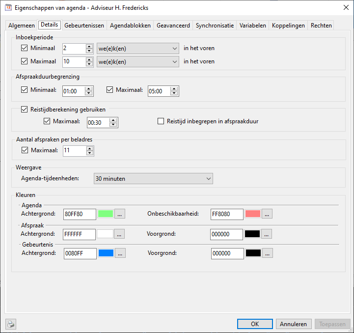 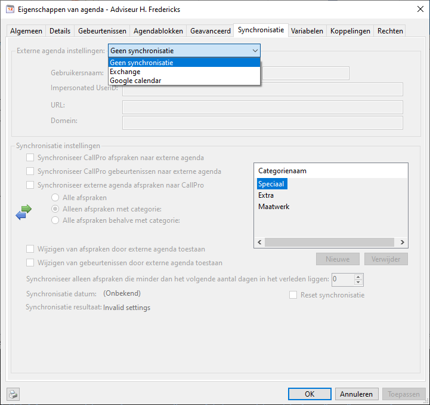

Voor het inplannen van afspraken zijn in de Agenda “agendablokken”
vastgelegd. Afspraken kunnen alleen worden ingepland op de tijden van
deze agendablokken.

 

Ook voor algemene gebeurtenissen is een voorziening. Hiermee kunnen
vaste rayon meetings, vakantie of andere afspraken worden vastgelegd
zodat op deze tijdstippen geen afspraken worden ingepland.

 

### Seat

De Seats (werkplek) wordt hoofdzakelijk gebruikt voor telefonie
instellingen. Door de werkplek op inactief te zetten kan worden
voorkomen dat iemand inlogt met de script module om te gaan bellen. Dit
kan bijvoorbeeld worden gebruikt voor stille hoekjes in het callcenter
die niet altijd beschikbaar moeten zijn.

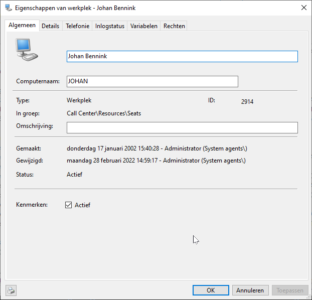 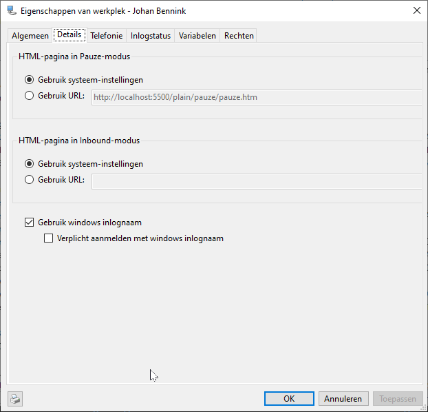
 

## Groups

TODO

## Campaigns

Ook de campagnes hebben hun eigen plaats en ook hier geldt dat de
indeling volledig kan worden afgestemd op de werkwijze van het call
center, of de opdrachtgevers.

Campagnes worden gemaakt onder de “Campaigns” folder. Alleen actieve
campagnes worden door CallPro gebruikt. Ook de prioriteit van een
campagne kan hier worden ingesteld.

Op de campagne worden de telefonie (dialer) instellingen gedaan op het
dialer tabblad. Voor outbound wordt de dialing mode gekozen en bij
inbound kan een wachtrij worden gekozen. Ook wordt hier aangegeven of
gespreksopnames moeten worden gemaakt.

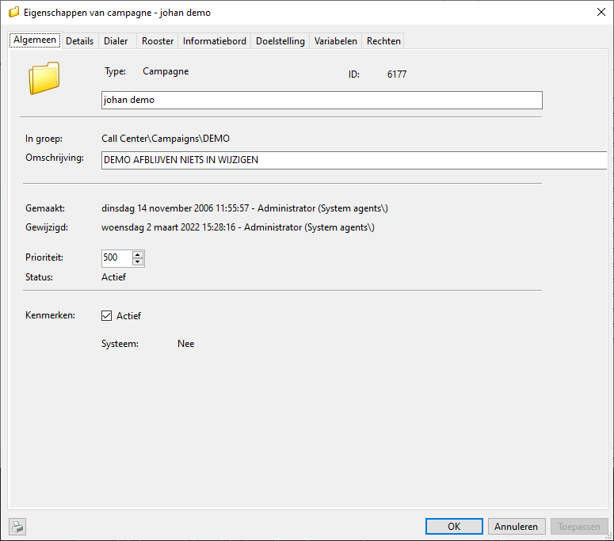
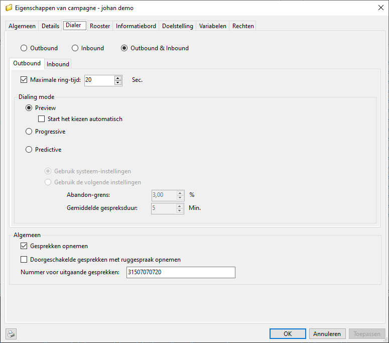

## Snelkoppelingen

Nu we hebben gekeken naar resources en de campagne folder is het
belangrijk om duidelijk te maken dat resources worden gekoppeld in de
campagne folder via een “koppeling”. Dit verschil is belangrijk en is
ook zichtbaar in de Resource Explorer. Dit zijn koppelingen:

En dit zijn (agent) resources:

Bij een koppeling opent via right-click “Eigenschappen” het
eigenschappen venster van de koppeling. Om de Resource eigenschappen te
openen van een koppeling moet in het right-click menu worden gekozen
voor de optie “Eigenschappen \<resource type\>”. Als een koppeling wordt
weggegooid blijft de onderliggende resource bestaan en wordt alleen de
koppeling verwijderd in de betreffende folder. Als de onderliggende
resource wordt weggegooid dan worden ook alle koppelingen naar deze
resource weggegooid\! Afhankelijk van het resource type wordt ook alle
bijbehorende informatie verwijderd.
