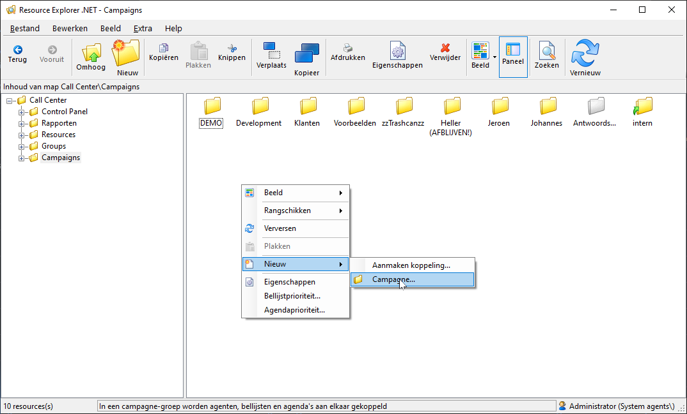
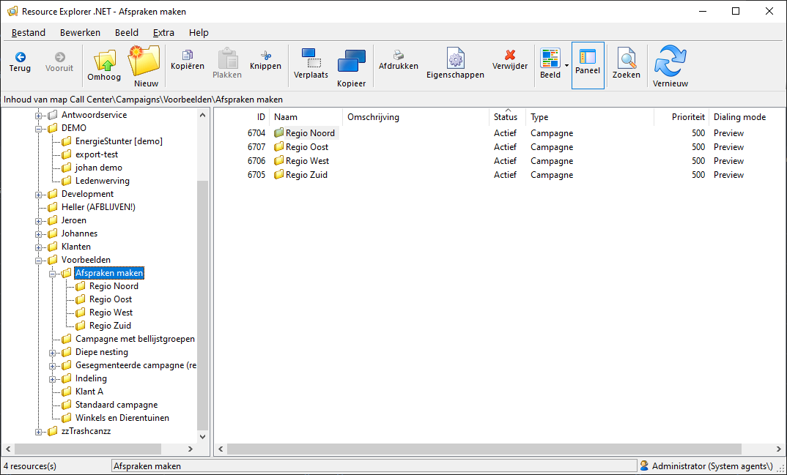
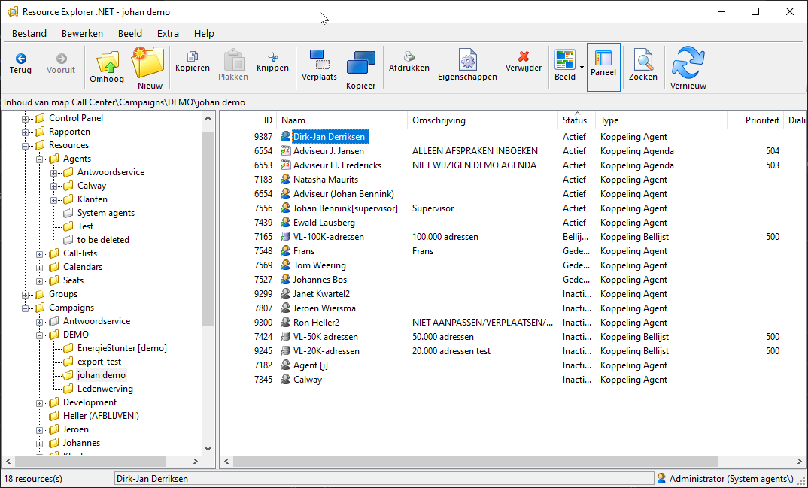
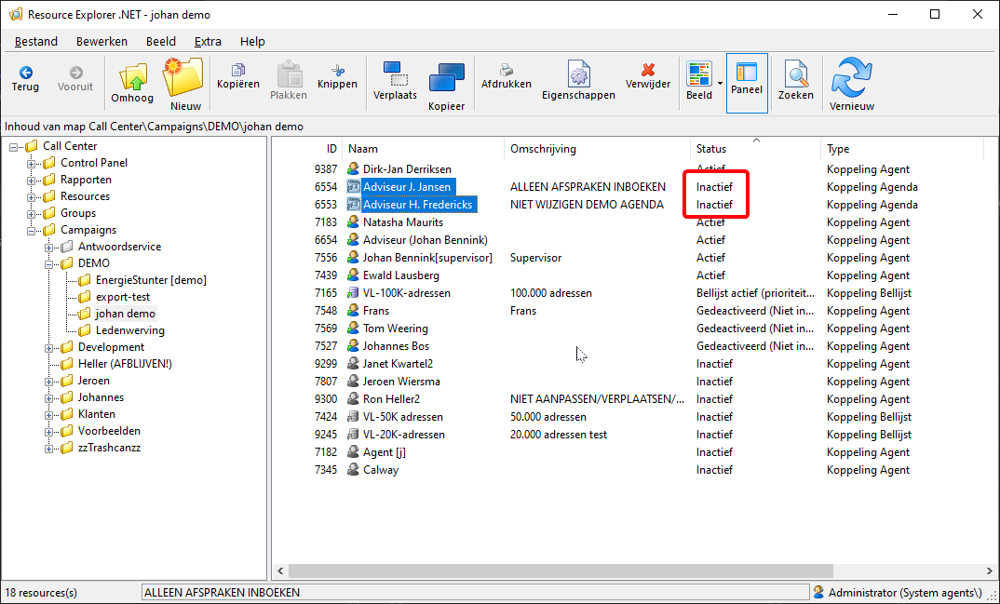
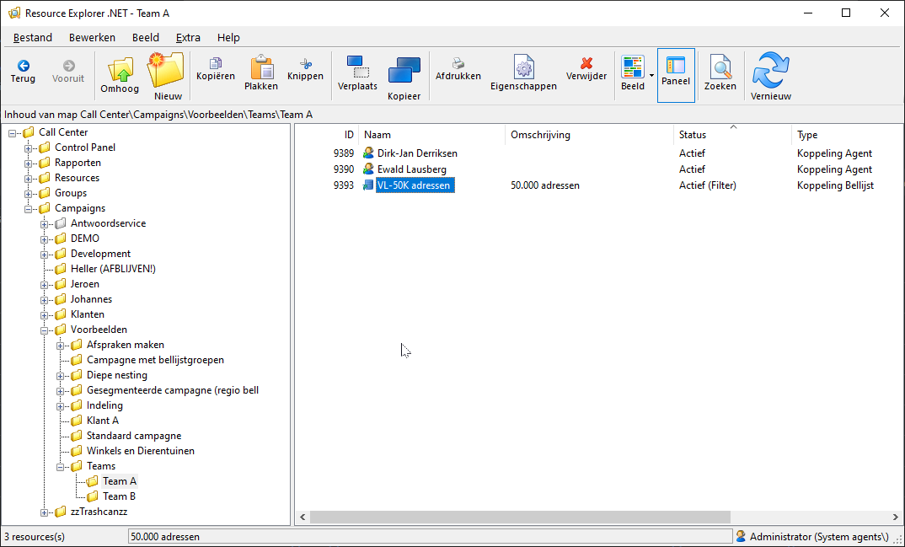
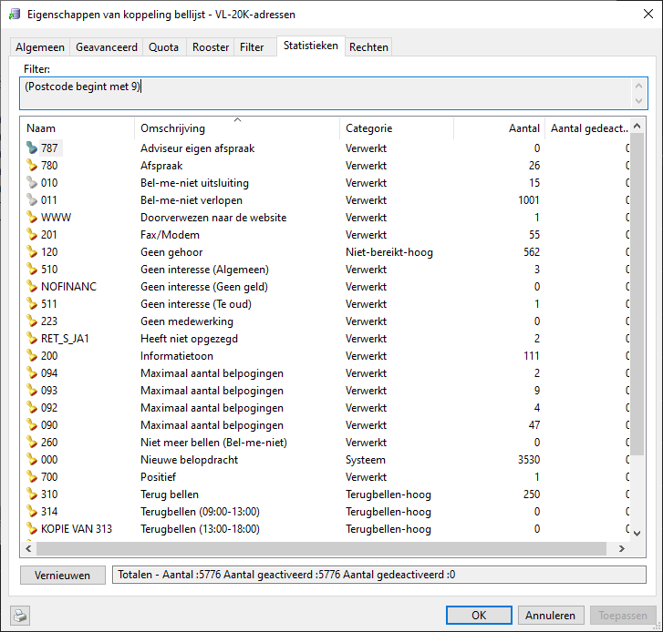

# Inhoudsopgave

[Een campagne inrichten in CallPro](#een-campagne-inrichten-in-callpro)

[Meer over campagnes en campagne instellingen](#meer-over-campagnes-en-campagne-instellingen)

[Actieve resources in de campagne](#actieve-resources-in-de-campagne)

[Agenten op meerdere campagnes indelen](#agenten-op-meerdere-campagnes-indelen)

[Bellijsten in meerdere campagnes gebruiken](#bellijsten-in-meerdere-campagnes-gebruiken)

[Filters op bellijsten in de campagne](#filters-op-bellijsten-in-de-campagne)

[Prioriteiten op bellijsten in de campagne](#prioriteiten-op-bellijsten-in-de-campagne)

[Een nieuwe campagne maken](#een-nieuwe-campagne-maken)

[Maak het belscript](#maak-het-belscript)

[Maak de scriptdefinitie](#maak-de-scriptdefinitie)

[Test de nieuwe scriptdefinitie](#test-de-nieuwe-scriptdefinitie)

[Maak de nieuwe campagne](#maak-de-nieuwe-campagne)

[Maak een exportdefinitie](#maak-een-exportdefinitie)

[Maak de importdefinitie](#maak-de-importdefinitie)

[Importeren](#importeren)

[Waarom importeert mijn bestand niet?](#waarom-importeert-mijn-bestand-niet)

[Naamgeving kolommen](#naamgeving-kolommen)

[Telefoonummerkolom](#telefoonummerkolom)

[Alle velden op 1 regel](#alle-velden-op-1-regel)

[Excel voorbeelden](#excel-voorbeelden)

[Telefoonnummer mist voorloop nul](#telefoonnummer-mist-voorloop-nul)

[Netnummer en abonneenummer in twee velden](#netnummer-en-abonneenummer-in-twee-velden)

[Postcode en Plaats in een veld](#postcode-en-plaats-in-een-veld)

[Waarden in een kolom vervangen](#waarden-in-een-kolom-vervangen)

[Meldingen tijdens de import](#meldingen-tijdens-de-import)

[Importdefinitie hoort niet bij de bellijst](#importdefinitie-hoort-niet-bij-de-bellijst)

[Problemen met de lengte van velden of het datatype](#problemen-met-de-lengte-van-velden-of-het-datatype)

[Ander veldscheidingsteken bij importeren csv bestanden](#ander-veldscheidingsteken-bij-importeren-csv-bestanden)

[Excel driver niet goed ingesteld](#excel-driver-niet-goed-ingesteld)

[Dagelijkse werkzaamheden](#Dagelijkse-werkzaamheden)

[Wijzigen van belopdrachten](#wijzigen-van-belopdrachten)

[Correctie afcoderen met verkeerde status door de Agent](#correctie-afcoderen-met-verkeerde-status-door-de-agent)

[Correctie afcoderen met verkeerde status door de Agent na doorbellen](#correctie-afcoderen-met-verkeerde-status-door-de-agent-na-doorbellen)

# Campagnebeheer voor supervisors

Een campagne bestaat uit de samenvoeging van resources van het type
agent, bellijst en agenda. Door deze resources samen te brengen in een
campagne folder ontstaat een campagne.

De bellijsten in de campagne bepalen op welke belopdrachten wordt
gebeld. De agenten bepalen wie de belopdrachten uit de gekoppelde
bellijsten belt. Agenda’s bepalen in welke agenda’s afspraken worden
gemaakt voor de belopdrachten.

# Een campagne inrichten in CallPro

De Supervisor beheert de campagnes en deelt Agents in op de
verschillende actieve campagnes. Een campagne bestaat uit een aantal
onderdelen, maar begint met het de campagne folder.

Campagnes kunnen op verschillende manieren zijn ingedeeld. Een campagne
kan bestaan uit 1 campagne folder, bijvoorbeeld voor het nabellen van
een mailing, of uit meerdere sub-campagnes, bijvoorbeeld voor het maken
van afspraken voor meerdere adviseurs of regio’s.

Campagnes worden gemaakt in de “Campaigns” folder met de Resource
Explorer. Ga naar de folder waar de campagne moet worden gemaakt,
right-click en kies “Nieuw\\Campagne-groep...

In de campagne folder worden de resources geplaatst die nodig zijn. Dit
kunnen Agent, Call-list en Calendar resources zijn. Deze resources
worden uit de folders binnen de “Resources” folder gehaald. Ga hiervoor
naar de betreffende folder, selecteer de resource(s), bijvoorbeeld de
Agents en sleep ze naar de campagne folder. Het is ook mogelijk om
resources via het clipboard te kopiëren en plakken.

Een Agent krijgt alleen belopdrachten uit een campagne aangeboden als
hij/zij is gekoppeld in de campagne, en actief is. Binnen de campagne
worden alleen belopdrachten aangeboden uit een bellijst als de
betreffende bellijst in de campagne folder staat en actief is.

# Meer over campagnes en campagne instellingen

In de basis is een campagne niets meer dan een folder met daarin de
bellijst(en), Agent(en) en agenda’s. In de praktijk wordt echter vaak
meer gevraagd van een campagne. Welke mogelijkheden biedt CallPro voor
die situaties

## Actieve resources in de campagne

Alleen resources die in de campagne folder staan worden gebruikt voor de
campagne. Door een agent uit de campagne folder te halen worden geen
belopdrachten van deze campagne meer aangeboden bij de betreffende
agent. Het zelfde geldt voor bellijsten en agenda’s. Als het om een
tijdelijke actie gaat kan ook de betreffende resource op inactief worden
gezet. Zo blijft de resource visueel gekoppeld, maar zal CallPro deze
toch niet gebruiken voor de campagne. Zeker als filters, en ander
instellingen zijn gedaan op de koppeling is het deactiveren eenvoudiger
omdat bij het verwijderen ook alle instellingen verloren gaan.

 

## Agenten op meerdere campagnes indelen

Het is vaak genoeg om een agent op 1 campagne in te delen. Toch zijn er
genoeg situaties waar dit niet voldoende is. CallPro biedt dan ook de
mogelijkheid om een agent in meerdere campagnes tegelijkertijd te
koppelen. Voor het bellen bepaald CallPro telkens uit welke campagne, en
bellijst de belopdracht die gebeld moet worden moet komen. Het aanbieden
gebeurd uniform random over de bellijsten uit alle campagnes waar de
agent is gekoppeld. Belopdrachten worden op prioriteit volgorde
aangeboden zodra ze weer gebeld mogen worden.

 

In de bellijsten uit de bovenstaande campagnes staan een aantal
belopdrachten klaar zoals in deze tabel aangegeven.

| Bellijst Hotleads 01-2010 | Bellijst CallPro Mailing Q1-2010 |                           |          |        |                    |          |          |
| ------------------------- | -------------------------------- | ------------------------- | -------- | ------ | ------------------ | -------- | -------- |
| ID                        | **Status**                       | **Tijd**                  | **Prio** | **ID** | **Status**         | **Tijd** | **Prio** |
| A1                        | Terugbellen                      | om 11:00                  | 25       | **B1** | Terugbellen        | om 10:05 | 25       |
| A2                        | Geen gehoor                      | opnieuw proberen om 10:00 | 76       | **B2** | Nieuwe belopdracht |          | 150      |
| A3                        | Nieuwe belopdracht               |                           | 150      | **B3** | Nieuwe belopdracht |          | 150      |

Agent Tom die is ingelogd op beide campagnes zal om 10:05 de belopdracht
B1 aangeboden krijgen. Dit is van de belbare adressen de belopdracht met
de hoogste prioriteit, en eerste terugbeltijd. Als hij om 10:15 klaar is
voor zijn volgende gesprek krijgt hij belopdracht A2. Als het dan nog
geen 11:00 is zal hij daarna een van de nieuwe belopdrachten krijgen.

Als Tom met zijn eerste gesprek tot na 11:00 bezig zou zijn geweest dan
was niet belopdracht A2 de volgende belopdracht geweest, maar
belopdracht A1 omdat deze belopdracht een hogere prioriteit heeft.
Daarna volgt dan A2 en dan een van de nieuwe belopdrachten.

CallPro kijkt altijd naar de tijd waarop een belopdracht mag worden
aangeboden, die moet in het verleden liggen, en dan wordt het eerst de
oudste belopdracht met de hoogste prioriteit aangeboden.

## Bellijsten in meerdere campagnes gebruiken

Niet alleen agents kunnen in meerdere campagnes tegelijkertijd worden
gezet, ook bellijsten kunnen in meerdere campagnes worden gezet. CallPro
biedt dezelfde belopdracht slechts 1 keer aan, dus een belopdracht die
is afgehandeld in campagne “Team A” is ook voor campagne “Team B”
afgehandeld. In de rapportage is wel te zien dat de belopdracht in
campagne “Team A” is afgehandeld en niet in campagne “Team B”. Op deze
manier kan heel gemakkelijk worden gewerkt met teams. Door ieder team
zijn eigen sub-campagne folder te geven is in de score te verdelen over
de teams.

 

## Filters op bellijsten in de campagne

Door filters te zetten op de bellijst die in een campagne is geplaatst
kan een restrictie worden gezet op de belopdrachten die binnen deze
campagne uit de bellijst worden aangeboden. Het filter kan gebruik maken
van alle systeemvelden, en alle scriptvelden in de bellijst.

Een
filter kan zo worden gebruikt om alleen belopdrachten aan te bieden uit
een bepaalde postcode, met een bepaald geslacht, of elk ander kenmerk
dat in een scriptveld is vastgelegd.

De meest voorkomende toepassing is het verdelen van de belopdrachten op
basis van regio, of gespreksfase. Door een filter op postcode te
plaatsen, of een adviseur/regio kenmerk, is deze regio indeling
eenvoudig te realiseren.

Ook als een gesprek na het eerste contact een andere fase in gaat en
door andere agents moet worden opgevolgd biedt een filter uitkomst.
Dezelfde bellijst wordt gebruikt in meerdere sub-campagnes waarbij een
filter wordt gezet op een scriptveld “BELFASE” dat wordt veranderd al
naar gelang de voortgang van het gesprek.

## Prioriteiten op bellijsten in de campagne

Als binnen een campagne meerdere bellijsten worden gebruikt kan de
volgorde van aanbieden worden bestuurd door de prioriteit van de
bellijst in de campagne aan te passen. Standaard staan de prioriteiten
van koppelingen in campagnes op 500. Door een bellijst (Hotleads
01-2010) op prioriteit 200 te zetten en een tweede bellijst (CallPro
Mailing Q1-2010) op prioriteit 500 zal CallPro binnen de campagne altijd
de voorkeur geven aan bellijst “Hotleads 01-2010” voor Niet bereikt en
nieuwe belopdrachten. Voor de belopdrachten met een status in de
terugbellen categorie blijft de prioriteit van de belopdracht bepalend
ongeacht de prioriteit van de bellijsten.

# Een nieuwe campagne maken

Voor een nieuwe opdracht moet een campagne worden ingericht. De
opdrachtgever heeft een bestand aangeleverd en een briefing document met
daarin de propositie, een callflow, tegenargumenten voor de bezwaren van
de prospect, informatie over de aangeleverde adressen en informatie over
de terug levering van de belresultaten.

De stappen die moeten worden doorlopen kunnen in de praktijk variëren
afhankelijk van of er al eerder voor de klant gebeld is, of dat de
campagne sterke overeenkomsten vertoond met ander campagnes die al zijn
gemaakt. Globaal worden deze stappen doorlopen.

### Maak het belscript

Op basis van het briefing document en de callflow beschrijving kan
worden gestart met het maken van de verschillende html pagina’s van de
callflow. In veel gevallen kan hiervoor gebruik worden gemaakt van
eerder gemaakte belscripts. Hergebruik van belscript onderdelen biedt
ook een meer uniforme look-and-feel voor de verschillende campagnes.
Uitleg over het maken van html pagina’s valt buiten de scope van dit
hoofdstuk.

### Maak de scriptdefinitie

Als het belscript vordert kan worden gestart met het maken van de
scriptdefinitie. Neem alle velden die in het belscript worden gebruikt,
en/of die zullen worden ingelezen uit het importbestand op in de
scriptdefinitie. Kies de benodigde belopdrachtstatussen uit de lijst.

### Test de nieuwe scriptdefinitie

Maak met de scriptdefinitie een test bellijst. Om duidelijk te maken dat
dit een test bellijst is kan het woord “_test” achter de naam van de
bellijst worden toegevoegd. Voeg daarna een aantal belopdrachten toe aan
de bellijst via right-click “Nieuwe belopdracht...”.

 

Meestal is het voldoende om alleen het telefoonnummer in te vullen, maar
afhankelijk van het belscript kan het nodig zijn om speciale
scriptvelden ook te voorzien van een geldige waarde. Vul dan via het
scriptvelden tabblad ook deze velden.

 

Met deze belopdrachten kan de werking van het belscript goed getest
worden.

### Maak de nieuwe campagne

Maak nu de campagne folder zoals eerder uitgelegd bij \<REF\>. Plaats
vervolgens eerst alleen de test bellijst in de campagne en koppel een
test gebruiker, of de eigen supervisor account. Start de script module
en login op de nieuwe campagne. Met de eerder aangemaakte belopdrachten
kan de callflow nu worden getest. Eventuele problemen kunnen in het
belscript worden opgelost. Probeer alle callflow paden in het belscript
en test in ieder geval de belangrijkste belopdrachtstatussen minimaal 1
keer.

### Maak een exportdefinitie

Afhankelijk van wat met de opdrachtgever is afgesproken moet een
exportdefinitie worden gemaakt. Afhankelijk van de werkwijze kan een
template exportdefinitie worden gekopieerd om hier vervolgens de extra
velde aan toe te voegen, of kan een nieuwe exportdefinitie worden
gemaakt.

 

Neem in ieder geval alle aangeleverde scriptvelden, en voeg de extra
verrijkingsvelden ook toe. Soms bevat het belscript ook enkele
scriptvelden die voor de callflow zijn toegevoegd, maar niet naar de
opdrachtgever terug geleverde hoeven te worden, neem deze dan ook niet
op in de exportdefinitie. Ook de systeemvelden van CallPro hoeven niet
allemaal te worden terug geleverd. Het belresultaat (sys_callstatusname
of sys_callstatuscode), de bellijstnaam (sys_calllistname) en de
unieke interne code van CallPro (sys_clentryid) zijn altijd handig om
op te nemen. Andere systeemvelden kunnen naar behoefte worden
toegevoegd.

Test nu met de test bellijst deze export definitie. Stuur het
exportbestand eventueel naar de opdrachtgever om te controleren of de
inhoud bruikbaar is.

### Maak de importdefinitie 

Gebruik het aangeleverde importbestand om een importdefinitie te maken
voor de nieuwe test bellijst.

 

Het wordt een importdefinitie voor het toevoegen van belopdrachten. Kies
het bestandstype van het aangeleverde bestand, meestal CSV of MS Excel.
Wijs het aangeleverde bestand aan. Controleer voor de zekerheid of het
bestand goed kon worden ingelezen door op de knop “Voorbeeld” te
drukken. CallPro laat dan de eerste 100 regels uit het importbestand
zien.

 

Koppel nu een voor een de velden uit het importbestand aan de velden van
de bellijst. Door het vinkje bij “Imp” leeg te maken worden de
betreffende velden uit het importbestand niet geïmporteerd.

 

In sommige gevallen heeft CallPro standaard een verkeerde keuze gemaakt
voor het Datatype. Voor het Addr_number veld in het bovenstaande
screenshot heeft CallPro gezien dat er alleen cijfers in het veld staan
en aangenomen dat het veld numeriek(2) moet zijn. De standaard velden
van CallPro gebruiken het karakter(10) type voor het huisnummer en het
veld kan dan ook niet gekoppeld worden (wordt grijs weergegeven). Nu
moet eerst het Datatype naar Karakter worden gezet voordat dit veld
gekoppeld kan worden.

 

Als alle velden zijn gekoppeld kan de importdefinitie worden bewaard.
Het is goed om een duidelijke naamgevingstrategie te hanteren.

De import vervolgd, doorloop deze stappen ook en importeer het bestand
in de test bellijst ter controle.

 

Doorloop nu het belscript ter controle nog een keer met deze
belopdrachten om te controleren dat alles er goed uit ziet. Als hier
niets meer uit naar voren komt kan het importbestand worden gebruikt
voor de productie bellijst. Verwijder de test bellijst en markeer de
productie bellijst en de agents als actief. De campagne is nu klaar voor
gebruik.

# Importeren

Voor het importeren van adressen in een bellijst is een importbestand en
een importdefinitie nodig. Hoewel deze taak in een ideale wereld niet
veel hoeft voor te stellen is de praktijk vaak anders. De
importbestanden die worden aangeleverd zijn vaak niet direct bruikbaar.
Oorzaken hiervan kunnen zijn, naamgeving van de kolommen, missende
kolommen, gegevens die over meerder kolommen zijn verspreid, of juist
informatie die in 1 kolom zit in plaats van in meerdere. Zelfs als al
eerder een bestand is aangeleverd is dit geen garantie dat het nieuwe
bestand in hetzelfde formaat is. Een visuele inspectie van het
importbestand is dan ook belangrijk.

In dit hoofdstuk worden een aantal voorbeelden behandeld van
aanpassingen die in de importbestanden kunnen worden gedaan om het
importeren te vereenvoudigen. We gebruiken hiervoor een importbestand in
Excel formaat.

## Waarom importeert mijn bestand niet?

CallPro heeft een aantal voorwaarden waar rekening mee moet worden
gehouden om bestanden eenvoudig te importeren.

### Naamgeving kolommen

Elke kolom in het importbestand moet een naam hebben. Een lege naam mag
niet. Ook zijn bepaalde tekens niet toegestaan in de kolomnaam. Vermijd
het gebruik van de speciale tekens, behalve de underscore, die op een
toetsenbord zijn te vinden zoals \!@\#$%^&\*+=-\~\`:;”’\[\]}{\<\>,./?\\|
Het gebruik van spatie’s wordt afgeraden, maar CallPro zal deze
vervangen door een underscore (_) teken.

Kolomnamen moeten uniek zijn. Het is niet toegestaan om een kolomnaam
twee keer te gebruiken voor verschillende kolommen. Ook mogen bepaalde
namen zoals “ID” of “CLENTRYID” niet gebruikt worden, dit zijn
gereserveerde namen.

### Telefoonummerkolom

Het telefoonnummer moet in 1 kolom staan. Sommige adres leveranciers, of
software werkt met aparte velden voor landcode, netnummer en
abonneenummer. Deze velden zullen eerst moeten worden samengevoegd, en
de resulterende kolom kan dan gebruikt worden in CallPro. CallPro
herkend de volgende waarden als geldige ‘Nederlandse’ telefoonnummers.

| Waarde          | Herkend als telefoonnummer |
| --------------- | -------------------------- |
| 0507070720      | Ja                         |
| 050-7070720     | Ja                         |
| 507070720       | Ja                         |
| \+31 0507070720 | Ja                         |
| 0031 0507070720 | Ja                         |
| \+31 507070720  | Ja                         |
| 0031 507070720  | Ja                         |
| 0507 07 0 72 0  | Ja                         |
| 50-70 70 720    | Ja                         |
| 31 507070720    | Nee                        |
| 00507070720     | Nee                        |

### Alle velden op 1 regel

CallPro importeert alle velden die op 1 regel staan in een belopdracht.
Het is niet geldig om de velden over meerdere regels onder elkaar in het
bestand als 1 belopdracht te zien.

## Excel voorbeelden

In de voorbeelden wordt gebruik gemaakt van een Engelse Excel. Bij de
Nederlandse versie van Excel zijn de functies ook in het Nederlands
omgezet, zo wordt LEFT dan LINKS en LEN wordt LENGTE. Sommige
Nederlandse namen zijn niet triviaal zoals MID wordt DEEL.STRING

### Telefoonnummer mist voorloop nul

Het kan gebeuren dat de kolom met het telefoonnummer in Excel wordt
weergegeven zonder voorloop nul. Hier hoeft niets aan te worden gedaan
omdat CallPro automatisch bij de telefoonnummer kolom als het veld 9
cijfers bevat en het eerste cijfer is geen nul de ontbrekende nul
toevoegt.

### Netnummer en abonneenummer in twee velden 

Voor CallPro is het belangrijk dat het telefoonnummer in zijn geheel in
1 veld/kolom staat, maar in twee velden met netnummer en abonneenummer
apart. Dit is in Excel eenvoudig op te lossen.

1.  Voeg een nieuwe kolom toe direct na de beide velden en geef deze de
    naam van de telefoonnummer kolom.

2.  Zet in de eerste lege cel de formule =K2&L2 en kopieer de formule
    naar de overige cellen door het hele gebied M2 t/m M14 te selecteren
    en dan CTRL-D

Deze methode kan ook worden toegepast om een postcode waarbij de cijfers
en letter in twee aparte kolommen zijn aangeleverd samen te voegen.

### Postcode en Plaats in een veld

Sommige adressen leveranciers plaatsen de postcode en plaats in 1 kolom.
Als er verder niks met de gegevens gedaan hoeft te worden raden wij aan
om de waarde in het “addr_city” veld te importeren. Is het echter de
bedoeling dat het adres wel kan worden aangepast, of moet het adres
gebruikt worde nicm de reistijdcontrole van CallPro dan dienen postcode
een plaats te worden gescheiden. Door het nette formaat van de
Nederlandse postcodes is dit niet erg ingewikkeld.

In dit voorbeeld staat geen spatie tussen de cijfers en letter van de
postcode dus kunnen we voor de postcode de linkse 6 tekens pakken. In
dit voorbeeld staan altijd 2 spaties tussen postcode en plaats dus
beginnen we vanaf positie 9 tot positie 99 (in ieder geval genoeg) voor
de plaats.

### Waarden in een kolom vervangen

Soms moeten warden in een kolom worden vervangen. Als voorbeeld een
geslacht kolom met “Man” en “Vrouw” in plaats van “M” en “V”. Selecteer
eerst de hele kolom door op de kolom kop te klikken (hier kolom A). Kies
nu CTRL+H (Replace...) en vul de zoeken en vervangen waarden in, kies
dan voor “Replace all”.

## Meldingen tijdens de import

### Importdefinitie hoort niet bij de bellijst

Als een importdefinitie wordt gekozen voor de import die niet bij de
bellijst hoort waar de import op moet worden gedaan volgt vaak een
melding als deze:

CallPro geeft aan dat er een verschil is tussen de velden die in de
importdefinitie worden benoemd en de velden die in de bellijst aanwezig
zijn. Kies een andere importdefinitie, maak een nieuwe importdefinitie
of pas de bestaande importdefinitie aan..

### Problemen met de lengte van velden of het datatype

Als in de importdefinitie de lengte van een veld langer is als de lengte
van hetzelfde veld in de bellijst zal CallPro deze melding geven.

Controleer nu of de lengte in de importdefinitie wel correct is. Is dit
zo, dan kan de importdefinitie niet worden gebruikt. De oorzaak zou ook
nog kunnen zijn dat de lengte die in de scriptdefinitie van de bellijst
is gekozen te klein was. Pas de importdefinitie aan, of pas de bellijst
(scriptdefinitie) aan.

Als het veld in de importdefinitie kleiner is als de lengte van het veld
in de bellijst levert dat geen probleem op. De melding wordt alleen
gegeven als doorgaan voor mogelijk verlies van informatie (veld inhoud)
zo zorgen bij de import.

### Ander veldscheidingsteken bij importeren csv bestanden

Bij het importeren van csv-bestanden waarbij in de importdefinitie is
aangegeven dat veldkoppen worden gebruikt en dat de velden zijn
gescheiden met het karakter comma (,) terwijl in het importbestand als
veldscheidingsteken een punt-comma (;) wordt gebruikt volgt meestal een
foutmelding. Afhankelijk van de aard van het probleem zal dit een van
deze meldingen zijn:

Een oplossing zou kunnen zijn om in de importdefinitie het
veldscheidingsteken aan te passen naar het teken dat in het
importbestand wordt gebruikt. Voordat het importbestand wordt gebruikt
is het altijd goed om het importbestand te openen om een visuele
inspectie te doen.

### Excel driver niet goed ingesteld

Callpro is een 32-bits Windows applicatie. Omdat Windows in 32-bits en
64-bits versies wordt geleverd en ook Office in 32-bits en 64-bits
versies kan het zijn dat de standard instellingen die Office tijdens de
installatie heft gedaan niet direct samenwerken met Callpro.

Voor de Excel koppeling wordt gebruik gemaakt van een Excel ODBC driver.
Office maakt er standaard een aan met naam “Excel Files” of ”Excel
bestanden” al naar gelang een Nederlandstalige of Engelstalige Office is
geïnstalleerd.

Open om de ODBC instellingen te controleren de ODBC Data Source
Administrator (ook deze naam in bij een Nederlandstalige Windows anders)
door het programma: c:\\windows\\system32\\odbcadm.exe te starten.

In dit geval is er een “Excel Files” Excel ODBC driver voor de 32-bits
versie, dat is goed. Omdat bij sommige bedrijven ook met verschillende
versies op verschillende computers gewerkt wordt raden wij aan om een
nieuwe ODBC koppeling te maken onder het System DSN tab met naam “Excel
CallPro”. Op die manier kan op alle computers dezelfde naam worden
gebruikt.

Ga hiervoor naar het System DSN tabblad en druk op “Add…”

Kies hier vervolgens de “Microsoft Excel Driver” die ook de \*.xlsx
extensie weergeeft. In ons geval hebben we Office 2016 geïnstalleerd en
gebruiken we versie 14.00.7010.1000, maar dat is afhankelijk van de
updates die zijn geïnstalleerd.

Geef de nieuwe ODBC koppeling de naam “Excel CallPro” en druk op OK. In
de lijst bij System DSN staat nu ook de nieuwe ODBC koppeling die
vervolgens in CallPro bij importdefinities voor Excel bestanden gebruikt
kan worden.

# Dagelijkse werkzaamheden

In dit hoofdstuk staan een aantal dagelijkse taken die je als supervisor
doet.

## Wijzigen van belopdrachten

Deze handeling kan worden gebruikt met meerdere doelen.

TODO

# Importeren

Verwijs ook naar de importeren sectie

TODO

# Exporteren

TODO

## Correctie afcoderen met verkeerde status door de Agent

Als een agent een belopdracht met de verkeerde status heeft afgesloten
kan de Supervisor op basis van enige gegevens over de belopdrachten deze
opzoeken en corrigeren. Als de unieke ID van elke belopdracht in het
belscript zichtbaar wordt gemaakt kan deze worden gebruikt, maar in veel
gevallen is het telefoonnummer ook makkelijk.

Als helemaal niks bekend is dan kan altijd nog worden gezicht naar de
meest recente gesprekken van de Agent via het zoeken van belpogingen.

In dit voorbeeld gaan we ervanuit dat de agent de status “Positief”
heeft gebruikt, terwijl dit de status “Negatief” had moeten zijn. Nadat
we de belopdracht hebben opgezocht en gevonden kan de status eenvoudig
worden aangepast door op de belopdracht right-click te geven en in het
contact-menu te kiezen voor “Wijzigen status…”

Het Belopdrachtstatus scherm komt omhoog. We willen de “Negatief” status
kiezen, dat is een status uit de categorie “Verwerkt”. Omdat we ook in
de rapportages de “Positief” status niet meer willen laten meetellen
laten we alles verder zo staan, inclusief de onderste optie “Wijzig
eveneens status van de belpoging”.

Als we een terugbellen status zouden kiezen kunnen we de terugbeltijd en
zelfs de agent die de call ontvangt kiezen. In dit geval, bij een
verwerkt status heeft dit geen effect.

Na deze wijziging is de status van de belopdracht, en de laatste
belpoging nu omgezet naar “Negatief”. Ook is bij de belopdracht de
gewijzigd datum en gebruiker ingesteld op de huidige datum/tijd en de
gebruiker die deze actie heeft uitgevoerd.

## Correctie afcoderen met verkeerde status door de Agent na doorbellen

In hele uitzonderlijke gevallen kan het zijn dat de dialer al extra
belpogingen heeft gedaan op een belopdracht voordat de status kon worden
aangepast. Zoals in voorgaande scenario is uitgelegd wordt standaard de
laatste belpoging bijgewerkt. Via het scherm kan echter ook een eerdere
belpoging worden aangepast zodat het belresultaat dat wordt gezet gaat
gelden voor de agent die die belpoging heeft gedaan, en niet op “naam
van” de dialer komt te staan. Het betreft in die gevallen altijd het
omboeken van een negatieve naar een positief belresultaat. De procedure
is identiek aan voorgaande voorbeeld, alleen wordt nu in het scherm met
de … knop ene eerdere belpoging gekozen.

 

Hier zetten we de status “Positief” op de belopdracht en op belpoging 2.

*LET OP\! Met deze wijziging wordt het Positieve resultaat in de
statistieken meegeteld voor de datum 1-5-2018. De belopdracht staat nu
op Positief, terwijl de laatste belpoging op 16-08-2018 op naam van
Agent(j) als Negatief telt in de historie.*
