### Importdefinities

In CallPro wordt een importdefinitie gebruikt om adressen te importeren
in een bellijst. Op basis van het aangeleverde importbestand, en de
bellijst, wordt met de importdefinitie bepaald welke velden in de
bellijst worden gevuld met de gegevens uit het importbestand. Een
importdefinitie kan worden gemaakt aan het einde van de Bellijst wizard,
of direct vanuit het control panel.

Vanuit de Importdefinitie folder kan met right-click
Nieuwe\\Importdefinitie... een nieuwe importdefinitie worden aangemaakt.

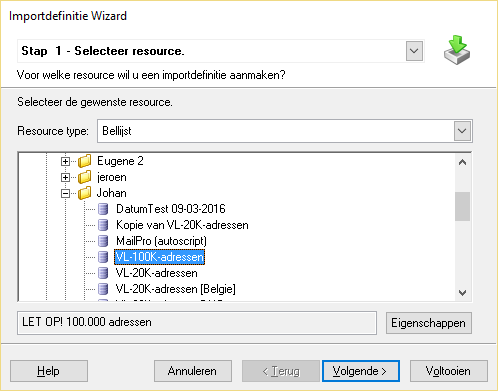 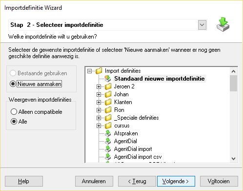
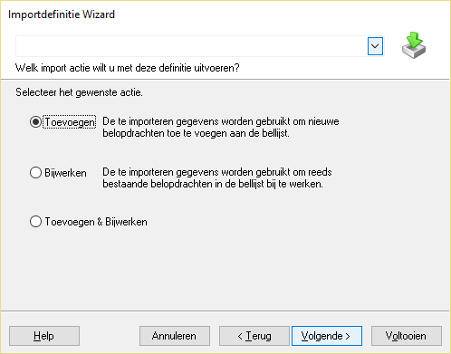 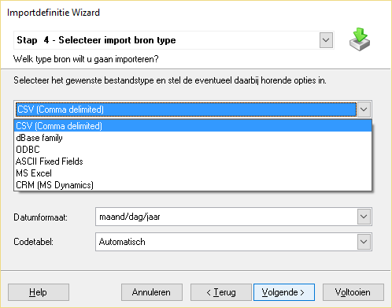

Afhankelijk van het gekozen bestandstype moeten verschillende
instellingen worden gedaan. De meest voorkomende bestanden die worden
aangeleverd zijn “CSV (Comma delimited)” of “MS Excel”. Bij de eerste
moet worden gelet op het veldscheidingsteken, en of de velden worden
gemarkeerd met quotes. Ook herkend CallPro dan het telefoonnummer
meestal als numeriek veld, terwijl dit in CallPro een karakter veld is.
Bij Excel bestanden worden vaak het veldtypes (stap 6) op karakter 255
gezet. Ook kan het zijn dat de lijst met Gegevens bronnen verschilt per
computer als zowel de Nederlandstalige Excel als de Engelstalige Excel
binnen het call center wordt gebruikt.

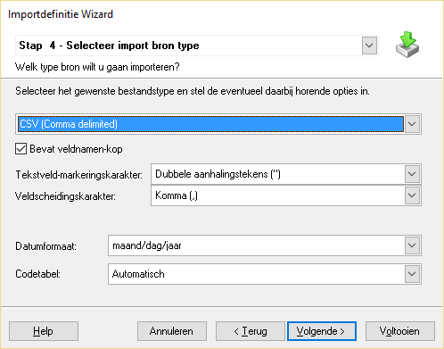 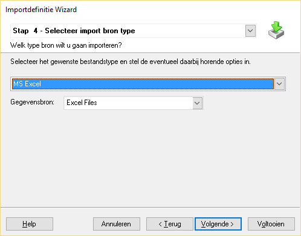

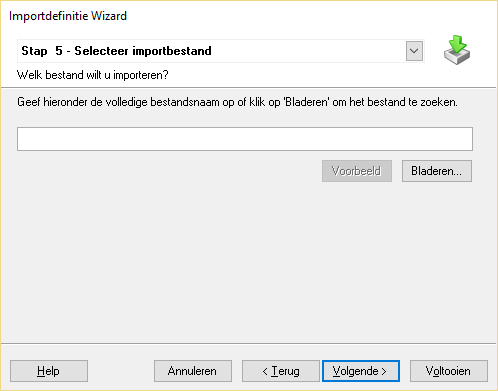 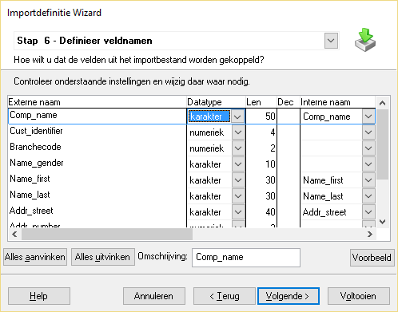

Sommige Excel sheets bevatten tabbladen met namen die niet geldig zijn
in CallPro. Als in stap 5 na de selectie van het Excel bestand en het
tabblad ene foutmelding volgt als onderstaande

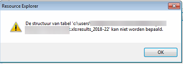

Dan bevat het tabblad in Excel mogelijk tekens die niet geldig zijn.
Tekens die niet altijd werken zijn \*%\!\\/-

In stap 6 worden de velden uit het importbestand (Externe naam)
gekoppeld aan de velden uit de bellijst (Interne naam). Velden die niet
nodig zijn hoeven ook niet te worden geïmporteerd, vul dan geen veld in
bij Interne naam. Velden kunnen alleen gekoppeld worden als het datatype
overeenkomt, en ook de lengte van het Interne veld groter of gelijk aan
de lengte van het Externe veld, dit om gegevensverlies te voorkomen.
Soms herkend CallPro een veld als numeriek (omdat er alleen cijfers in
het veld staan) terwijl die bijvoorbeeld karakter moet zijn. Corrigeer
dan het datatype om het veld te kunnen koppelen.

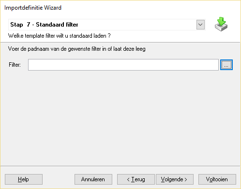 
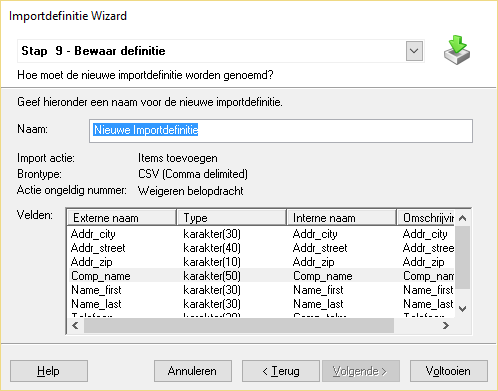

In stap 7 kan een standaard filter worden ingesteld op de
importdefinitie die bij elke import automatisch wordt ingevuld. In de
meeste gevallen moeten alle records uit het importbestand worden
ingelezen en zal dit leeg blijven. In Stap 8 wordt aangegeven wat er
moet gebeuren met ongeldige telefoonnummers tijdens de import, weigeren
(niet importeren) of importeren met een speciale systeemstatus.

Tot slot krijgt de import definitie in de laatste stap een naam.