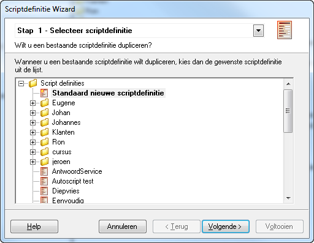
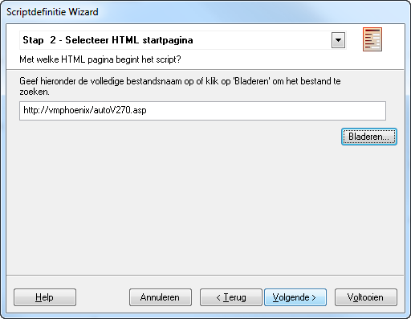
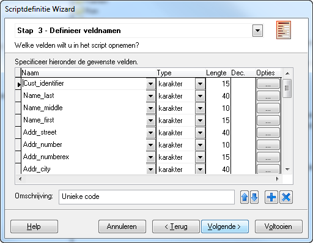
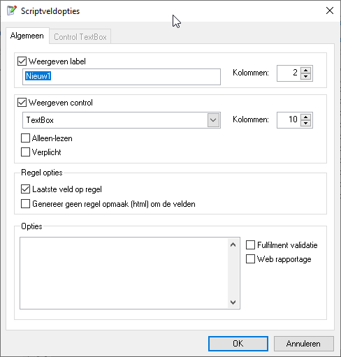
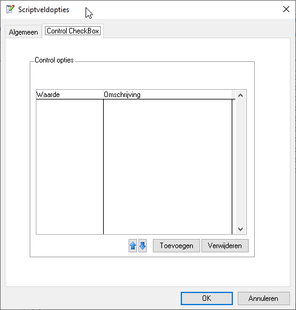
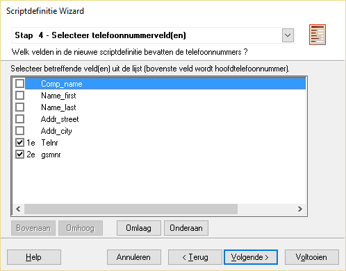
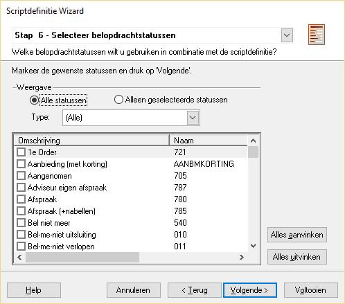
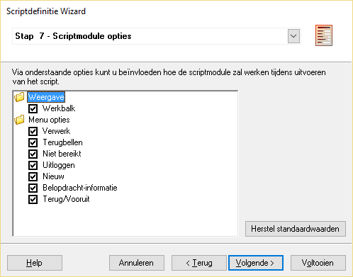
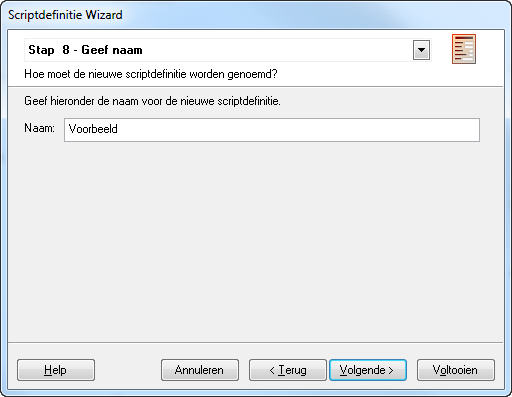
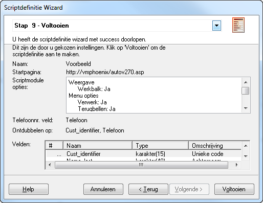

### Scriptdefinities

Een scriptdefinitie beschrijft de scriptvelden, en belopdrachtstatussen
die kunnen worden gebruikt in een belscript of callflow. Een bellijst
wordt aangemaakt op basis van een scriptdefinitie. Bij het aanmaken van
een nieuwe scriptdefinitie kunnen de instellingen van een bestaande
scriptdefinitie worden overgenomen.

In de scriptdefinitie wordt alleen de startpagina van het belscript
vastgelegd. Als het belscript op een webserver (http) staat kan deze
niet via de “Bladeren…” knop worden gekozen maar moet de volledige url
worden ingetypt.

In stap3 worden alle velden die in het belscript worden gebruikt, en/of
die moeten worden geimporteerd vastgelegd. Soms worden velden via het
importbestand aangeleverd die later terug moeten worden geleverd aan de
opdrachtgever, maar tijdens het bellen niet van belang zijn. Deze velden
worden dan wel in de scriptdefinitie (en ook de importdefinitie)
opgenomen. De scriptdefinitie bevat ook velden die niet in het
importbestand staan, maar wel nodig zijn in het belscript (gegevens
verrijking). Ook kan het zijn dat er stuurvelden worden opgenomen in de
scriptdefinitie die worden gevuld afhankelijk van de wijze waarop het
belscript/de callflow wordt doorlopen.

Per scriptveld wordt in ieder geval vastgelegd wat de naam, het datatype
en de lengte is. Aanvullend kunnen voor de autoscript omgeving nog een
Vraag, en de weergave van het scriptveld worden vastgelegd. Deze
informatie wordt alleen gebruikt i.c.m. de autoscript functie van
CallPro.

 

In de scriptdefinitie wordt aangegeven welke velden een telefoonnummer
bevatten. Dit is belangrijk zodat CallPro de telefonie kan aansturen en
telefoonnummers automatisch kan bellen. Een andere belangrijke
instelling zijn de ontdubbelvelden. Door een of meer velden aan te
vinken kan worden vastgelegd dat alleen belopdrachten mogen worden
geïmporteerd die een unieke waarde bevatten voor deze velden. Meestal
wordt hiervoor het telefoonnummer gebruikt.

 

De scriptdefinitie legt ook vast welke belopdrachtstatussen gebruikt
kunnen worden (stap 6). Tijdens het bellen kunnen Agents alleen de hier
geselecteerde belopdrachtstatussen gebruiken om gesprekken af te
coderen.

 

Nu is de scriptdefinitie klaar, en kan een bellijst worden gemaakt
gebaseerd op deze scriptdefinitie.