## Geavanceerde opmaak met het autoscript

Met het autoscript kan een belscript in enkele minuten worden
klaargemaakt. Toch zijn er situaties waar de eenvoud van het autoscript
net niet voldoende is en je als scriptbouwer de weergave of validatie
van velden meer wilt controleren. Hiervoor kan de HTML weergave worden
gebruikt.

Het autoscript maakt standaard regels kolommen aan. Hierdoor worden ook
de custom velden altijd weergegeven binnen een opmaakt voor 1 regel
zoals:

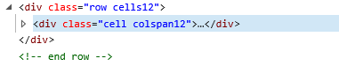

Hierbij staat de html opmaak binnen de binnenste div. Door de optie
“Genereer geen regel opmaak (html) om de velden” aan te vinken
genereert het autoscript geen regels en kolommen maar moet alle opmaak,
compatible met de tabel opmaak van de MetroUI stijl zelf worden
geplaatst in het HTML blok.

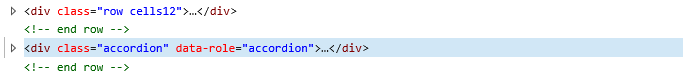

Het is goed te weten dat bij verkeerd gebruik van de html opmaak de
weergave in de war kan raken. Zorg altijd dat de weergave goed
gecontroleerd wordt bij het maken van het script tenzij wordt gewerkt
met maatwerk code die niet zichtbaar is zoals \<script\> blokken.

### Maatwerk opmaak voor invoervelden

Via de control weergave Html kan de gehele opmaak van het veld, of een
samenstel van meerdere velden worden gemaakt. Om deze regel te maken is
de onderstaande html nodig.


Kijk voor inspiratie en mogelijkheden van de MetroUI stijl op de website
<https://metroui.org.ua/v3> Controleer wel altijd de juiste werking
binnen CallPro omdat sommige controls via jQuery worden gemaakt en
hierdoor het in de opmaakcode gedefinieerde input veld niet wordt
gebruikt voor de opslag van de veldwaarde. CallPro kijkt altijd alleen
naar de originele input tag met de naam script_\<veldnaam\> Als jQuery
onder water in het DOM model nieuwe velden aanmaakt zijn deze niet
gekoppeld tenzij ze ook de script_\<veldnaam\> naam krijgen.

### Plaats velden binnen een tabcontrol

Om velden in het autoscript in een tabcontrol te plaatsen zijn 2 extra
scriptvelden nodig. De velden worden verder niet gebruikt dus het beste
kan het veldtype op karakter(1) worden gezet. De TAB01_BEGIN wordt
boven het eerste veld geplaatst dat in de tabcontrol moet komen en
TAB01_END wordt na het laatste veld geplaatst. Bij beide velden wordt
de optie “Genereer geen regel opmaak (html) om de velden” aangegeven en
ook “Laatste veld op regel”. Het voorgaande veld moet ook de optie
“Laatste veld op regel” aan hebben staan zodat de tabcontrol op een
nieuw regel begint.

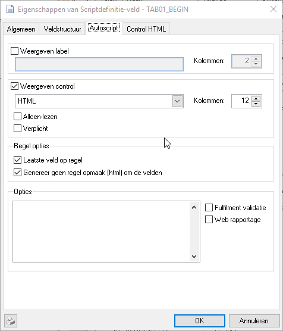 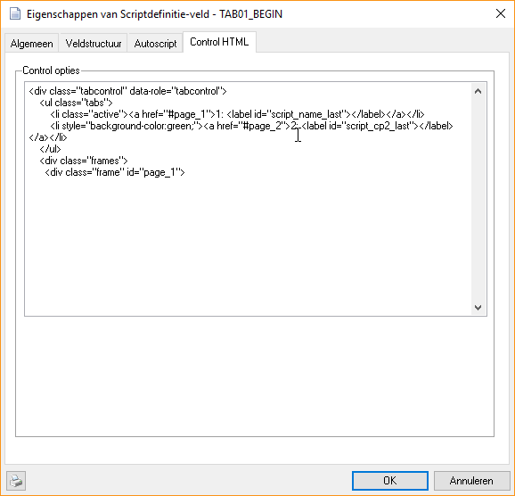

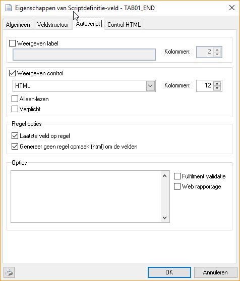 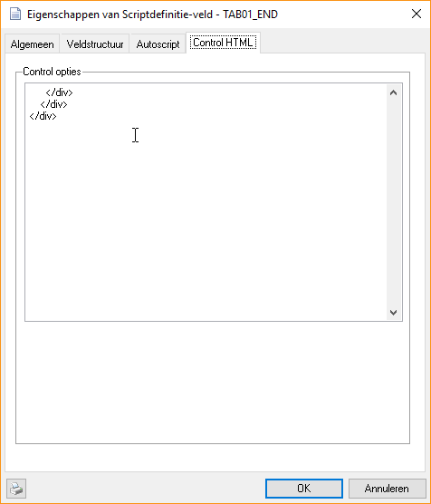

In het autoscript ziet die er als volgt uit.

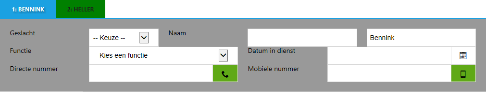

Om extra tabs te maken kan deze opmaak ook weer in een extra veld worden
geplaatst.

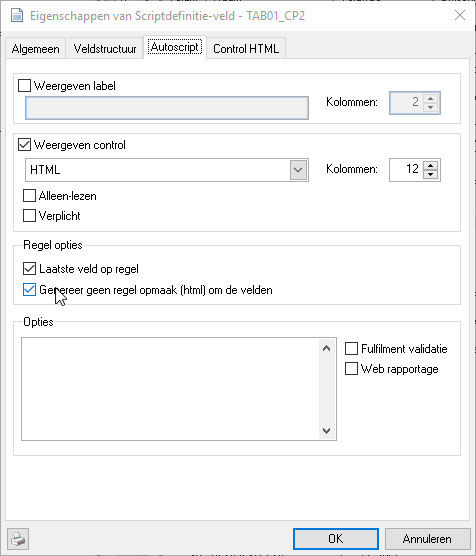 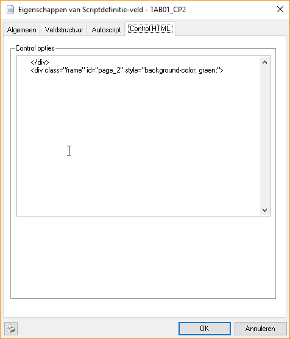

### Belhistorie resultaten aanpassen met CSS opmaak

Als de belhistorie wordt afgebeeld komen alle eerdere belpogingen in de
lijst. Soms wil je bepaalde belresultaten niet weergeven, of juist
markeren in de belhistorie. Dit is mogelijk door gebruik te maken van de
variabele FEATURE.CSS en hier enkele CSS opmaak regels op te nemen.

Door de volgende stijl regel op te nemen kan een belpoging die is
afgecodeert met een belopdrachtstatus worden onzichtbaar gemaakt. In dit
voorbeeld wordt de “Geen gehoor” (120) belopdrachtstatus onzichtbaar
gemaakt.


Door meerdere van deze regels op te nemen met telkens de statuscode (120
in het voorbeeld) kunnen meer belpogingen onzichtbaar worden gemaakt. De
opbouw van elke belpoging is als volgt.

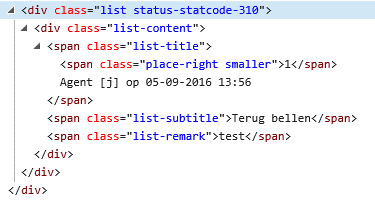

Met deze informatie kunnen ook individuele onderdelen worden aangepast
via CSS opmaak. Bekijk de structuur van de autoscript html pagina eens
vanuit de browser en gebruik de “Inspect element” of “View source”
optie. Via CSS zijn diverse andere onderdelen ook cosmetisch aan te
passen.

### Afcoderingen verbergen in de statuslijst met CSS opmaak

Ook de afcoderingen in de linkerbalk kunnen worden weggehaald met CSS
opmaak. Hoewel er bij de status vanaf v4.30 kan worden opgegeven of deze
in het belscript zichtbaar moet zijn, is die instelling voor alle
belscripts (globaal over CallPro). Om een bepaalde (systeem) status weg
te laten uit 1 belscript, of zelfs voor 1 situatie kan de volgende CSS
opmaak worden gebruikt.

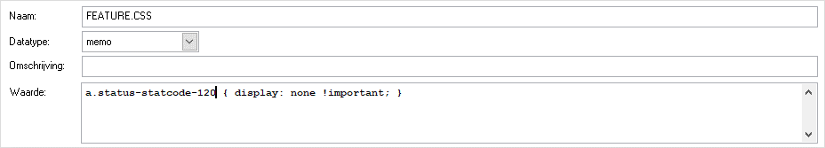

Met bovenstaande CSS opmaak wordt de Geen gehoor systeemstatus
onzichtbaar gemaakt in het autoscript.

### Custom validatie tijdens afcoderen

Tijdens het afcoderen roept het autoscript een functie
“Custom_ValidationCheck” uitgevoerd. Als paramater wordt een
javascript object met de status code die is geklikt doorgegeven. Als
resultaat geeft deze functie een boolean terug die aangeeft of het
afcoderen door mag gaan of niet.

Deze functie oproep wordt vooral gebruikt om extra veld controles te
laten uitvoeren op basis van de afcodering die is gekozen. Bijvoorbeeld
om bij een nieuwe afspraak te controleren dat de NAW gegevens wel
compleet zijn ingevuld, of dat er een email adres voor de lead is
ingevuld. Doorgaan wordt deze functie in de variabele SCRIPT.HEADER
geplaatst.

```
function Custom_ValidationCheck(status) {
var validationResult = true;
switch(status.code)
{
    case "780":
        // Basic gedrag.
        setFieldValue("script_app_email_to",
        getFieldValue("script_name_email"));
        setFieldValue("script_exp_app","");
        break;
    case "710":
        if(getFieldValue("script_info")=="")
        {
        status.errors.add("Kies eerst een informatiepakket");
        validationResult = false;
        }
        if(getFieldValue("script_info_email_to")=="")
        {
        status.errors.add("Kies een email adres voor de verzending");
        validationResult = false;
        }
        if(\!checkValidEmail("script_info_email_to"))
        {
        status.errors.add("Het opgegeven email adres is niet geldig");
        validationResult = false;
        }
        if(validationResult)
        {
        // Last check still valid
        setFieldValue("script_exp_info","");
        }
        break;
}
return validationResult;
}
```

In deze voorbeeld functie wordt bijvoorbeeld voor het versturen van
informatie (code 710) gecontroleerd ode diverse verplichte velden wel
zijn gevuld. Zo niet dan wordt de errors collectie van het status object
gevuld met een melding die vervolgens door het autoscript wordt
afgebeeld.

Het interne status object heeft de volgende velden die kunnen worden
uitgelezen en gebruikt.

<table>
<thead>
<tr class="header">
<th>Veld</th>
<th>Werking</th>
</tr>
</thead>
<tbody>
<tr class="odd">
<td>code</td>
<td>Dit is de code van de belopdrachtstatus die de agent heeft geklikt om af te coderen. Wij hanteren een 3-cijferige code</td>
</tr>
<tr class="even">
<td>logicalcategory</td>
<td><p>Dit is het type veld van de belopdrachtstatus zoals ingesteld op het tabblad “Type en Tijd”. Mogelijk waarden zijn:</p>
<p>1 – Niet bereikt</p>
<p>2 – Terugbellen</p>
<p>3 – Verwerkt</p></td>
</tr>
<tr class="odd">
<td>prioritycategory</td>
<td><p>Dit is de prioriteitscategory van de belopdrachtstatus. Mogelijke waarden:<br />
1 – Niet bereikt hoog</p>
<p>2 – Terugbellen laag</p>
<p>3 – Verwerkt</p>
<p>4 – Systeem</p>
<p>5 – Niet bereikt laag</p>
<p>6 – Terugbellen hoog</p></td>
</tr>
<tr class="even">
<td>errors</td>
<td>Een collectie met fouten. Via de Add functie kunnen aan de errors collectie extra meldingen worden toegevoegd (zie ook het voorbeeld)</td>
</tr>
<tr class="odd">
<td>callbackexpr</td>
<td>Hiermee kan tijdens het afcoderen het standaard gedrag van de belopdrachtstatus worden overschreven voor wat betreft de terugbeltijd expressie.</td>
</tr>
<tr class="even">
<td>callbackagent</td>
<td>Volledige pad+naam van de agent die als terugbelagent moet worden ingesteld.</td>
</tr>
<tr class="odd">
<td>mincallbackexpr</td>
<td>Als callbackexpr maar nu voor de betrefende parameter</td>
</tr>
<tr class="even">
<td>maxcallbackexpr</td>
<td>Als callbackexpr maar nu voor de betrefende parameter</td>
</tr>
<tr class="odd">
<td>autoselect</td>
<td>Een boolean veld dat aangeeft dat CallPro direct moet afcoderen en <strong>niet</strong> eerst het popupvenster van CallPro moet afbeelden.</td>
</tr>
<tr class="even">
<td>entrynote</td>
<td>Door dit veld te vullen kan het notitieveld worden gezet met de betreffende waarde. Deze waarde heeft voorrang boven een waarde die de agent in een veld in het belscript heeft ingevuld.</td>
</tr>
</tbody>
</table>
