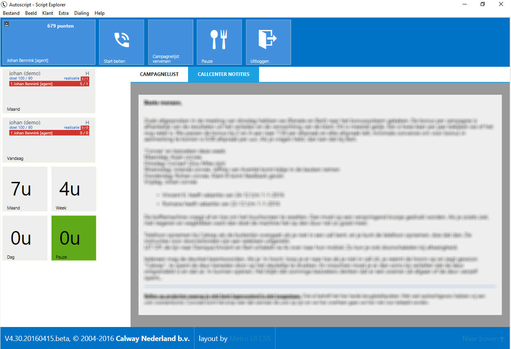
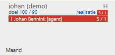
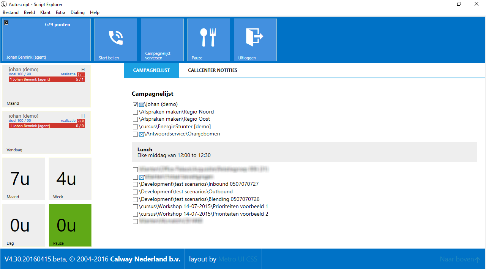

# Pauze pagina

Als een agent inlogt in de scriptmodule wordt als eerste de pauzepagina
getoond. Initieel worden de call center notities getoond, de
campagnelijst geeft een overzicht van de aan de agent gekoppelde
campagnes.

Enkele informatie tiles geven inzicht in de scores van de agent per
campagne en de gewerkte uren.

De score tile geeft per campagne een leaderboard top 5 met agenten op
basis van de instellingen op de campagne, en de globale variabele
BREAK.ScoreTiles.Category. De weergave van deze tiles kan worden
aangestuurd via de BREAK.ShowScoreTiles boolean variabele.

| Variabele                 | Type     | Betekenis                                                                                              |
| ------------------------- | -------- | ------------------------------------------------------------------------------------------------------ |
| BREAK.ScoreTiles.Category | Karakter | Geeft aan welke Belopdrachtstatus categoriegroep wordt gebruikt voor de Score Tiles. (Default = Score) |
| BREAK.ShowScoreTiles      | Bool     | True/**False** Bepaald of de Score Tiles worden weergegeven.                                           |

In de campagnelijst staan alle campagnes die aan de agent zijn
gekoppeld. Een blauwe enveloppe geeft aan dat er een notitie beschikbaar
is. Door op deze enveloppe te klikken wordt de informatie getoond. De
mogelijk voor de agent om zelf campagnes aan/uit te schakelen kan worden
beperkt op globaal niveau of per campagne worden ingesteld met de
variabele BREAK.DisableCampaignSelection.

| Variabele                      | Type | Betekenis                                                                                                                                                                                                                                                                        |
| ------------------------------ | ---- | -------------------------------------------------------------------------------------------------------------------------------------------------------------------------------------------------------------------------------------------------------------------------------- |
| BREAK.DisableCampaignSelection | Bool | True/**False** Bepaald of agenten in het pauzescherm zelf de campagnes aan/uit kunnen vinken waar ze aan zijn gekoppeld. Dit is een globale switch, op campagne. Als deze False is kan op campagne niveau met een zelfde variabele per campagne dit gedrag aan/uit worden gezet. |
