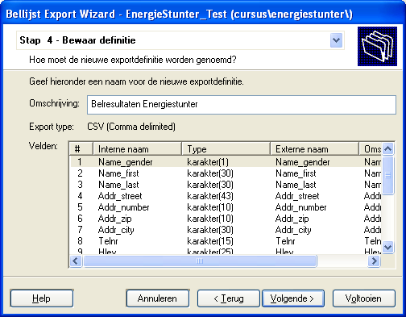
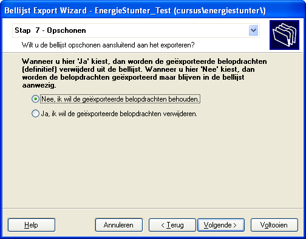

# Rapportage

Voor de dagelijkse aansturing is het van belang dat de supervisor een
overzicht heeft van de resultaten per campagne. Voor de aansturing van
de medewerkers heeft de supervisor ook inzicht in de performance van de
agenten nodig. Binnen de Resource Explorer zijn hiervoor enkel
overzichten beschikbaar.

## Belhistoriestatistieken

Start de wizard Belhistoriestatistieken, deze is te vinden onder XSL
Rapporten in de Resource Explorer. De belhistoriestatistieken geeft een
overzicht van de belpogingen die zijn uitgevoerd op de belopdrachten in
bellijsten. De wizard geeft toegang tot de rapportage templates, of er
kan een nieuwe blanco template worden gebruikt.

 

In de tweede stap kiezen we de rapportage periode, meestal vandaag, deze
week, of deze maand, en optioneel nog welke dialingmode, bellijsten
en/of agenten we willen zien. Deze restrictie is vaak niet nodig omdat
alle resultaten zichtbaar moeten worden. Alleen als met teams wordt
gewerkt is het soms beter om een restrictie te zetten op bellijsten of
agenten.

Vervolgens kan een aggregatieniveau worden ingesteld op maximaal 3
niveaus. Voor campagne scores wordt: “Per bellijst” of “Per campagne”
gebruikt, voor de agent scores “Per agent”. Voor een overzicht waarbij
de tijd meespeelt kan ook “Per dag” of “Per week” als een van de niveaus
worden toegevoegd. In stap 4 bepalen we de kolommen die gewenst zijn.
Een kolom kan een telling van belopdrachtstatussen, een tijdsmeting, of
een verhouding zijn.

Bij de telling van belopdrachtstatussen kunnen individuele statussen
worden gekozen, of kan een “status categoriegroep” worden gekozen. Voor
de tijdsmeting wordt meestal de som of het gemiddelde gebruikt. Met
vinkjes kan worden aangegeven welke tijden gewenst zijn.

Let op\! Zet niet alle vinkjes. De wachttijd is de tijd die een Agent
heeft gewacht totdat hij/zij een nieuwe call kreeg, hierbij is de
setuptijd inbegrepen. De setuptijd telt alleen de tijd die het duurde om
het gesprek (live of non-live) op te zetten.  
Om alle tijd te krijgen moeten dus alle vinkjes
behalve Setuptijd worden gezet\! Of als
het gaat om de tijd die is besteed aan elke belpoging kan alles behalve
Wachttijd worden gebruikt.

Kies voor Verhouding om op basis van de waardes van 2 kolommen een
verhouding te berekenen. Als 2 aantallen kolommen worden gedeeld is het
resultaat een percentage. Wordt een tijdsmeting kolom gedeeld door een
aantal levert dit een gemiddelde tijd op, en als een aantal door een
tijdsmeting wordt gedeeld is het resultaat een aantal/uur.

Maak de kolommen op maat en bewaar de instellingen als nieuwe template.

Als een bestaande template wordt gebruikt hoeft alleen stap 2 te worden
ingevuld en kan direct op voltooien worden gedrukt om naar stap 7 te
springen en het rapport uit te voeren.

Kies voor “Beeld\\Verversen” om de cijfers te verversen, of kies voor
“Beeld\\Automatisch verversen” en kies het interval zodat CallPro
automatisch elke x minuten de cijfers actualiseert.

## Bellijst statistieken

Een eenvoudige vorm van de belhistoriestatistieken. Deze wizard laat
niet de belpogingen, maar de belopdrachten met hun actuele status zien.
In deze rapportage is daarom ook het aantal “Nieuwe belopdrachten” te
zien.

## Bellijst eigenschappen

Door op een bellijst onder “Resources\\Call-lists” of “Campaigns” met
right-click de optie “Statistieken” te kiezen worden de bellijst
statistieken getoond. Dezelfde informatie is ook zichtbaar in het
tabblad “Statistieken” in de eigenschappen schermen van de bellijst.

 

Zoals te zien is aan de bovenstaande screenshots is er wel een verschil.
Het scherm dat vanuit de campagne wordt geopend houdt rekening met het
filter dat op de bellijst in de betreffende campagne is gezet.

In de kolom “Aantal gedeactiveerd” worden belopdrachten getoond met de
betreffende status, maar die inactief staan en dus ook niet door CallPro
zullen worden aangeboden. \<REF:Verwijzing deactiveren belopdrachten\>

## Reportserver rapporten

Microsoft levert met SQL Server een rapportage tool “Reportserver” mee.
Vanuit een web-interface kunnen rapporten worden benaderd en op het
scherm, als pdf, of als Excel bestand worden weergegeven en opgehaald.

Ook biedt deze tool de mogelijkheid om rapporten periodiek uit te voeren
en het resultaat als email te versturen (niet bij de Express versie).
Bij CallPro worden standaard rapporten geleverd die op Reportserver
kunnen worden geïnstalleerd. Uitvoerige behandeling van deze rapporten
valt buiten de scope van dit handboek.

| Rapport                                      | Inhoud/gebruik                                                                                                                                                                                                                                                                                                                                               |
| -------------------------------------------- | ------------------------------------------------------------------------------------------------------------------------------------------------------------------------------------------------------------------------------------------------------------------------------------------------------------------------------------------------------------ |
| Standaard bellijst rapportage                | Dit rapport geeft een overzicht van een resultaten in de bellijst op basis van de huidige belopdrachtstatus. Statussen worden gegroepeerd onder “Te benaderen”, “Uitval”, “Geen interesse” en “Positief..                                                                                                                                                    |
| Standaard bellijst rapportage met beluren    | Hetzelfde rapport als de voorgaande, maar nu worden ook de beluren weergegeven.                                                                                                                                                                                                                                                                              |
| Standaard bellijst rapportage met scriptveld | Hetzelfde als de eerste, maar nu met de mogelijkheid om ook een uitsplitsing op een belscriptveld op te nemen.                                                                                                                                                                                                                                               |
| Standaard bellijst belvoorraad rapportage    | Dit rapport geeft een overzicht van de belbare adressen van alle campagne en per campagne de bellijsten uitgesplitst naar status. Hierbij wordt ook rekening gehouden met filters die op de bellijst in de campagnes zijn ingesteld.                                                                                                                         |
| Standaard Campagne voortgangsrapportage      | Dit rapport geeft de voortgang van een campagne weer op basis van de van te voren ingestelde parameters op de campagne. Zo worden het gesprekstarief, maximaal aantal gesprekken, conversie per live gesprek en conversie op gesprekken ingesteld en wordt op basis van de werkelijke cijfers een prognose van de totale kosten en kosten per score bepaald. |
| Standaard Agent conversie rapportage         | Dit rapport geeft per Agent inzicht in de beluren, en belpogingen gegroepeerd op belopdrachtstatus groepen. Tevens worden conversies per groep getoond in percentage en per uur.                                                                                                                                                                             |
| Agent sessietijden Rapportage                | Geeft inzage in het inlog- en pauze gedrag van agenten.                                                                                                                                                                                                                                                                                                      |
| Agent sessietijden Rapportage 2              | Een alternatieve versie met meer uitsplitsing                                                                                                                                                                                                                                                                                                                |
| Standaard Bellijst conversie rapportage      | Hetzelfde rapport als de voorgaande, maar nu per bellijst.                                                                                                                                                                                                                                                                                                   |
| Belvoorraad per scriptveld rapportage        | Dit rapport geeft een overzicht van de belbare adressen in een bellijst uitgesplitst naar de verdeling over een scriptveld (of een expressie)                                                                                                                                                                                                                |
| Bel-me-niet registraties per adverteerder    | Dit rapport geeft een overzicht van de aantallen bel-me-niet en RVV registraties per Adverteerder                                                                                                                                                                                                                                                            |
| Wachtrij overzicht                           | Geeft per wachtrij statistieken van aantallen gesprekken en wachttijd weer                                                                                                                                                                                                                                                                                   |
| Campagne Performance                         | Geeft voor 1 dag voor 1 of meer campagnes een performance overzicht van de dialer.                                                                                                                                                                                                                                                                           |
| Agendavulling                                | Een rapport dat voor een week de vulling van elke agenda per dag van de week weergeeft. Per dag is te zien hoeveel afspraken er staan, en hoeveel beschikbare blokken over zijn. Ook als een gebeurtenis op of over een afspraakblok staat telt deze niet meer als beschikbaar.                                                                              |

# Exporteren

Om de belresultaten die met CallPro worden gerealiseerd te exporteren
voor gebruik in andere systemen, of als terug levering naar de
opdrachtgever wordt gebruik gemakt van de Export optie in CallPro.

Na de keuze voor “exporteren...” start de exportwizard. Indien eerder
een export is gedaan op de bellijst dan zal de exportdefinitie van de
laatste export standaard zijn geselecteerd. Kies deze, een andere, of
maak een nieuwe exportdefinitie. Als we kiezen voor het maken van een
nieuwe exportdefinitie worden de volgende stappen doorlopen.

In stap 2 wordt het type exportbestand gekozen dat moet worden gemaakt.
Afhankelijk van deze keuze kunnen verdere instellingen worden gedaan.
Voor een CSV bestand moet worden opgegeven of het exportbestand een
kolom kop moet krijgen met de namen van de velden, of tekstvelden moeten
worden omsloten met een bepaald teken, welk karakter het
veldscheidingsteken moet zijn en in welk formaat een datum wordt
geschreven.

In stap 3 wordt aangegeven welke velden in het exportbestand worden
opgenomen. Alle scriptvelden staan standaard aan, en geen enkel
systeemveld van CallPro staat aangevinkt. Kies de velden die moeten
worden opgenomen en pas eventueel de externe naam aan. De externe naam
wordt bijvoorbeeld gebruikt als veldnaam in de kolomkop van
CSV-bestanden.

In Stap 4 wordt de nieuwe scriptdefinitie voorzien van een naam en
bewaard. Daarna vervolgt de export met stap 5 om een export filter te
definiëren. Meestal zal dit filter bestaan uit de te exporteren
belopdrachtstatussen en een gewijzigd datum. Export filters zijn gelijk
aan de filters die op bellijsten in de campagne kunnen worden gezet. Ten
slotte wordt in Stap 6 de bestandsnaam opgegeven van het exportbestand.

Bij reguliere exports van belresultaten zal Stap 7
altijd met “nee” beantwoord worden.
Alleen als het de bedoeling is om de belopdrachten ook te verwijderen
uit de bellijst moet hier “Ja” geantwoord worden. Let op dat bij de
keuze “Ja” alle belpogingen ook worden verwijderd en dus geen
rapportages meer mogelijk zijn.

De export start en er wordt weergegeven hoeveel records er worden
geëxporteerd.
