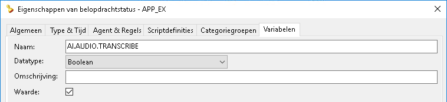

# Gesprekstranscriptie
CallPro biedt de mogelijkheid om van de opnames van gesprekken transcripties te maken. Van de transcriptie wordt een samenvatting gemaakt, en er kunnen ook vragen worden gesteld over deze transcriptie.

Om gesprekstranscriptie in te stellen zijn de volgende instellingen nodig.

## Instellingen
### AI.AUDIO.TRANSCRIBE
De transcriptie kan worden ingesteld op verschillende niveaus. Deze variabele kan bij een belopdrachtstatus, scriptdefinitie of campagne worden vastgelegd. Het moet een variabele zijn van het datatype `boolean` en de waarde moet `true` zijn.
* Door bij een belopdrachtstatus de variable vast te leggen worden alle gesprekken, call center breed, die worden afgecodeerd met deze status voorzien van een transcriptie en samenvatting. 

* Door bij de scriptdefinitie de variabele vast te leggen worden alle gesprekken van belopdrachten uit een bellijst die is gebaseerd op deze definitie voorzien van een transcriptie en samenvatting.

* Door op een campagne de variabele vast te leggen worden alle gesprekken die binnen deze camagagne ontstaan voorzien van een transcriptie en samenvatting.

### AI.AUDIO.LANGUAGE
Standaard wordt verondersteld dat de gesprekken in het Nederlands zijn en wordt als culture `nl-NL` gebruikt. Indien een afwijkende, maar door Azure Speech ondersteunde taal wordt gesproken kan dit worden aangepast met deze variabele.
De instelling kan op zowel de Scriptdefinitie, als op Campagne niveau worden gedaan, waarbij als beide zijn ingesteld de Campagne instelling voorrang heeft.
De beschikbare Speech to Text talen zijn te vinden bij de [Speech service documenttation](https://learn.microsoft.com/en-us/azure/ai-services/speech-service/language-support) hoewel meestal `nl-NL`, `nl-BE`, `fr-BE`, `fr-FR`, `de-DE` of `en-EN` toepasbaar zullen zijn.

### AI.SUMMARIZATION.PROMPT
Voor het maken van de samenvatting wordt een standaard prompt gebruikt. De {0} placeholder wordt in CallPro vervangen door de naam van de Agent.
> Je bent een digitale assistent die samenvattingen maakt van gespreksopnames van een callcenter agent (`{0}`). Geef naast de samenvatting ook alle relevante informatie die tijdens het gesprek is verzameld weer.

Deze variable kan ook op scriptdefinitie of campagne niveau worden vastgelegd en vervangt de standaard prompt.

### AI.ANSWERQUESTION.PROMPT
Bij het beantwoorden van vragen wordt een standaard prompt gebruikt. De {0} placeholder wordt in CallPro vervangen door de naam van de Agent.
> Je bent een digitale assistent die vragen beantwoord over een gesprekstranscriptie tussen een callcenter agent (`{0}`) en een klant.

Ook deze prompt kan worden ingesteld op zowel scriptdefinitie als campagne niveau en vervangt dan de standaard prompt.

### AI.QUESTIONS
> Dit is een experimentele feature die in de toekomst kan veranderen.

Door op de scriptdefinitie een variabele met deze naam van het type `Memo` vast te leggen kan hier in json een aantal vragen worden vastgelegd die worden gesteld middels AI over de gesprekstranscriptie.
```json
[
{
	"AssociationType": "<ScriptDef | ScriptField>",
	"AssociationLabel": "<weergave label>",
	"Question": "<vraag>"
},
...
]
```
Het is een json array met vragen waarbij de schrijfwijze exact moet matchen. Bij typefouten wordt geen enkele vraag gesteld!

Met het `AssociationType` wordt aangegeven of dit een vraag is die globaal op scriptdefinitie `ScriptDef` of specifiek slaat op een scriptveld `ScriptField`. Dit wordt gebruikt bij de weergave van de antwoorden.

Het `AssociationLabel` wordt gebruikt als weergave van de vraag en `Question` is de volledige prompt die aan de AI wordt gegeven.

Om de AI te forceren om met Ja of Nee te antwoorden kun je de vraag-zin eindigen met `, antwoord alleen met 'Ja' of 'Nee'?`  hoewel soms de AI alsnog meer tekst als antwoord geeft.

## Speciale scriptvelden
Door in de scriptdefinitie deze velden op te nemen kan de waarde van de transcriptie, of de samenvatting worden overgenomen in de belopdracht.
Omdat een belopdracht vaker kan worden gebeld en afhankelijk van de instellingen vaker een transcript  wordt gemaakt moet rekening worden gehoude ndat de belopdracht alleen de **laatste** transcriptie zal bevatten.
### ai_transcription
Door een veld met deze naam op te nemen van het datatype `Memo` zal na het maken van de transcriptie in de belopdracht dit veld worden gevuld met de laatste transcriptie.
### ai_summary
Door een veld met deze naam op te nemen van het datatype `Memo` zal na het maken van de samenvatting in de belopdracht dit veld worde ngevuld met de laatste samenvatting.
