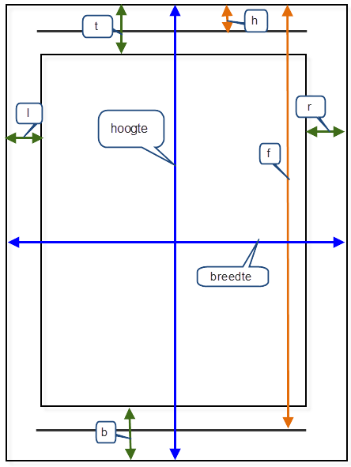

# Fulfilment handleiding
De Mergetool is een krachtige tool waarmee allerhande fulfilment acties of andere nabewerkingsacties kunnen worden geautomatiseerd. Mogelijkheden van de tool zijn het automatisch e-mailen, brieven maken, wijzigingen doorvoeren in de database, communiceren met externe bronnen (webservices & API’s).

De Mergetool is eenvoudig in gebruik, maar vergt wel enige kennis voor het inrichten van de juiste acties. Vereiste voorkennis voor succesvol gebruik zijn:

* [XML kennis](./basiskennis.md#xml-kennis)
* [SQL kennis](./basiskennis.md#sql-kennis)
* [CallPro Datamodel kennis](./basiskennis.md#callpro-datamodel)
* Optioneel: HTML kennis

# Configuratiebestand
Een fulfilmentservice configuratiebestand heeft een XML opmaak en ziet er als volgt uit:

```xml
<Settings>
    <Schedule>
        <Cron>
            <Expression>* * * * *</Expression>
        </Cron>
    </Schedule>
    <ConnectionString>database connectionstring</ConnectionString>
    <MailServer [Domain="maildomain"] 
        [DefaultTimeOutSeconds="300"]
        [Username="username"]
        [Password="password"]
        [Userdomain="userdomain"]
    >
        [smtpserver,only for SMTP mail actions]
    </MailServer>
    <LogLevel>level</LogLevel>
    <Errors>
        <Email From="[from adres]">[email adres]</Email>
    </Errors>
    <CryptoKey>[cryptokey]</CryptoKey>
    <RegionalSettings>
        <Language>nl-NL</Language>
        <DecimalSeparator>.</DecimalSeparator>
        <ThousandsSeparator>,</ThousandsSeparator>
        <CurrencySymbol>€</CurrencySymbol>
    </RegionalSettings>
    <Name>korte naam van de fulfilment</Name>
    <Description>Omschrijving van de fulfilment</Description>
    <System>true | false</System>
    <WorkingDirectory>c:\data\fulfilment\...</WorkingDirectory>
    <Variables>
        <VariabaleNaam1>waarde1<VariabaleNaam1>
        <VariabaleNaam2>waarde2<VariabaleNaam2>
    </Variables>
    <Query>
        [Queries en actions]
    </Query>
</Settings>
```

## Algemene instellingen
Dit zijn de algemene settings die globaal gelden voor alle MergeTool acties die verderop beschreven worden. Wanneer deze niet opgegeven zijn dan worden de gegevens gebruikt uit de mergetool.exe.config.

### Connectionstring
Dit is de database connectie naar de CallPro database. Deze tag is optioneel en hoeft alleen te worden ingevuld als een andere database dan de Callpro database gebruikt dient te worden. Een connectie string ziet er als volgt uit:

``` 
data source=<servername>;initial catalog=<databasename>;Application Name=CallPro Fulfilment; user id=<db-user>;password=<db-password>;persist security info=False;TrustServerCertificates=true
```
* `servername` is de naam van de sql server machine
* `databasename` is de naam van de database op de eerder genoemde server
* `db-user` is een geldige gebruiker op de server met toegang tot de database
* `db-password` is het password van de gebruiker

In deze connectie string kan optioneel een `querytimeout=30;` attribuut worden meegegeven (default waarde 30) die bepaald hoe lang een query mag duren vorodat deze is afgerond. Ook kan een connection timeout `connect timeout=60;` worden ingesteld die aangeeft hoe lang het verbinden met de database/server mag duren. Met name als gewerkt wordt met remote servers kan het nodig zijn deze waarden te verhogen. Voor lokaal gebruik zijn de defaults voldoende. 
> Let op: Wanneer de connectionstring naar een andere database wijst dan de CallPro database kan er geen gebruik worden gemaakt van resource acties.

> **DEPRECATED**: In versies van de mergetool voor 5.0.0 was de tag anders. Bij migratie dient deze instelling aangepast te worden omdat de oude syntax bij de opvolgende versie **niet** meer ondersteunt wordt. De oude syntax was:

```xml
<ConnectString>database connectionstring</ConnectString>
```

### MailServer
De mailserver tag is optioneel en hoeft alleen te worden gebruikt als een andere mailserver dan de standaard mailserver gebruikt dient te worden voor het versturen van mail in deze .config.

Voor SMTP servers staat de servernaam of ip-adres ingevuld als waarde. Voor Exchange zijn de attributen zoals domein, username etc verplicht. Indien er gebruik van SSL gemaakt moet worden geeft dan direct na de URL de ssl-poort op, bijvoorbeeld:
```
smtp.office365.com:587
```
Als de mailserver setting ontbreekt in de config wordt de setting uit de applicatie configuratie gebruikt.

### Loglevel
Loglevel bepaald hoeveel informatie de Mergetool naar een logbestand schrijft. Mogelijke loglevels zijn:
| LogLevel | Omschrijving |
| - | - |
| trace | Alles |
| debug | Alleen debuginfo en hoger |
| info, information | Alleen interessante informatie en hoger |
| warn,  warning | Alleen waarschuwingen en hoger |
| error | Alleen errors en hoger |
| fatal, critical | Alleen fatal errors |

Wanneer de loglevel in de config ontbreekt wordt de loglevel uit de applicatie configuratie gehaald.

Optioneel kan een ReferenceID worden meegegeven aan iedere logregel. Dit kan
worden aangezet door een expressie op te nemen als Tag attribuut, bijvoorbeeld:
```xml
<SQL Collection="SQL" ReferenceID="e:%SQL.ENTRYID%">
```
Dit zal een logregel opleveren waarbij de logmelding vooraf wordt gegaan door `e:<entryid>`

### Error mail notificatie
Een logfile wordt altijd aangemaakt. Deze logfile kan optioneel worden gemaild naar een email adres dat hier wordt ingesteld. De logfile wordt alleen verstuurd wanneer er logmeldingen zijn van het type error.
```xml
<Errors>
    <Email From="[from adres]">[email adres waar de log file naar to gemailt wordt]</Email>
</Errors>
```

> **DEPRECATED**: In versies van de mergetool voor 5.0.0 was de syntax anders. Bij migratie dient deze instelling aangepast te worden omdat de oude syntax bij de opvolgende versie **niet** meer ondersteunt wordt. De oude syntax was:

```xml
<ErrorsMailTo>[email adres waar de log file naar to gemailt wordt]</ErrorsMailTo>
```

### CryptoKey
Deze optionele parameter kan worden gebruik om data te encrypten voor bijvoorbeeld vertrouwelijke oproepen naar de CallPro portal die in een email meegestuurd worden.
De cryptokey kan in iedere action overschreven worden door een actionbased
cryptokey. Deze wordt echter na de action weer gereset naar de default.

### Schedule
Met deze optie kunnen taken gescheduled worden in de Mergetool i.p.v. eenmalige batches of scheduling via de windows task scheduler.
Aan een config kunnen meerdere schedules worden toegevoegd.

```xml
<Schedule>
    <Cron>
        <Expression>5,20,40,55 * * * *</Expression>
    </Cron>
</Schedule>
```

Voor de exacte syntax van deze cron regels kijk op [Crontab Guru](https://crontab.guru) waar je eenvoudig een scheduke kutn maken.

## Queries en Acties
Acties zijn specifieke settings in de configuratie file die betrekking hebben op, en iets doen met data. Een actie staat altijd genest binnen een Query. De query haalt immers de data op. Zonder data geen acties!

### Query loop
Een Query levert zoals gezegd een recordset op. Dit is een lijst met data uit de database. Deze data is te refereren door gebruik te maken van een collectie naam en de veldnamen. Een collectienaam wordt als attribuut meegeven aan de SQL tag (zie verder). Dit bepaald de naam van de recordset. Een collectie heeft daarna 1 of meer velden, ook wel kolommen genoemd. Deze zijn te refereren door de kolomnaam uit de query. Bijvoorbeeld:

```xml
<Query Condition="yes|no|expression">
    <SQL Collection="collectionname">select * from table</SQL>
    [one or more Actions; <Action>]
    [one or more Queries; <Query>]
</Query>

```
Bij een query kan een optionele vlag condition worden gezet (staat standaard op true). Wanneer deze vlag op **yes** staat dan wordt de query uitgevoerd, anders niet.

Binnen een query kunnen weer 1 of meerdere (sub)query’s worden gedefinieerd. Deze moeten voldoen aan dezelfde voorwaarden.

> Let op: Als een query geen resultaat oplevert bestaat de collectie niet!. Echter als de query op het zelfde niveau staat als vervolg acties of query’s worden deze wel uitgevoerd. Het resultaat van een query is altijd true, ook al levert het geen records op.

### Repeat loop
In plaats van een query kan ook een repeat blok worden gemaakt. Een repeatblok ziet er als volgt uit:
```xml
<Repeat>
    <Counter Collection="dummy">10</Counter>
    [one or more Actions; <Action>]
    [one or more Queries; <Query>]
</Repeat>
```
Binnen de repeat kunnen net als bij een Query actions worden gedefinieerd. Het voorbeeld blok zal alle geneste acties 10x uitvoeren. De variabele %dummy.recordnr% bevat het huidige iteratie nummer en is zero-based.
Naast een teller kan ook een opsomming worden meegeven die komma gescheiden is.
Bijvoorbeeld: <Counter Collection="set">a,b,c,10</Counter>
De volgende merge velden worden dan gemaakt:
%set.Recordnr% en %set.Value% met de waarden 0,"a" |1,"b" | 2,"c" en 3,"10"

### Excel loop
Een excel loop is vergelijkbaar met een Query loop. De data komt echter uit een excel sheet.
```xml
<Excel>
    <FileName Collection="excelrows" sheet="sheet1"></FileName>
    [one or more Actions; <Action>]
    [one or more Queries; <Query>]
</Excel>
```
Sheet bepaald de naam van de sheet met daarin de data.

## Acties
Een `actie` is een onderdeel van een `query`, en zal voor ieder record uit de query worden uitgevoerd. Als voor een record een actie niet uitgevoerd kan worden omdat bijvoorbeeld een template niet bestaat dan worden alle volgende acties overgeslagen voor dit record, en springt het programma door naar het volgende record uit de recordset van de bovenliggende (omvattende query). Er zijn verschillende soorten acties:

```xml
<Action Type="Merge | Email | SQL | Pdf | Tag | FileCopy | Webservice | FTP | Resource | Set | SMS" Mergetwice="0..">
    ...
</Action>
```

De verschillende soorten actie tags worden in de komende paragrafen verder behandeld. Het `Mergetwice` attribuut kan wordne gebruikt om de inhoud van een tag vaker te evalueren. Standaard wordt de tag inhoud 1 keer door de merge enige gehaald om velden te vervangen. Soms komt uit het samenvoegen een nieuw veld dat ook moet worden vervangen, en het is dan nodig om via de `Mergetwice` attribuut aan te geven dat het resultaat vaker dan 1 keer moet worden samengevoegd.

### Action hierarchie
Het resultaat van een actie gaat mee naar een vervolg actie als deze binnen dezelfde loop/query zit (zelfde niveau). In dit voorbeeld heeft Actie A geen effect op Actie B of C.
```xml
<Query>
    <SQL></SQL>
    <Query>
        <SQL></SQL>
        <Action A>
        </Action A>
    </Query>
    <Query>
        <SQL></SQL>
        <Action B>
        </Action B>
    </Query>
</Query>
<Action C>
</Action C>

```

### OnSuccess en OnFailure
Met een `OnSuccess` en `OnFailure` tag kunnen vervolg acties conditioneel worden uitgevoerd. Als de omvattende actie met success is uitgevoerd, dan worden de acties binnen de `OnSuccess` tag uitgevoerd. Als de omvattende actie een fout oplevert, dan worden de `OnFailure` acties uitgevoerd. Op deze manier kan zowel conditionele acties worden ingericht, als ook foutafhandeling.
> **DEPRECATED** In versies van de mergetool voor 5.0.0 was de tag OnSuccesful maar deze wordt vanaf 5.0.0 vervangen door OnSuccess. Bij migratie dient deze instelling aangepast te worden omdat de oude syntax bij de opvolgende versie **niet** meer ondersteunt wordt.

Wat je ook kan doen als je bepaalde acties wilt laten afhangen van het resultaat van de buitenste is dit:
```xml
<Query>
<SQL></SQL>
    <Query>
        <SQL></SQL>
    </Query>
    <Query>
        <SQL></SQL>
    </Query>
    <Action A>
        <OnSuccess>
            <Action C>
            </Action C>
        </OnSuccess>
    </Action A>
    <Action B>
        <OnSuccess>
            <Action C>
            </Action C>
        </OnSuccess>
        <OnFailure>
            <Action D>
            </Action D>
        </OnFailure>
    </Action B>
</Query>
```
Bij een `OnFailure` worden er een tweetal tags toegevoegd aan de mergefield collection:
DEBUG.ACTION en DEBUG.LASTERROR

### Conditional attribuut
Dat wil zeggen dat een actie alleen wordt uitgevoerd als aan een bepaalde voorwaarde (condition) wordt voldaan.
```xml
<Action Type="eMail" Condition="%VARIABLE.TESTVALUE% = 1">

</Action>
```

In dit voorbeeld wordt de eMail actie alleen uitgevoerd wanneer VARIABLE.TESTVALUE evalueert naar 1. In de condition kan gebruikt worden gemaakt van de volgende operators: =, <>, <, >, <=, >= en ><. De variabelen worden geanalyseerd en geëvalueerd op types: string, integer, decimaal of datum.
De laatste operator >< werkt al een “in" statement, bijvoorbeeld:
3 >< (1,2,3,4,5) zal true opleveren.

### Cryptokey attribuut
In de header van iedere action kan een optionele cryptokey worden meegegeven. Deze wordt gebruikt in de xx switch om een mergestring te encrypten. De crytpo key die zo wordt ingesteld geldt alleen voor alle acties en queries binnen deze action. Bijvoorbeeld:
```xml
<Action Type="eMail" cryptokey="%VARIABLE.CRYPTOKEY%">
…
</Action>
```

### Merge action
De merge actie is de meest voorkomende actie die wordt gebruik om uitvoer te genereren. Deze actie neeemt een input template en genereert output in een bestand.
```xml
<Action Type="Merge">
    <Input source="BLOB|FILE">inputtemplate</Input>
    <Output Append="yes|no"
        EOL="windows|unix|<characters>"
        Encoding="<encoding>">outputfile</Output>
</Action>
```
De input template kan uit de database komen, of uit een bestand. Voor bestanden worden enkele typen herkend zoals Word (extensie .docx) of Excel (extensie .xlsx) of tekstbestanden.

#### Word
Voor het gebruik van Word als merge template dient de `source=file` te worden gebruikt en moet het bestand de .docx extensie hebben (en uiteraard een Microsoft Word bestand zijn). Van ieder record wordt een input template gemerged (Source=FILE).

#### Excel
Om Excel als input template te gebruiken voor een merge dient dit bestand aan enkele voorwaarden te voldoen.

1. Het bestand moet een Excel bestand zijn met extensie .xlsx
2. Het Excel bestand moet minimaal 1 worksheet bevatten.
3. Regel 1 in het Excelbestand bevat de header regel en regel 2 in het excel bestand bevat de detail regel.
4. Indien per export record meerdere Excel rijen geschreven moeten worden kan ook een name region (CTRL-F3) gemaakt worden`header`en een named region `detail` die de betreffende onderdelen bevatten. Zo kan data over meerdere rijen worden verdeeld.

```xml
<Action Type="Merge">
    <Input Sheet="belopdrachten">inputtemplate.xlsx</Input>
    <Output Sheet="%SYS.DATE%">output-%SYS.DATE%.xlsx</Output>
    <MergeCopy>infosheet</MergeCopy>
    <Copy>pivotsheet</Copy>
    <Copy>grafieksheet</Copy>
</Action>
```
Standaard gedragsregels bij Excel merges:
1. Wanneer er meerdere sheets in de input Excel staan worden deze standaard
gekopieerd naar de output Excel als het output bestand nog niet bestaat.
2. Als binnen de actie 1 of meer `<MergeCopy>` of `<Copy>` tags worden gevonden dan worden alleen de sheets vermeld in deze tags overgenomen van de input Excel naar de output Excel en ook alleen bij aanmaken van de output Excel.
3. Een `<Copy>` tag kopieert de bronsheet naar de output Excel.
4. Een `<MergeCopy>` tag kopieert de bronsheet ook naar de output Excel maar voert ook een merge uit op eventuele merge-expressies op deze sheet.
5. De output sheet wordt altijd aangemaakt als die nog niet bestaat in de output
Excel.
6. Als in de output Excel een sheet reeds bestaat worden regels toegevoegd aan
de reeds aanwezige regels in de betreffende sheet.

#### Tekstbestand
Het resultaat van de input template wordt geschreven naar de outputfile. Met de attribuut `append=yes` kan worden bepaald of een bestaand bestand wordt uitgeebreidt, of overschreven. 

De optionele `Encoding` attribuut geeft aan welke encoding wordt gebruikt om het output bestand te maken en te schrijven. Mogelijke encodings zijn:
* utf-8 - Windows default
* utf-7 - Only use for legacy, this encoding is less secure
* utf-16 - also known as unicode
* utf-16BE - Bigendian Unicode
* unicode - Windows default unicode encoding
* utf-32
* us-ascii

> Let op: Wanneer een input template meerdere keren gemergd moet worden gebruikt dan innersource="file" bij de `<input>` tag. Zonder deze toevoeging wordt het inputbestand “slechts" 1x gemergd.


### Email action
```xml
<Action Type="eMail">
    <System>SMTP|Exchange|exchange_ews_basic_auth|m365_graph_api</System>
    <MailServer [Domain="maildomain"] [DefaultTimeOutSeconds="0"]
        [Username="username"]
        [Password="password"]
        [Userdomain="userdomain"] 
        [applicationid]="ApplicationId"
        [tenantid]= "tenantId"
        [clientsecret] = "clientSecret" >
        [smtpserver,only for SMTP mail actions]
    </MailServer>
    <ReadReceipt>YES|NO</ReadReceipt>
    <From Name="friendlyname">van</From>
    <Onbehalfof Name="friendlyname">van</Onbehalfof>
    <Recipient Type="TO|CC|BCC" Name="friendlyname" 
        Validate="TRUE|FALSE">emailadres</Recipient>
    <Subject>onderwerpregel</Subject>
    <Header Name="headertag">van</Header>
    <Body Merge="YES|NO" InnerSource="BLOB|FILE"
        BodyType="HTML|PLAIN">emailbodytext</Body>
    <Attachment [cid="content-Id"] [type="FILE|TEXT|BLOB"]
        [OutputFile="attachmentfilename"] [Seperator="+" PathPrefix="path only">
        attachmentfile
    </Attachment>
</Action>
```
#### System en MailServer
Het mail system dat gebruikt kan worden voor het versturen van email.
Standaard worden de gegevens overgenomen van de globale MailServer instellingen uit de settings sectie. Wanneer de MailServer tag wordt opgenomen overschrijft dit de globale instellingen voor deze actie.

##### SMTP
Hiermee wordt de mail verstuurd via een smtp server. De `MailServer` tag die volgt geeft dan het server adres aan en in de parameters `Username`, `Password` voor het inloggen met basic authentication.
##### exchange_ews_basic_auth of Exchange
Dit is een Exchange webservice koppeling die gebruik maakt van basic authentication. De naam `Exchange` is behouden voor backward compatibility. Gebruik in de `MailServer` tag het server adres en in de parameters `Username`, `Password`, en optioneel `Userdomain` de naam van Active Directory.

> Vanaf 1-10-2022 kan dit **niet** meer gebruikt worden met Microsoft/Office 365 omdat Microsoft Basic Authentication vanaf die datum heeft uitgeschakelt. Sinds 2018 geeft Microsoft al aan dat de webservices obsolete zijn en niet verder worden doorontwikkeld. Het wordt geadviseerd om over te stappen op de Microsoft Graph API.
De exchange webservice koppeling kan nog steeds gebruikt worden voor on-premise Exchange servers of mail servers die compatible zijn met de Exchange WebServices.

##### m365_graph_api
Hierbij wordt gebruik gemaakt van de Microsoft Graph API. De `MailServer` tag heeft geen inhoud maar wel de parameters `applicationid`, `tenantid` en `clientsecret`. Maak in Azure Portal een App registration die deze gegevens oplevert. 
#### ReadReciept
Geeft aan of de verzender van de email een lees bevestiging wilt ontvangen.
#### From
Het From adres voor de email. Als parameter kan ook een `Name` worden opgegeven die als friendlyname wordt gebruikt.
#### OnbehalfOf
Indien gezet wordt dit gebruikt om een `onbehalf of` in te stellen. Ook bij deze tag kan een parameter `Name` worden gebruikt die als friendlyname wordt gebruikt. 
#### Recipient
De recipient tag mag vaker voorkomen binnen de email actie. 
Er dient minimaal 1 TO recipient te zijn. Meerdere recipients kunnen zowel in aparte recipient tags, als binnen een recipient tag als , of ; gescheiden lijst worden opgegeven. Bij de recipient kan ook een friendlyname worden meegegeven in de `Name` parameter.
De `Validate` parameter bepaald of een poging wordt gedaan om te controleren dat het opgegeven email adres geldig is door contact op te nemen met de mailserver van het domein.

#### Subject
De onderwerp regel van de email
#### Header
#### Body
De email body tekst
#### Attachment
De Attachment tag mag vaker voorkomen binnen de email actie. De attachment file mag ook een wildcard naam zijn in plaats van 1 specifieke filename.

De content-Id is optioneel bij een attachment, en zorgt ervoor dat een afbeelding in de mailbody wordt weergegeven wanneer daar een img tag staat met dezelfde content-Id Bijvoorbeeld: ` />`

Voor attachment is File de default, dus de attachment moet een bestaande file zijn.
Wanneer blob of text worden gebruikt komt de inhoud van de attachment uit een database veld (collection). Alles ook mogelijk icm de Content-ID
De emailbodytext mag zowel een ascii tekst bestand zijn als een HTML bestand (Source=FILE) of een blob (Source=BLOB). Wanneer de optionele Merge tag NO is wordt dit bestand niet gemerged, de default hiervoor is echter YES.


### SQL Action
```xml
<Action Type="SQL">
    <SQL>querystring</SQL>
    <ConnectionString>connectionstring</ConnectionString>
</Action>
```
Deze actie kan bijvoorbeeld gebruikt worden om update en/of insert queries uit te voeren. De ConnectionString is optioneel, en kan wijzen naar een andere ODBC
databron. Als ConnectionString niet is vermeld wordt de standaard connectie
gebruikt.

### File Action
```xml
<Action Type="FILECOPY">
    <Sourcefile>filename1</Sourcefile>
    <Destinationfile Overwrite="YES|NO" Compress="YES|NO">filename2</Destinationfile>
</Action>
```
Deze actie kan worden gebruikt om een file te kopiëren. Als de destinationfile al bestaat en overwrite = YES dan wordt de file overschreven door eerst de oude te verwijderen. De compress optie kan optioneel meegegeven worden om het uitvoerbestand de gzippen.

### ZIP Action
```xml
<Action Type="ZIP">
    <Sourcefile>filename1</Sourcefile>
    <Sourcefile>filename2</Sourcefile>
    <Destinationfile Overwrite="YES|NO" Append="YES|NO">filename2</Destinationfile>
    <Password>wachtwoord(optioneel)</Password>
</Action>
```
Deze actie kan worden gebruikt om één of meerdere Sourcefiles te bundelen in één zip bestand. Optioneel kan het zipbestand van een wachtwoord worden voorzien. Alle sourcefiles worden dan met AES256 bits encryptie versleuteld. De actie is herhaalbaar wanneer append = true worden gebruikt. Er worden dan SourceFiles toegevoegd aan het zip bestand. Gebdruik dan wel telkens hetzelfde wachtwoord om problemen met het uitpakken te voorkomen. Overwrite = true maakt telkens een nieuw zipbestand.

### FTP Action
```xml
<Action Type="FTP">
    <Sourcepath recursive="true">c:\data\sample\output*</Sourcepath>
    <Sourcefiles>*.pdf</Sourcefiles>
    <Destinationpath>/upload/</Destinationpath>
    <Destinationfile>kopie.pdf</Destinationfile>
    <Protocol>FTP</Protocol>
    <Hostname>connect.calway.net</Hostname>
    <Username>callpro</Username>
    <Password>123</Password>
    <Passive>YES</Passive>
</Action>
```
Deze actie kan worden gebruikt om bestanden die met de mergetool zijn gegenereerd, maar ook andere bestanden te ftp’en naar een andere locatie. Als protocol kan gebruik worden gemaakt van ftp of sftp. Voor sftp is een optionele extra tag <fingerprint> nodig.
Zie http://winscp.net/eng/docs/faq_script_hostkey voor meer informatie over de
fingerprint. Passive is standaard false, met de Passive tag kan deze op YES worden gezet. Voor passive ftp in plaats van active. Secure ftp (TLS/SSL) wordt ondersteund door FTPS te gebruiken als Protocol.

| Tag | Omschrijving |
| - | - |
| Sourcepath | Optioneel. Dit is het pad waarin gezocht wordt naar bestanden die gekopieerd moeten worden. Er kan gebruik gemaakt worden van een wildcard. Standaard wordt er recursief gezocht, dus ook subfolders die aan de wildcard voldoen worden gebruikt voor de ftp. Zonder wildcard worden er niet gezocht, en is dit “slechts" een statisch pad. Vergeet niet af te sluiten met een \ omdat anders de laatste map de wildcard wordt! |
| Sourcefiles | Zonder wildcard resulteert dit in 1 file, met wildcard wordt gezocht naar voorkomens van bestanden die aan de wildcard voldoen. Sourcefile  mag een pad bevatten als er geen sourcepath meegegeven is! |
| Destinationpath | Rootfolder voor de ftp actie. GEEN wildcards! |
| Destinationfile | Optioneel, uitvoer bestandnaam, GEEN wildcards!. Kan alleen gebruikt worden wanneer er slechts een sourcefile is. De file wordt nml. telkens overschreven als er meerdere sourcefiles zijn. |
| Protocol | <ul><li>ftp (basic)</li><li>sftp, simple ftp. Fingerprint tag verplicht. De fingerprint krijg je bij de eerste ftp-poging. Neem deze dan op in de fingerprint tag.</li><li>ftps, secure ftp</li> |

### PDF action
```xml
<Action Type="PDF" Engine="EO|essentialobjects" EmbedFonts="YES|NO">
    <InputFile Source="BLOB|FILE"
        Location="header|footer|content">inputtemplate</InputFile>
    <OutputFile>outputfile</OutputFile>
    <Margins>l;r;t;b;h;f</Margins>
    <Page>DEF|w;h</Page>
</Action>
```
M.b.v. van deze actie van van een html template een pdf bestand worden gemaakt. Dit bestand kan vervolgens worden gebruikt als email bijlage. Voor de actie is een licentie nodig op de pdf engine. Voor de pdf-engine is EO de standaard. De `Margins` instellingen zijn optioneel. De parameters voor de margins zijn als volgt (puntkomma gescheiden):

| | | 
| - | - |
| l | Linker marge |
| r | rechter marge |
| t | bovenkant marge |
| b | onderkant marge |
| optioneel:||
| h | positie van de header vanaf de bovenkant van het papier |
| f | positie van de footer vanaf de bovenkant van het papier |

Alle settings moeten in cm of in inch. De parameter bestaat dus uit 4 of 6 cijfers, allemaal gevolgd door of cm of inch. Uiteraard moet alles of in inch, of in cm, dus geen mix!
Bijvoorbeeld (default settings):
```xml
<Margins>2.0cm;2.0cm;2.0cm;2.0cm;1.0cm;27.0cm</Margins>
``` 
Een pagina kan worden opgemaakt met drie afzonderlijke html delen, de header, de
footer en de content(body). Header en Footer zijn (evenals margins) optioneel.
Daarnaast kan nog de pagina size worden opgegeven. Deze staat standaard op A4. De parameter bestaat uit een voor gedefinieerde paginagrootte zoals A4, A3, Letter etc., of uit een breedte en hoogte in cm of inch. Bijvoorbeeld: 21.0cm;29.7cm



### TAG Action
```xml
<Action Type="TAG">
    <TAG loglevel="<loglevel>">tagstring1</TAG>
    <TAG>tagstring2</TAG>
    <TAG>tagstring3</TAG>
</Action>
```
Deze regels worden in de logfile geschreven. Standaard als een info log. Via de
loglevel kan een andere level worden gebruikt. Mogelijkheden zijn: trace, debug, info, warning, error en critical.

### SET Action
```xml 
<Action Type="SET">
    <Variable Name="varname" Type="reference|value">1</Variable>
</Action>
```
De set actie set variabelen die in vervolg acties kunnen worden gebruikt. De variabelen krijgen de naam `VARIABLE.varname`. Standaard is een variabele een reference, dit betekend dat de waarde 1-op-1 wordt overgenomen bij later gebruik. Wanneer type="value" dan wordt de gemergde waarde meegenomen voor later gebruik.

### URL Action
```xml
<Action Type="URL" Collection="collectionname">
<URL>tagstring1</URL>
<optioneleparameters>waarde</optioneleparameters>
</Action>
```
De URL wordt opgeroepen, en het resultaat (html pagina) wordt in de collectionset opgenomen met de naam collectionname.URL Optionele parameters worden geurlencode toegevoegd aan de URL voordat deze wordt opgeroepen.

### Resource Action
```xml
<Action Type="Resource" Collection="collectionname"
    Report="True|False">
    <ResourceType>EXPORTDEF|ENTRY|…</ResourceType>
    <ResourceID>id</ResourceID>
</Action>
```
Dit actie werkt alleen i.c.m. CallPro, en zal een CallPro resource type proberen te laden.
De ResourceID is verplicht, evenals een geldig ResourceType. De volgende
Resourcetypen worden ondersteund:

| ResourceType | |
| - | - |
| ENTRY | Extra: Alle scriptvelden zijn dan beschikbaar via de collectie |
| EXPORTDEF | Extra: EXTERNAL, INTERNAL en TEMPLATE zijn beschikbaar External is een gescheiden lijst met de externe veldnamen. Internal is een gescheiden lijst met de interne veldnamen Template is een gescheiden lijst met interne veldnamen inclusief de collecties (CALLIST of CLENTRIES) Filter expressie voor de export
| CALLLIST ||
| CALENDAR ||
| APPOINTMENT ||
| SCRIPTDEF ||
| CAMPAIGN ||

Naast enkele extra velden zijn alle standaard properties en resvariables beschikbaar van het resourcetype.

### Export Action
```xml
<Action Type="Export">
    <CallListID>id</CallListID>
    <ExportID>id</ExportID>
    <Header>id</Header>
    <Detail>id</Detail>
    <Filter>filterconditie(sql)</Filter>
    <OutputFile Type="Excel|Text"
        Sheet="sheetname">filename</OutputFile>
</Action>
```
Deze actie maakt een export zoals CallPro dat ook doet. De keuze is een export naar excel of naar een text bestand. I.c.m. met de Resource action automatiseert deze actie een volwaardige export, zie voorbeeld:

### Import Action
Deze actie importeert een bestand (Excel) naar een bellijst in CallPro op dezelfde manier als in CallPro.
```xml
<Action Type="Import">
    <CallListID>id</CallListID>
    <ImportID>id</ImportID>
    <Filter>filterconditie(sql)</Filter>
    <InputFile Type="Excel"
        sheet="sheetname">filename</InputFile>
</Action>
```
Deze actie importeert de file `filename` vanuit een Excel of tekstbestand. Voor Excel is `sheet` optioneel, standaard wordt de eerste sheet gebruikt.

### SMS Action
```xml
<Action Type="SMS" gateway="speakup|spryng">
    <Username>username</Username>
    <Password>username</Password>
    <Originator>username</Originator>
    <Recipients>username</Recipients>
    <Message>username</Message>
</Action>
```
Verstuurd een sms bericht (message) naar recipient(s). Recipients mag 1 zijn, maar ook meerdere komma gescheiden mobiele nummers. Standaard wordt verstuurd via Speakup, maar ook spryng kan worden gekozen als SMS gateway.

### API Action
De API action is niet direct bedoeld voor fulfilment, maar wordt gebruikt als configuratie voor een query-engine. Een API action moet in een config met schedule type API worden geplaatst. De config kan alleen worden gestart middels een API call naar de Mergetool service, en levert uitvoer als json bericht.
Voorbeeld van een API script dat actieve gebruikers oplevert.
```xml
<Settings>
    <Name>Agentlist</Name>
    <Description>CallPro Agentlist</Description>
    <Schedule Type="API"></Schedule>
    <Query>
        <SQL Collection="agent">
select
TOP %VARIABLE.TOP \SW""?"5"%
  resdefs.resid
, resdefs.name
, resdefs.account
, agent.firstname
, agent.lastname
, agent.address
, agent.email
, resdefs.createddtm as Since
, resdefs.enabled as Active
from AgentDefs agent 
join resdefs on agent.ResID=resdefs.ResID 
where resdefs.resid >= 0
        </SQL>
        <Action Type="API">
            <Column Name="resid">%agent.resid%</Column>
            <Column Name="name">%agent.name%</Column>
            <Column Name="account">%agent.account%</Column>
            <Column Name="firstname">%agent.firstname%</Column>
            <Column Name="lastname">%agent.lastname%</Column>
            <Column Name="address">%agent.address%</Column>
            <Column Name="email">%agent.email%</Column>
            <Column Name="since">%agent.since%</Column>
            <Column Name="active">%agent.active%</Column>
        </Action>
    </Query>
</Settings>
```

Deze api kan worden opgeroepen met ene REST POST call naar `http://server:port/api/Query` met een json payload:

```json
{
    "queryName": "Agentlist",
    "parameters": {
        "top": "10",
    },
    "forceRefesh": true,
    "cacheSeconds": 0
}
```
In de aanroep wordt via `queryName` de naam van deze API opgegeven, in `parameter` kunnen (optioneel) parameters worden meegegeven die als variabele binnenkomen. `forceRefresh` kan optioneel worden gebruikt om de cache te omzeilen, en `cacheSeconds` geeft aan hoe lang een vorige call, met dezelfde parameters, zal worden gecached, standaard 1800 seconden (30 minuten).

### Webservice Action
De webservice action is een generieke methode om webservices aan te roepen, en resultaten terug te ontvangen. Bijvoorbeeld:
```xml 
<Action Type="webservice" Collection="address">
    <library>addresspro</library>
    <url>http://addresspro.net</url>
    <authorization>url | basic auth</authorization>
    <username></username>
    <password></password>
    <header name="Authorization">apikey %Variable.AddressProToken%</header>
    <method type="GET">api/Address/GetAddressRecord</method>
    <postcode>9727DL</postcode>
    <huisnummer>15E</huisnummer>
    <result fieldName="addr_city">data[0].woonplaats</result>
    <result fieldName="addr_street">data[0].straat</result>
</Action>
```
Dit is een voorbeeld van een webservice die op basis van een postcode en huisnummer de straat en woonplaats oplevert. Het resultaat komt in de mergecollection terecht met de namen ADDRESS.ADDR_CITY en ADDRESS.ADDR_STREET

Voorbeeld Microsoft Teams:
```xml
<Action Type="webservice" Collection="teams" Condition="false">
    <library>teams</library>
    <url>https://outlook.office.com/webhook/zzzzzz-yyyy-43a1-xxxxggggggggggggggggg-a95d-4eb3-8eb9-9f84226449ec/</url>
    <method type="POST">IncomingWebhook/xxxxxxxxxxxxxxf/85bbbbb-5aaaa-41ce8a52-b437f5f50a44</method>
    <header name="contenttype">application/json</header>
    <header name="accept">application/json</header>
    <payload>
    {"title": "Fulfilment %SYS.DATE%", "text" : "some text to
        post", "themeColor": "EA4300"}
    </payload>
</Action>
```
Bovenstaande webservice call zou een nieuwe post plaats in een Teams channel.

## Systeemvelden
De mergetool kent een aantal systeemvelden die beschikbaar zijn in de collectie `SYS`, `ENVIRONMENT` en `VARIABLE`. Deeze laatste bevat alle gedefinieerde environment variabelen op de machine en optioneel via de .config gezette variabelen. Onderstaande is ene uitdraai van de standaard inhoud.

<table><tr><td valign=top>SYS</td><td valign=top>VERSION</td><td valign=top><b>1.01</b></td></tr><tr><td valign=top>SYS</td><td valign=top>VERSIONMAJOR</td><td valign=top><b>1</b></td></tr><tr><td valign=top>SYS</td><td valign=top>VERSIONMINOR</td><td valign=top><b>01</b></td></tr><tr><td valign=top>SYS</td><td valign=top>VENDOR</td><td valign=top><b>Calway Nederland b.v.</b></td></tr><tr><td valign=top>SYS</td><td valign=top>VENDORURL</td><td valign=top><b>http://www.calway.nl</b></td></tr><tr><td valign=top>SYS</td><td valign=top>DATETIME</td><td valign=top><b>08-12-2020 15:31:45</b></td></tr><tr><td valign=top>SYS</td><td valign=top>DATE</td><td valign=top><b>08-12-2020</b></td></tr><tr><td valign=top>SYS</td><td valign=top>TIME</td><td valign=top><b>15:31:45</b></td></tr><tr><td valign=top>SYS</td><td valign=top>FILLER</td><td valign=top><b></b></td></tr><tr><td valign=top>ENVIRONMENT</td><td valign=top>COMMANDLINE</td><td valign=top><b>Mergetool  -Eval</b></td></tr><tr><td valign=top>ENVIRONMENT</td><td valign=top>CURRENTDIRECTORY</td><td valign=top><b>C:\data\app\mergetool</b></td></tr><tr><td valign=top>ENVIRONMENT</td><td valign=top>MACHINENAME</td><td valign=top><b>JOHAN</b></td></tr><tr><td valign=top>ENVIRONMENT</td><td valign=top>OSVERSION</td><td valign=top><b>Microsoft Windows NT 6.2.9200.0</b></td></tr><tr><td valign=top>ENVIRONMENT</td><td valign=top>USERDOMAINNAME</td><td valign=top><b>AzureAD</b></td></tr><tr><td valign=top>ENVIRONMENT</td><td valign=top>USERNAME</td><td valign=top><b>JohanBennink</b></td></tr><tr><td valign=top>ENVIRONMENT</td><td valign=top>DOTNETVERSION</td><td valign=top><b>4.0.30319.42000</b></td></tr><tr><td valign=top>ENVIRONMENT</td><td valign=top>INTERACTIVE</td><td valign=top><b>True</b></td></tr></table>

## Format opties
Bij ieder veld kunnen format specifiers worden meegegeven die bepalen hoe de
uiteindelijke string opgebouwd/weergegeven gaat worden. Er kunnen 0 of meer format specifiers bij 1 veld worden meegegeven. Bijvoorbeeld:

`%CL.MODIFIEDDTM \DTddMMyyyy \ALC#12%`

Geeft als resultaat

`##01042005##`

<table>
<tr>
<th>Code</th>
<th>Betekenis</th>
</tr>
<tr>
<td>DT</td>
<td>
Specificeer een datum/tijd formaat. Er kan gebruik worden gemaakt van
de volgende combinaties (volledige lijst op <a href="https://docs.microsoft.com/en-us/dotnet/standard/base-types/standard-date-and-time-format-strings" target="_blank">docs.microsoft.com</a>:<br/>
<br/>dddd, MMMM dd yyyy :Thursday, August 17 2015
<br/>ddd, MMM d "'"yy :Thu, Aug 17 '15
<br/>dddd, MMMM dd :Thursday, August 17
<br/>M/yy :8/15
<br/>dd-MM-yy :17-08-15
<br/>ddMMyyyy :17082015
<br/>dd-MM-yyyy HH:mm : 17-08-2015 09:15
</td>
</tr>
<tr>
<td>AL</td>
<td>
Alignment van de tekst.
[L|C|M|R]<character><width>
<br/>L=links uitlijnen
<br/>C en M zijn centreren
<br/>R=rechts uitlijnen
<br/>Character is het uitlijn tekens. Bijvoorbeeld een spatie ‘ ‘
<br/>Width is de lengte van het veld.
<br/>\ALR 10 geeft een rechts uitgelijn veld van 10 posities waarbij het uitlijnteken een spatie is.
</td>
</tr>
<tr>
<td>CC</td>
<td>
Hoofdletter/kleineletter conversie
<br/>0|1|2|3
<br/>0=De eerste letter wordt een hoofdletter, de rest klein.
<br/>1=Iedere eerste letter (na spatie of -) wordt een hoofdletter.
<br/>2=Alles hoofdletters
<br/>3=Alles kleine letters
<br/>4=Initialen, resultaat is een lijst met letters en punten.
</td>
</tr>
<tr>
<td>SW</td>
<td>
Switch commando (ook wel case of decode genoemd)
Kommagescheiden lijst. Werkt als volgt:
"a","1","b","2","c","3"
Als de veldwaarde a is wordt een 1 weergegeven
Als de veldwaarde b is wordt een 2 weergegeven
Als de veldwaarde c is wordt een 3 weergegeven

Binnen de " " mogen ook weer velden worden gebruikt.
Als de veldwaarde niet voorkomt wordt er niets vervangen.
</td>
</tr>
<tr>
<td>TF</td>
<td>Formateer het telefoonnummer.
<br/>Gebruik:
<br/>F - Netnummer – abonneenummer (050-5275525)
<br/>N - alleen netnummer (050)
<br/>A - alleen abonnenummer (5275525)
</td>
</tr>
<tr>
<td>TR</td>
<td>Spaties links en/of rechts worden verwijderd.
<br/>L|R|A
<br/>L - verwijder spaties voor de tekst
<br/>R - verwijder spaties na de tekst
<br/>A – L en R (default)
</td>
</tr>
<tr>
<td>QS</td>
<td>Quote save. Vervangt enkele quotes door dubbele.
Het quote karakter moet mee worden gegeven als parameter
Bijvoorbeeld: \QS’
</td>
</tr>
<tr>
<td>LS</td>
<td>Linesave
Vervang alle CR en LF door een spatie.
</td>
</tr>
<tr>
<td>IF</td>
<td>If then else constructie
\IF “condition"?"then-value":"else-value"
Condition, then-value en else-value mogen zowel constante teksten zijn,
als velden.
Bijvoorbeeld: %R.COUNTRY% \IF "NL"?"%R.ZIP R.CITY%":"%R.CITY
R.ZIP%"
</td>
</tr>
<tr>
<td>CO</td>
<td>Zelfde als de IF, maar dan met een “bevat" vergelijking i.p.v. gelijk-aan
</td>
</tr>
<tr>
<td>SU</td>
<td>Substring constructie
Hello world \SU6,5 haalt een substring op beginnend op
positie 2
(zero based!) met lengte 4. Dus dit levert <b>world</b> op
</td>
</tr>
<tr>
<td>RE</td>
<td>Replace commando
Vervang een zoektekst voor een vervangtekst, bijvoorbeeld:
%CL.ENTRYNOTE \RE"\r\n","< BR/ >"
Vervangt alle [CR][LF] door < BR />
</td>
</tr>
<tr>
<td>FL</td>
<td>Floatingpoint format function
\FL "<format>"
Format is een C# format specifier voor floating points zoals beschreven op <a href="https://docs.microsoft.com/en-us/dotnet/standard/base-types/standard-numeric-format-strings" target="_blank">docs.microsoft.com</a>:<br/>
<br/>f2: 2 decimalen 12.34
<br/>f1: 1 decimaal 12.3
<br/>p2: 2 decimale percentage 12.34 %
<br/>c2: 2 decimale bedragen &euro; 12.34
</td>
</tr>
<tr>
<td>FS</td>
<td>Filename safe. Vervangt illegale karakters in de filename door een _ zodat
de filenaam geldig is.
</td>
</tr>
<tr>
<td>PS</td>
<td>Filename+path safe. Vervangt illegale karakters door een _ in een volledig
file+path naam.
</td>
</tr>
<tr>
<td>CU</td>
<td>Change the current culture (restore afterwards to original culture).
\CU"nl-NL" or \CU"fr-FR"
</td>
</tr>
<tr>
<td>UL</td>
<td>URL Encode the input string</td>
</tr>
<tr>
<td>XX</td>
<td>Encrypt de waarde m.b.v. de actieve cryptokey</td>
</tr>
</table>