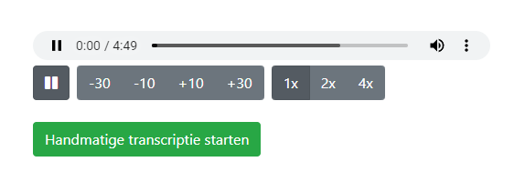
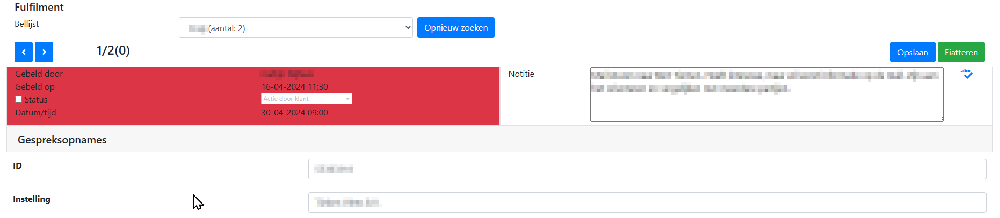

# CallProPortal Release Notes
Dit zijn de Release Notes voor CallProPortal. Release Notes voor de overige onderdelen van CallPro zijn [hier](/releases/v5/release-notes) te vinden.


***
## v5.0.46 - 2025-05-15
### Changed
-- Wachtrij overzicht van Abandoned calls en van gepsrekken per uur van de dag aangepast zodat als geen wachtrij is geselecteerd  alle wachtrijen worden getoond.

***
## v5.0.45 - 2025-04-14
### Fixed
- Issue met de handmatige transcriptie button bij opnames die nog geen transcriptie hebben opgelost waardoro deze button niet werkte!

### Changed
- Voeg laatste gesprek kolom toe aan wachtrij overzicht

***
## v5.0.43-44 - 2025-02-14
### Changed
- Het Wachtrij overzicht liet niet altijd alle wachtrijen zien door een bug tijdens de conversie van missende data. Hier is een fix voor gemaakt. Helaas is deze fix iets te snel uitgebracht en was meteen een volgende release nodig om ook de statistieken te fixen die door de eerdere fix niet meer werkten.

***
## v5.0.42 - 2025-01-06
### Changed
- Kleine aanpassing in de fulfilment validatie. Voorheen werden velden die met custom opmaak in het autoscript werden gebruikt **niet** in de fulfilmentvalidatie weergegeven. Nu wordt het veld als standaard TextBox afgebeeld in de fulfilment validatie. Dit kwam bijvoorbeeld voor bij email veld controle waar je het veld ook in de fulfilment validatie wilt blijven zien.

***
## v5.0.41 - 2024-11-29
### Fixed
- Bugfix release. Bij sommige klanten werden instellingen gebruikt die met een recente update waren omgevallen. Dit hersteld de werking totdat alle gebruikers op dezelfde database versie zitten.

***
## v5.0.40 - 2024-11-21
### Changed
- Verwijderen ongebruikte en oude functionaliteit mbt Agenda weergave. Een bezoek evaluatieformulier waar bepaalde statussen konden worden gezet, en een specifieke optie om ene afspraak als vervolgafsrpaak te markeren.

***
## v5.0.39 - 2024-11-14
### Changed
- Kleine interne aanpassing ter vorobereiding van aanpasisngen in de Resource Explorer mbt gespreksopnames. We geven nu intern niet het hele pad mee, maar alleen het relatieve pad naar de opanmes.

***
## v5.0.38 - 2024-10-29
### Changed
- Cosmetische aanpassing zodat de `Handmatige transcriptie starten` knop bij een gespreksopname alleen zichtbaar is als transcriptie ook is geactiveerd.

***
## v5.0.37 - 2024-08-01
### Added
- Als gespreksopnames worden afgespeeld waarvoor geen transcriptie beschikbaar is kan een handmatige transcriptie worden gestart met de onderstaande button. Het duur dan nog minimaal zo lang als de opname duurt voordat deze transcriptie beschikbaar is. 


***
## v5.0.36 - 2024-07-30
### Changed
- De default voor scriptvelden **Fulfilment validatie** is nu `true` en de Fulfilment validatie in CallproPortal gebruikt dit veld om te bepalen of een veld zichtbaar moet zijn.

***
## v5.0.35 - 2024-05-15
### Fixed
* De Gespreksopnames pagina gaf een 500 error als de ingelogde gebruiker in een security rol zat waar bijzondere resource-rechten waren uitgedeeld die geen `parent` object hebben. Dit treed alleen op als bepaalde rechten in een rol zijn ingesteld, wat bij een heel klein deel van de gebruikers optrad.

***
## v5.0.34 - 2024-05-03
### Changed
* Fulfilment validatie heeft al heel lang de mogelijkheid om te bepalen welke velden zichtbaar worden.In de scriptdefinitie kan per veld worden aangegeven of deze in de scriptvelden lijst moet worden afgebeeld in Fulfilment validatie. Dit gedrag is nu hersteld. Velden die `hidden` of `html` zijn gemarkeerd en velden met een naam die begint met `EXP_` worden op dit moment nooit getoond, ook moet als het vinkje aan staat.

Op dit moment worden nieuwe scriptvelden in een scriptdefinitie niet automatisch op *Fulfilment validatie* gezet. In een volgende release van de Resource Explorer wordt dit aangepast zodat scriptvelden het vinkje standaard aan hebben staan.

Mocht er een use-case zijn waarvoor het ook voor dit soort velden handig is om ze in de Fulfilment validatie zichtbaar te maken laat dit dan weten.

***
## v5.0.33 - 2024-05-01
### Changed
* In de fulfilmentvalidatie komen nu alle calls die zijn gemarkeert als `CONTROLE` **of** `ERROR` waarbij deze laatste gebruikt gaat worden als tijdens de fulfilment iets fout gaat. Dit kan bijvorbeeld zijn als het email adres in de belopdracht niet juist is en het versturen van de mail mislukt, of voor API integraties als de externe API call is mislukt.
In het geval van `ERROR` wordt het Het info kader rood.

***
## v5.0.32 - 2024-04-18
### Changed
* Het afspelen van gespreksopnames vanuit de Resource Explorer loopt vanaf deze versie via CallProPortal. Hierdoor kan dezelfde audioplayer worden gebruikt, en kunnen ook transcripties zichtbaar worden gemaakt. Voor lokaal beheer is nu ook geen toegang tot de opnames nodig op de lokale computer
> Deze update is vereist om vanaf Resource Explorer 5.0.10 gespreksopnames te kunnen afspelen.

***
## v5.0.31 - 2024-04-09
### Changed
* Bij de transcriptie worden nu ook meldingen van de engine, met name problemen bewaard en weergegeven. Met name de Summarization geeft soms  meldingen over `hate`, `self-harm`, `sexual` en `violence` waarvan bij controle blijkt dat dit tot nu toe altijd false-positives zijn. Omdat er dan geen summary is wordt de melding weergegeven.

***
## v5.0.30 - 2024-03-26
### Added
* Toevoeging van de Spreker. In de huidige (alpha) engine worden speakers als "Guest-1", "Guest-2"... geidentificeerd. In vroege tests is al duidelijk dat twee sprekers die doorelkaar praten niet goed worden herkend als twee sprekers.

***
## v5.0.29 - 2024-03-18
### Fixed
Een bug in de google authorization proces zorgde ervoor dat bepaalde gebruikers zich niet konden aanmelden. Dit probleem is nu opgelost. Dit probleem deed zich alleen voor bij specifieke registratie gegevens en werd bij slechts 1 CallPro klant gemeld. Omdat dit een erg storend probleem is die het synchroniseren van agenda's belemmerde is deze bugfix versneld uitgerold.

***
## v5.0.28 - 2024-03-14
### Fixed
* Als de Fulfilment validatie in twee Browser vensters open was  erd bij het opslaan een van de twee overschreven met de andere! Met deze update is het probleem met het gebruik van meerdere vensters opgelost.

***
## v5.0.27 - 2024-02-28
Ondersteuning voor keuzelijsten in het script waarvan de data uit een json of een externe url komt. Met CallPro 5.0 is deze toevoeging gedaan, maar met name de Fulfilment validatie kon deze gegevens nog niet correct weergeven. Er worden twee soorten json data ondersteunt.
```json
[
    {
        "id": "Unieke id",
        "text": "Weergave label"
    },
    ...
]
```

Het tweede formaat is hetzelfde formaat dat de <a href="https://select2.org/data-sources/formats" target="_blank">Select2 jQuery</a> html control gebruikt:
```json
{
    "results": [
        {
        "id": "Unieke id",
        "text": "Weergave label"
        },
        ...
    ]
}
```

***
## v5.0.26 - 2024-02-07
Fix voor queuemonitoring die geen wachtrijen meer weergaven. Met deze update werkt het weer. 

***
## v5.0.21-25 - 2024-01-20-2024-01-29
Diverse updates vanwege Google App verificatie eisen. 

***
## v5.0.20 - 2024-01-19
De Fulfilmentvalidatie module is versneld door de lijst met te controleren belopdrachten nu te delen over alle ingelogde gebruikers. Zo kan er ook als meerdere mensen fiatteren, elkaars fiatteren meteen oppakken. Wel blijven opletten dat je niet beide dezelfde controleert!

***
## v5.0.19 - 2024-01-19
Het Google App verificatie process vroeg om extra informatie op ene pagina die in de App wordt genoemd met uitleg over de Agenda synchronisatie. In deze update wordt zo'n pagina toegevoegd, hopelijk is het nu goed!

***
## v5.0.18 - 2024-01-18
Extra zoeken optie voor gespreksopnames. Er kan nu naar tekst gezocht worden in het notitieveld van de belopdracht, en de AI gesprekstranscriptie als die is gemaakt.

***
## v5.0.17 - 2024-01-12
In deze versie is een aanpassing doorgevoerd voor de Agenda synchronisatie autorisatie. Er zat een bug in dit onderdeel waardoor Google calendars niet konden worden geregistreert voor synchronisatie. Vanaf deze versie icm Calendarsync v5.0.4 werkt dit nu wel.

***
## v5.0.16 - 2023-12-20
Fulfilment validatie is soms erg traag. In deze versie is hier een  verbetering in aangebracht. Door de manier waarop deze module werkt blijft het een traag onderdeel.

***
## v5.0.15 - 2023-08-08
Uitbreiding gespreksopname weergave met richting van het gesprek (inbound of outbound). Voor campagnes die zowel inbound als outbound worden gebruikt is het nuttig om te kunnen zien op het gesprek en de opname is ontstaan uit een inbound of outbound call.

In de draaitabel voor belresultaten webpart zijn extra kolommen toegevoegd. Tevens is voor het opslaan van templates de mogelijkheid toegevoegd om ook de sorteervolgorde van de kolom en rij velden vast te leggen.

***
## v5.0.12 - 2023-07-04
Dit is een non-breaking database wijziging die nodig is om nog niet aangekondigde functionaliteit te kunnen gebruiken. In deze versie is ondersteuning toegevoegd voor de weergave van de `Alpha` gesprekstranscriptie en AI analyse. Deze functionaliteit is nog in een erg vroeg stadium en de exacte invulling ligt nog niet vast. 
> Voor gebruikers die deze functionaliteit in dit vroege stadium al willen inzetten, neem contact op met j.bennink@calway.nl. 

### Changed
- Gespreksopname audiospeler is uitgebreidt met weergave van een gesprekstranscriptie, een gesprekssamenvatting, en enkele per scriptdefinitei instelbare vraag- en antwoorden.
- De fulfilment validatie is aangepast om ook de nieuwe audio speler te gebruiken.

***
## v5.0.10 - 2023-06-01
### Fixed
 - Kleine code changes en optimalisaties
 - Consolidatie release

***
## v5.0.9 - 2023-05-30
### Fixed
- Een probleem bij specifieke script inrichting plugins met de signalr verbinding opgelost.
- Tevens verwijderd deze versie functionaliteit die al langere tijd als obsolete is aangegeven, w.o. Informatiebord.

***
## v5.0.8 - 2023-05-30
### Fixed
- Een issue met de weergave van velden in de fulfilment validatie door een bootstrap update is opgelost
- Login issue opgelost voor nieuwe 5.0 databases

***
## v5.0.7 - 2023-03-01
## Changed
- Het is nu mogelijk om gebruikers van CallProPortal op gespreksopnames beperkte rechten te geven voor niet alleen bepaalde bellijsten, maar ook binnen bellijsten voor bepaalde gebruikers.

***
## v5.0.6 - 2023-02-01
### Changed
- Gespreksopnames maken gebruik van de html audio control. Hierdoor hoeven opnames niet eerst geconverteerd naar mp3 en zijn er meer afspeel mogelijkheden zoals de afspeelsnelheid.

### Breaking
- `services/ValidateEmail` is verplaatst, de nieuwe locatie is `api/v1/Services/ValidateEmail`
- `services/bmnr.ashx` is verwijderd omdat het bel-me-niet register in Nederland niet meer actief is.
- `Telephony/bmnr` is verwijderd omdat het bel-me-niet register in Nederland niet meer actief is.
- `Telephony/rvv` is verwijderd. Gebruik in de plaats hiervan het ProxyService endpoint `Ivr\MarkEntryAsRVV` Kijk in de ProxyService swagger pagina voor informatie over dit endpoint. **Bij upgrade is ook een wijziging nodig in het Asterisk dialplan**

Onderstaande endpoints zijn interne endpoints die niet in gebruikt zouden moeten zijn bij klanten.

- `services/GetResourcePicture.ashx` is verplaatst nar `Migration/GetResourcePicture`
- `/RecordDownloadHandler.ashx` is verplaatst naar `Migration/GetRecording`
- `RefactorMe_GetGridDataExportToXls.ashx` is verplaatst naar `Migration/GetGridDataExportToXls`
- `/calendar/OutlookHandler.ashx` is verplaatst naar `Migration/GetOutlookVCalendar`

- De bel-me-niet webparts zijn verwijderd. Deze moeten voor of na de upgrade van de betreffende pagina's worden verwijderd.
- De zoeken in bel-me-niet registraties pagina is verwijderd.

- In de callpro database is de tabel 'RegDoNotCall' met alle ivr registratie gegevens verwijderd. Voor klanten met eigen integraties met deze tabel moet dit worden opgeruimd.

- Restanten van de Engage Gamification Module zijn verwijderd. Het gaat om de tabellen 'AchievementDefs`, ``AgentAchievementCycles` en `AgentAchievements`. Voor klanten met eigen integraties met deze tabellen moet dit worden opgeruimd.
