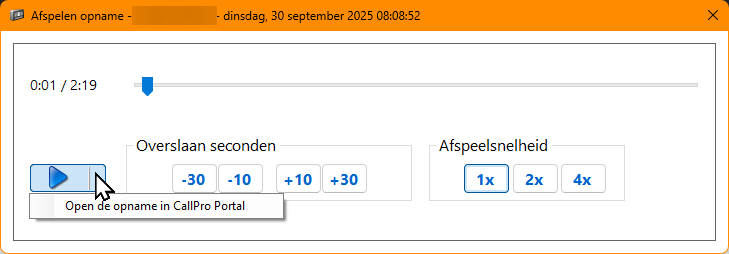
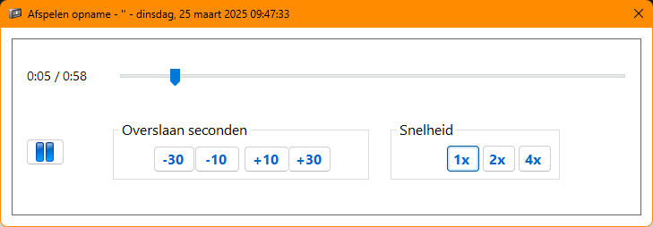
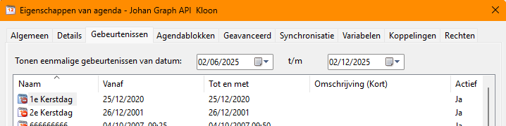
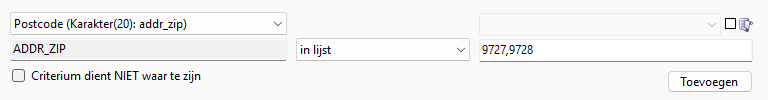

# Resource Explorer Releases
Dit zijn de Release Notes voor de Resource Explorer. Release Notes voor de overige onderdelen van CallPro zijn [hier](/releases/v5/release-notes) te vinden.

 

***
## v5.0.26 - 2025-09-30
### Changed
- Interne audioplayer heeft een optie gekregen om de opname in CallProPortal te openen.

- Import voorgangsscherm compacter gemaakt.
- Knoppen in filter scherm breder gemaakt.

***
## 5.0.25 - 2025-09-23
### Changed
* Met database versie 5.1.0 wordt de lengte van de importdefinitie en exportdefinitie naam verlengd. Deze versie bevat de voorbereidende stappen om dit mogelijk te maken.

### Fixed
* Met het wijzigen van de manier waarop opnames worden afgespeeld was verzuimd om ook de manier om opnames te downloaden bvij te werken. Doordat deze functie afhankelijk was van CallProPortal en het inmiddels uit CallProPortal is gehaald werkte het kopieren van opnames in de Resource Explorer niet meer. Dat is nu opgelost door de nieuwe manier te gebruiken via de ProxyService.

***
## 5.0.24 - 2025-08-19
### Changed
* Vanuit de Resource Explorer is een nieuwe audioplayer geintroduceerd die de opnames native kan afspelen. Deze vervangt het gebruik van de audioplayer uit CallProPortal. We gebruiken nu de api vande ProxyService om opnames te benaderen.

Om deze nieuwe audioplayer te gebruiken moet de ProxyService url worden geconfigureerd in het control panel Systeem configuratie\Geavanceerd\Overig.

*** 
## 5.0.23 - 2025-07-15
### Fixed
* Probleem met enkele resourcelijsten dat dubbelklikken niet de eigenschappen opent is opgelost.
* Een probleem in de Belhistorie statistieken waarbij het niet mogelijk was om de "Alle statussen" optie te kiezen voor een kolom is opgelost.
* Oplossing voor een specifieke issue waarbij een belopdracht met een afspraak status, waarvan de afspraak in het verleden ligt in inbound mode niet kon worden geannuleerd vanwege de controle dat bij de status afspraak een geldige toekomstige afspraak aanwezig moet zijn. Dit kan nu wel.
* Het veranderen van de volgorde van velden in een scriptdefinitie is nu beperkt tot het veranderen wanneer de velden in de actuele sorteervolgorde staan. We kregen een melding dat iemand zijn scriptdefinitie flink door elkaar had gegooid door de lijst met velden eerst te sorteren op bijvoorbeeld naam, en dan enkele velden te verschuiven in de lijst. Bij het opslaan zet CallPro de velden in de huidige volgorde in de lijst (wat zeker niet de bedoeling is!). De volgorde kan nu alleen worden aangepast als de sorteervolgorde van de lijst met scriptvelden staat op de huidige Volgorde kolom, anders werken de 4 knoppen onder aan om velden heen en weer te schuiven **niet**!

### Changed
* In de afgelopen maanden is het enkele keren gebeurd dat gebruikers per ongeluk een verkeerde bellijst verwijderen. We hebben daarom dubbele bevestiging voor het verwijderen van Bellijsten en Agenda's toegevoegd. Je moet bij de tweede bevestiging ook je wachtwoord invullen.

*** 
## 5.0.22 - 2025-06-25
### Fixed
* Kort na de release van 5.0.21 kwam een melding binnen dat er in 5.0.20 een fout was geintroduceerd die bij de Events, alle recurring events van alle agenda's weergeeft bij elke agenda. Dat is in deze release opgelost.

*** 
## 5.0.21 - 2025-06-25
### Changed
* De vorige release gaf bij sommige gebruikers problemen bij de installatie. Wij konden het reproduceren op nieuwe Windows 11 installaties. Door eerst de Scriptmodule te installeren kon v5.0.20 wel worden geinstalleerd. Deze nieuwe 5.0.21 versie heeft dit probleem niet en installeert wel op een nieuwe Windows 11 computer.

*** 
## 5.0.20 - 2025-06-03
### Fixed
* Bij het maken een een herhalende Gebeurtenis in de Agenda gaf een foutmelding `Invalid column name 'Source'`. Hierdoor konden vanuit de Resource Explorer geen herhalende Gebeurtenissen worden aangemaakt.

### Changed
- Vanaf deze versie is de Resource Explorer alleen als x64 versie beschikbaar. De afgelopen maanden hebben we gezien dat de x86 versie helemaal niet meer in gebruikt is wat de overstap naar volledig x64 mogelijk maakte.
- Bij de eigenschappen van de agenda worden voor de gebeurtenissen nu niet meer alle gebeurtenissen opgehaald. In sommige uitzonderlijke situaties haalde CallPro meer dan 1000 gebeurtenissen op. Nu wordt van de eenmalige gebeurtenissen alleen een beperkte datum reeks opgehaald.

- Bij het zoeken naar belopdrachten kan in het zoek filter nu voor karakter velden ook gebruik worden gemaakt van de lijst operator `in lijst` om een hele reeks comma gescheiden waarden mee te geven. Hiermee wordt het eenvoudiger om belopdrachten te vinden die een bepaalde `unieke` waarde in een veld hebben staan waarvan je snel een sub-set wilt opzoeken.

Door te dubbelklikken in het invoerveld opent een grotere editor veld voor eenvoudige invoer, of knippen plakken.

***
## 5.0.19 - 2025-04-24
### Changed
* Diverse zoek vensters hebben nu de mogelijk om de zoek criteria in te klappen zodat het venster meer ruimte heeft voor de zoek resultaten.

### Fixed 
* Een bug bij het opslaan van de exporthistorie als de `Melding` kolom zichtbaar was is opgelost.
* De `Volgorde...` en `Volgorde groep...` opties om de volgorde van statussen in te stellen sorteert nu correct op de `Volgorde` kolom. Voorheen werd dit als string-waarde gedaan in plaats van de numerieke waarde waardoor het onmogelijk was deze functie te gebruiken.
* Het export formaat `Excel (ODBC)` is vanaf deze versie als `deprecated` gemarkeerd en zal in een toekomstige versie worden verwijderd. Bij het gebruik van dit formaat volgt nu ook een melding. Gebruik de native `Excel` formaat.

***
## 5.0.18 - 2025-04-03
### Fixed
- Opnieuw uitgebrachte versie van 5.0.17 omdat deze vorige versie niet bij klanten wilde installeren?

***
## 5.0.17 - 2025-04-02
### Changed
- De Resource Explorer ondersteunt nu zowel x86 als x64 en is hiermee officieel ook 64-bits. Voor sommige acties is nu meer geheugen beschikbaar. Mogelijk zal in de toekomst de x86 (32-bits) versie verdwijnen omdat niemand meer oude computers heeft die alleen 32-bits Windows kunnen draaien.
- We hebben de maken van variabelen vereenvoudigt. Als je de naam van een variabele begint te typen krijg je een lijstje met bestaande variabelen die met deze letters beginnen. Zo kun je snel een variabele kiezen die elders al in gebruik is. Vooral voor het opnemen van veel voorkomende variabelen maakt dit de invoer sneller en eenvoudiger.

***
## 5.0.16 - 2025-03-24
### Fixed
- Bij het kopieren van het 1e telefoonnummer veld in een scriptdefinitie ontstond een probleem dat er twee 1e telefoonnummer velden waren. Hierdoor kon de scriptdefintie niet worden bewaard. Je kon het extra veld ook niet meer verwijderen omdat dit als 1e telefoonnummer veld gemarkeerd was. Met deze release is deze bijzondere bug opgelost.

### Changed
- De minimale afmeting van rapportage vensters is verkleind zodat deze beter zijn af te stemmen op de inhoud. Dit is vooral handig als rapportage vensters open blijven met een auto-refresh.

***
## v5.0.15 - 2025-02-24
### Changed
- Voor database v5.1.0 is ondersteuning voor lange paden toegevoegd voor import en export bestanden. Met name bij gebruik van Onedrive/Sharepoint worden paden soms veel dieper dan gebruikelijk. Voorheen was de maximale lengte van het pad + bestandnaam 200 tekens, dit is nu verlengt tot de miaxmale lengte die Windows toestaat. Databases met lagere versie nummers hebben hier geen voordeel van omdat dit ook een wijziging in de database nodig heeft.
- Op de campagne folder is een mogelijkheid toegevoegd om naar belopdrachten te zoeken. Hierbij worden alle actieve bellijsten uit de campagne gebruikt, waarbij ook ingestelde filters worden toegepast.
- In zoeken vensters is een extra popup verwijderd die als je een zoekcriterium had ingesteld, maar niet toegevoegd elke keer vroeg of je die wilde toevoegen. CallPro gaat er nu van uit dat dit filter niet hoeft te worden meegenomen.
- Een niet gebruikte feature om met smileys een "agent mood" aan te geven wordt verwijderd. Deze functie is in 2019 toegevoegd maar wordt door niemand gebruikt. Het nut hiervan is ook bij test gebruikers nooit echt naar voren gekomen.

***
## v5.0.14 - 2025-01-15
### Fixed
- Agenda wijzigingen konden niet meer worden bewaard, en nieuwe agenda's konden niet worden aangemaakt doordat er in de code werd verwezen naar een database veld dat er niet is. Er waren nog geen meldingen van gebruikers, maar deze update lost het probleem op.

***
## v5.0.13 - 2025-01-09
### Changed
- Mogelijkheid om de Reistijdcontrole licentiesleutel in te vullen in het control panel

### Fixed
- Variabelen tabblad werd soms niet weergegeven ondanks dat de gebruiker rechten had.
- Als een importbestand op de laatste regel geen `newline` had eindigde de import met een foutmelding doordat regels verkeerd werden geteld en de import voorbij het einde van het bestand wilde lezen.

***
## v5.0.12 - 2024-07-30
### Changed
- De default voor scriptvelden **Fulfilment validatie** is nu `true` en de Fulfilment validatie in CallproPortal gebruikt dit veld om te bepalen of een veld zichtbaar moet zijn.

***
## v5.0.11 - 2024-06-19
### Changed
- We hebben de rapportage vensters aangepast zodat deze modeless kunnen worden gebruikt, los van de rapportage wizard. Hierdoor kun je de rapporten als los venster gebruiken en ook meerdere tegelijkertijd open hebben. 
- Ook is aan de rapport een auto-refresh functie toegevoegd in de rechter onderkant van het scherm kun je kiezen voor een auto-refresh interval zodat de rapport inhoud wordt geactualiseerd.
- Ook het handmatig verversen met de refresh button (die er al was) werkt nu en ververst het rapport handmatig.

***
## v5.0.10 - 2024-04-23
### Fixed
- Bij het kopieren van scriptvelden tussen verschillende scriptdefinities werden bestaande bellisjten die zijn gebaseerd op de scriptdefinitie die het nieuwe veld ontving **niet** bijgewerkt. Het probleem treedt alleen op bij het kopieren van velden tussen verschillende scriptdefintiies via het clipboard!

### Changed
- **v5.0 database only**: Op de seat kan worden aangegeven dat de auto-provisioning wel/niet moet worden uitgevoerd. Voor deze update erd altijd auto-provisioning gebruikt, en werd Microsip vervolgens automatisch opgestart. 
- **v5.0 database only**: Op de seat kan nu worden aangegeven dat bij het afsluiten van de Scriptmodule ook Microsip wordt afgesloten. Deze optie is alleen zichtbaar voor CallPro installaties die **database versie 5** hebben, en werkt ook alleen icm een Scriptmodule v5.0.10

***
## v5.0.9 - 2024-02-28
### Fixed
- Bij het bewerken van variabelen van type Memo (er wordt dan een RichtEditbox gebruikt) gaat er iets fout als tekst wordt ingevoerd die foutief herkend wordt als hyperlink. Deze hyperlink detectie gaat de eerste keer goed, maar eenmaal herkende hyperlinks (die geen hyperlink zijn) worden soms verkeerd omgezet in platte tekst wat resultaat in `< >` om de hyperlink. Dit trad op in javascript code in de variabele die hierdoor niet meer correct werkte.
- Bij het exporteren van bellijsten naar Excel op een Onedrive locatie volgde soms ene foutmelding tijdens het exporteren doordat Onedrive het upload en CallPro geen exclusieve toegang kan krijgen. De melding is vervangen door een Herhaal optie zodat het openen van het exportbestand herhaald kan worden, wat meestal direct werkt, tenzij het uploaden naar Onedrive heel traag gaat, maar dan kan het meerdere keren geprobeert worden totdat het lukt. Een alternatieve optie is om de Onedrive synchronisatie tijdelijk te pauzeren.

***
## v5.0.8 - 2023-12-06
### Fixed
- In de rapportage werd bij het gebruik van de "Export naar Excel" optie cijfer kolommen niet gezien als cijfers, maar als tekst. Dit is opgelost. Een resterend probleem is dat tijdsduur kolommen nog steeds als tekst worden gezien en in Excel niet worden herkend als een tijdsduur. Als je de cell bewerkt herkend Excel de *handmatige* invoer wel als tijdsduur. We hebben hier nog geen oplossing voor kunenn vinden anders dan dat je als gebruiker `F2` en `Enter` moet uitvoeren op de cell.

### Changed
- Cosmetische verbeteringen in keuzelijsten met checkbox selectie.
- Er is een sneltoets toegevoegd `Ctrl-Shift+C` om het volledige pad van de huidige resource in het clipboard te zetten.

***
## v5.0.7 - 2023-10-18
### Fixed
- In de standaard zoekvelden was per abuis het filteren met `%` verwijderd waardoor er niet meer kon worden gezocht op bijvoorbeeld bedrijfsnaam bevat "bakker" door in het bedrijfsnaamveld "%bakker" te gebruiken. Voor alle duidelijkheid, met `%` geef je aan dat het niet uit maakt wat er voor staat, maar dat ergens "bakker" in de bedrijfsnaam moet staan. CallPro voegt standaard al een `%` achter de gebruiker-invoer toe (zodat je altijd zoekt op een `begint met`)

    Daarnaast kan ook een `_` worden gebruik om aan te geven dat hier elk willekeurig karakter kan staan of `[]` met tussen deze haken een 1- of meer tekens zoals `9[5678]` om aan te geven dat gezocht moet worden op postcodes die beginnen met "95, 96, 97 of 98". Deze reeks kan nog eenvoudiger als `9[5-8]` worden geschreven.

***
## v5.0.6 - 2023-10-17
### Fixed
- Extra applicatie icoon in Start menu voor Campagne Grid en Suppressielijsten import.

### Changed
- In de Agendamodule is een calendar maand control toegevoegd voor snellere navigatie door de agenda.

***
## v5.0.5 - 2023-07-18
### Changed
- De icons in de toolbar zijn nu uniform van afmeting. Dit ziet er een stuk beter uit

### Fixed
- In de terugbeltijd expressie berekening die gebruikt wordt voor de status datum berekening, specifiek voor TimeAdd, konden door een fout geen minuten meer gebruikt worden. De syntax `TimeAdd=5m` (5 minuten) werd niet herkend als geldig, maar `TimeAdd=1h` (1 uur) nog steeds wel. Dit was een feature regressie bug die snel kon worden opgelost.

***
## v5.0.4 - 2023-07-17
In deze versie is een begin gemaakt met de mogelijkheid om meerdere eigenschappen vensters tegelijkertijd open te kunnen hebben, veel CallPro vensters zijn "modal" wat betekent dat als dit venster open is, geen enkel ander programma venster kan worden gebruikt tot dit venster is gesloten. Voor diverse gebruik scenario's is het handig als je meerdere vensters naast elkaar open kunt hebben, en kunt gebruiken.

***
## v5.0.3 - 2023-03-01
Gebruikers op Windows 10 hadden veel problemen met automatische updates en installatie. Deze versie werkt alleen met het nieuwe developer certificaat en op zowel Windows 10 als Windows 11. Verwijder eerst voorgaande versies en installeer dan deze nieuwe versie.

***
## v5.0.2 - 2023-02-01
Door het verlopen van het developer certificaat werkten automatische updates niet meer. Deze versie gebruikt het nieuwe certificaat en ondersteunt op Windows 11 ook upgrade van het oude certificaat.

***
## v5.0.1 - 2022-02-01
Dit is de eerste officiele versie van deze client. Met deze versie gebruiken we https://installer.callpro.nl voor de installatie (voor Windows 10/11)

***
## v5.0.0 - unreleased
